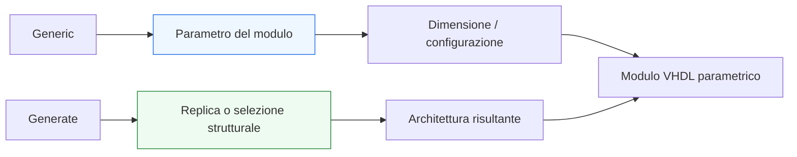
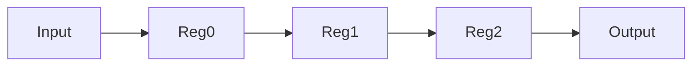

# Generics e generate

Dopo aver introdotto **datapath**, **control unit** e **pipeline**, il passo successivo naturale è affrontare un tema fondamentale per la qualità progettuale del codice VHDL: la **parametrizzazione** e la **generazione strutturata** dell’hardware. In questo contesto entrano in gioco due strumenti molto importanti del linguaggio:
- i **`generic`**
- i costrutti **`generate`**

Questi elementi sono centrali perché permettono di scrivere moduli che non siano validi solo per un caso specifico, ma che possano essere:
- adattati a larghezze di dato diverse;
- riusati in più contesti;
- scalati in numero di canali, stadi o blocchi;
- mantenuti più facilmente nel tempo;
- letti come strutture progettuali coerenti, invece che come copie quasi uguali di codice.

Dal punto di vista RTL, `generic` e `generate` sono molto importanti perché collegano il linguaggio a una idea più matura di progetto:
- non solo descrivere un circuito;
- ma descrivere una **famiglia di circuiti** coerenti;
- oppure una **struttura ripetuta** controllata in modo ordinato.

Questa lezione mantiene il taglio della sezione:
- didattico ma tecnico;
- orientato all’RTL sintetizzabile;
- attento al significato architetturale;
- accompagnato da esempi di codice e schemi quando utili.



## 1. Perché `generic` e `generate` sono importanti

La prima domanda utile è: perché dedicare una pagina specifica a questi due costrutti?

### 1.1 Perché evitano duplicazione inutile
Senza parametrizzazione, è facile finire con più versioni quasi identiche dello stesso modulo:
- una a 8 bit;
- una a 16 bit;
- una a 32 bit;
- una con 2 canali;
- una con 4 canali.

### 1.2 Perché migliorano il riuso
Un modulo parametrico può adattarsi meglio a:
- datapath di dimensioni diverse;
- pipeline con numero variabile di stadi;
- strutture replicabili;
- ambienti FPGA e ASIC con requisiti differenti.

### 1.3 Perché rafforzano la qualità architetturale
Il codice non è più solo corretto per un’istanza, ma esprime una struttura generale di progetto.

---

## 2. Che cos’è un `generic`

Un **`generic`** è un parametro del modulo che consente di configurare certe proprietà della `entity` o della sua implementazione.

### 2.1 Significato essenziale
Il `generic` permette di dire:
- questo blocco ha una certa larghezza;
- questo blocco usa una certa profondità;
- questo blocco ha un certo numero di stadi;
- questo blocco abilita o disabilita una certa variante strutturale.

### 2.2 Perché è utile
Invece di fissare tutto nel codice, si può rendere il modulo:
- configurabile;
- più generale;
- più riusabile.

### 2.3 Esempio semplice

```vhdl
entity reg_n is
  generic (
    WIDTH : integer := 8
  );
  port (
    clk : in  std_logic;
    d   : in  std_logic_vector(WIDTH-1 downto 0);
    q   : out std_logic_vector(WIDTH-1 downto 0)
  );
end entity reg_n;
```

### 2.4 Che cosa mostra questo esempio
La larghezza del modulo non è fissa: è controllata dal parametro `WIDTH`.

---

## 3. Dove si dichiarano i `generic`

I `generic` vengono tipicamente dichiarati nella `entity`.

### 3.1 Perché lì
La `entity` rappresenta l’interfaccia e la configurabilità del blocco. Se il modulo è parametrico, questa proprietà deve risultare visibile già dal suo “contratto esterno”.

### 3.2 Forma generale

```vhdl
entity example_block is
  generic (
    WIDTH : integer := 8
  );
  port (
    a : in  std_logic_vector(WIDTH-1 downto 0);
    y : out std_logic_vector(WIDTH-1 downto 0)
  );
end entity example_block;
```

### 3.3 Perché è una buona pratica
Chi legge la `entity` capisce subito:
- che il modulo è configurabile;
- quale parametro ne controlla la dimensione o il comportamento.

---

## 4. `generic` e larghezza del datapath

Uno degli usi più comuni dei `generic` è la parametrizzazione della larghezza dei dati.

### 4.1 Perché è utile
Molti moduli hanno la stessa struttura logica, ma devono lavorare con:
- 8 bit;
- 16 bit;
- 32 bit;
- larghezze custom.

### 4.2 Esempio

```vhdl
entity add_reg is
  generic (
    WIDTH : integer := 8
  );
  port (
    clk : in  std_logic;
    a   : in  std_logic_vector(WIDTH-1 downto 0);
    b   : in  std_logic_vector(WIDTH-1 downto 0);
    q   : out std_logic_vector(WIDTH-1 downto 0)
  );
end entity add_reg;
```

### 4.3 Perché è importante
Il modulo diventa subito più flessibile senza cambiare architettura di base.

---

## 5. `generic` come parametro architetturale

Il `generic` non serve solo per la larghezza di un bus.

### 5.1 Altri usi comuni
Può controllare:
- numero di stadi;
- profondità di una struttura;
- valori costanti di configurazione;
- limiti di contatori;
- numero di canali o istanze.

### 5.2 Esempio concettuale
Per esempio:
- un contatore con valore massimo parametrico;
- una pipeline con numero configurabile di registri;
- un blocco con numero variabile di ingressi replicati.

### 5.3 Perché è importante
Questo rende i `generic` un vero strumento di progettazione architetturale, non solo un dettaglio di comodo.

---

## 6. Esempio: registro parametrico

Vediamo un esempio semplice ma molto tipico.

```vhdl
library ieee;
use ieee.std_logic_1164.all;

entity reg_n is
  generic (
    WIDTH : integer := 8
  );
  port (
    clk   : in  std_logic;
    reset : in  std_logic;
    d     : in  std_logic_vector(WIDTH-1 downto 0);
    q     : out std_logic_vector(WIDTH-1 downto 0)
  );
end entity reg_n;

architecture rtl of reg_n is
  signal q_reg : std_logic_vector(WIDTH-1 downto 0);
begin
  process(clk, reset)
  begin
    if reset = '1' then
      q_reg <= (others => '0');
    elsif rising_edge(clk) then
      q_reg <= d;
    end if;
  end process;

  q <= q_reg;
end architecture rtl;
```

### 6.1 Che cosa mostra
- un solo modulo;
- una larghezza configurabile;
- una descrizione RTL stabile;
- riuso immediato su più casi.

### 6.2 Significato hardware
È sempre un registro, ma la sua dimensione cambia in base al parametro.

---

## 7. Che cos’è `generate`

Il costrutto **`generate`** serve a descrivere in modo strutturato:
- repliche;
- scelte architetturali;
- istanziazioni ripetute;
- varianti condizionali dell’hardware.

### 7.1 Significato essenziale
Con `generate` il progettista non sta “eseguendo un ciclo” come in un linguaggio software, ma sta dicendo al linguaggio:
- genera questa struttura più volte;
- includi questa parte solo se una certa condizione vale.

### 7.2 Perché è utile
Permette di costruire:
- array di istanze;
- catene di registri;
- ripetizioni regolari;
- strutture parametriche.

### 7.3 Perché è importante capirlo bene
Il `generate` descrive **struttura hardware replicata**, non un comportamento runtime.

---

## 8. `generate` e replica strutturale

Uno degli usi più comuni di `generate` è replicare una certa struttura più volte.

### 8.1 Esempio intuitivo
Se vogliamo una catena di più registri o di più istanze simili, scrivere tutto a mano sarebbe:
- lungo;
- fragile;
- poco scalabile.

### 8.2 `generate` come soluzione
Il costrutto permette di esprimere la ripetizione in forma ordinata e coerente.

### 8.3 Perché questo è molto utile in RTL
Molte architetture hanno una struttura regolare:
- banchi di canali;
- stadi di pipeline;
- array di celle;
- catene di elaborazione.

---

## 9. Esempio concettuale di replica con `generate`

Immaginiamo di voler descrivere una piccola catena di registri.



### 9.1 Che cosa si vuole ottenere
Una struttura composta da più stadi simili.

### 9.2 Perché `generate` è adatto
Perché la struttura è:
- regolare;
- ripetitiva;
- controllabile da un parametro.

---

## 10. Esempio: istanziazione ripetuta con `generate`

Vediamo un esempio strutturale semplice.

```vhdl
gen_regs : for i in 0 to N-1 generate
  reg_i : entity work.reg_n
    generic map (
      WIDTH => WIDTH
    )
    port map (
      clk   => clk,
      reset => reset,
      d     => stage_d(i),
      q     => stage_q(i)
    );
end generate gen_regs;
```

### 10.1 Che cosa mostra
- un blocco ripetuto `N` volte;
- istanziazione strutturata;
- riuso di un modulo parametrico.

### 10.2 Perché è importante
Mostra bene il legame tra:
- `generic`
- riuso del modulo
- costruzione di architetture più grandi

### 10.3 Come va letto
Non come ciclo runtime, ma come:
- “genera N istanze di questo blocco”

---

## 11. `generic` e `generate` insieme

Questi due strumenti mostrano il loro vero valore quando vengono usati insieme.

### 11.1 `generic`
Definisce:
- quanti elementi servono;
- quanto largo è il dato;
- quale variante strutturale si desidera.

### 11.2 `generate`
Usa questi parametri per:
- costruire la struttura;
- replicare i blocchi;
- selezionare parti dell’architettura.

### 11.3 Perché questa combinazione è potente
Permette di descrivere moduli e microarchitetture:
- flessibili;
- coerenti;
- scalabili;
- più facili da mantenere.

---

## 12. `generate` e pipeline

Uno degli usi più naturali di `generate` è la descrizione di pipeline regolari.

### 12.1 Perché
Se una pipeline ha più stadi simili, conviene spesso descrivere questa regolarità in modo parametrico.

### 12.2 Casi tipici
- catena di registri;
- stadi ripetuti di buffering;
- banchi di ritardo;
- strutture a canali paralleli.

### 12.3 Beneficio
Il codice riflette meglio l’idea architetturale di “stadi ripetuti” invece di diventare una lunga copia manuale.

---

## 13. `generate` e array di canali

Un altro uso molto utile riguarda la replica di percorsi dati paralleli.

### 13.1 Esempio concettuale
Un progetto può avere:
- 4 canali identici;
- 8 lane parallele;
- più ingressi o uscite della stessa natura.

### 13.2 Perché `generate` è adatto
Permette di scrivere una struttura regolare una sola volta e di replicarla in modo controllato.

### 13.3 Implicazione progettuale
Questo migliora:
- leggibilità;
- scalabilità;
- riduzione degli errori da copia e incolla.

---

## 14. `generic` e leggibilità del progetto

La parametrizzazione migliora molto la qualità del codice, ma solo se usata bene.

### 14.1 Quando aiuta davvero
Quando il parametro rappresenta una proprietà progettuale chiara, per esempio:
- larghezza del bus;
- numero di stadi;
- numero di canali;
- profondità di un blocco.

### 14.2 Quando rischia di peggiorare il codice
Se si introducono troppi parametri poco motivati o poco leggibili, il modulo può diventare:
- difficile da usare;
- ambiguo;
- meno manutenibile.

### 14.3 Buona regola
Il parametro deve riflettere una vera scelta architetturale, non solo complicare il modulo.

---

## 15. `generate` e leggibilità della struttura

Anche il `generate` va usato in modo disciplinato.

### 15.1 Quando è molto utile
Quando la struttura è davvero:
- ripetitiva;
- regolare;
- naturalmente parametrica.

### 15.2 Quando può essere eccessivo
Se la struttura è piccola o poco regolare, un uso di `generate` può rendere il codice più complesso del necessario.

### 15.3 Buona regola
Usa `generate` quando chiarisce la struttura, non quando la nasconde.

---

## 16. Errori comuni

Questi strumenti sono molto potenti, ma anche facili da usare male se non si ha una visione architetturale chiara.

### 16.1 Usare `generic` senza vero significato progettuale
Il codice diventa più complicato senza reale beneficio.

### 16.2 Introdurre troppi parametri inutili
Si riduce la leggibilità del modulo.

### 16.3 Leggere `generate` come un ciclo software
Questo è uno degli equivoci più comuni.

### 16.4 Duplicare struttura complicata senza chiarezza
Un `generate` mal progettato può rendere il codice più difficile da seguire.

### 16.5 Non collegare la parametrizzazione alla verifica
Un modulo parametrico deve essere anche pensato in termini di test, configurazione e casi d’uso diversi.

---

## 17. Buone pratiche di modellazione

Per usare bene `generic` e `generate` in VHDL, alcune linee guida sono particolarmente utili.

### 17.1 Parametrizzare ciò che ha vero senso architetturale
Per esempio:
- larghezza;
- profondità;
- numero di stadi;
- numero di canali.

### 17.2 Tenere i nomi dei parametri chiari
Per esempio:
- `WIDTH`
- `DEPTH`
- `NUM_STAGES`
- `NUM_CHANNELS`

### 17.3 Usare `generate` per strutture regolari
Pipeline, repliche e array di blocchi sono candidati naturali.

### 17.4 Mantenere leggibile la struttura
Il lettore deve capire:
- che cosa viene parametrizzato;
- che cosa viene replicato;
- quale hardware risulta dalla descrizione.

### 17.5 Pensare al riuso
Il vero valore di questi costrutti emerge quando il modulo viene riutilizzato in contesti diversi.

---

## 18. Collegamento con il resto della sezione

Questa pagina si collega direttamente a:
- **`datapath-control-and-pipelining.md`**, perché datapath e pipeline sono casi naturali di parametrizzazione;
- **`entity-architecture-and-types.md`**, perché i `generic` vengono dichiarati a livello di interfaccia;
- **`synthesis.md`**, dove verrà chiarito come la struttura parametrica si traduce in hardware sintetizzato;
- **`vhdl-for-fpga-and-asic.md`**, perché riuso e scalabilità hanno un impatto molto importante nei flussi reali;
- **`verification-and-testbench.md`**, perché moduli parametrizzati richiedono anche una verifica coerente con le configurazioni supportate.

---

## 19. In sintesi

I **`generic`** permettono di parametrizzare un modulo VHDL e di renderlo configurabile rispetto a proprietà come:
- larghezza dei dati;
- numero di stadi;
- numero di canali;
- dimensioni architetturali.

I costrutti **`generate`** permettono invece di costruire in modo ordinato:
- strutture ripetute;
- istanziazioni replicate;
- varianti architetturali.

Capire bene `generic` e `generate` significa compiere un passo importante verso una progettazione RTL più matura, riusabile e scalabile.

## Prossimo passo

Il passo successivo naturale è **`synthesis.md`**, perché adesso conviene chiarire come tutte le strutture introdotte fin qui — inclusi moduli parametrizzati, FSM, registri, mux e pipeline — vengano interpretate dal processo di sintesi e tradotte in hardware concreto.
