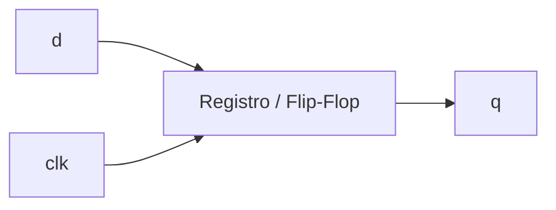

# VHDL

La sezione **VHDL** introduce il linguaggio da una prospettiva di progettazione **RTL**, con attenzione al legame tra:
- descrizione hardware;
- sintesi;
- timing;
- verifica;
- implementazione su FPGA o in flussi ASIC.

L’obiettivo non è trattare VHDL come un linguaggio “solo sintattico”, ma come uno strumento di progetto con cui descrivere circuiti reali in modo:
- corretto;
- leggibile;
- sintetizzabile;
- coerente con il comportamento atteso dell’hardware.

Questa sezione è pensata per un uso:
- universitario;
- professionale introduttivo;
- orientato alla progettazione digitale reale.

Nel corso delle lezioni verranno introdotti:
- concetti teorici essenziali;
- esempi di codice VHDL;
- schemi e diagrammi quando utili a chiarire struttura, flusso o comportamento temporale;
- collegamenti con FPGA, ASIC, timing e verifica.

## Obiettivi della sezione

Al termine di questa sezione dovresti essere in grado di:
- comprendere la struttura di base di un progetto VHDL;
- distinguere correttamente tra logica combinatoria e sequenziale;
- modellare registri, multiplexer, FSM e pipeline;
- usare generics e costrutti di riuso in modo ordinato;
- leggere il codice VHDL dal punto di vista della sintesi e del timing;
- costruire testbench di base e interpretare i risultati di simulazione;
- collegare il linguaggio ai principali contesti progettuali FPGA e ASIC.

## Come leggere questa sezione

La sezione è organizzata in modo progressivo.

Si parte dai **fondamenti del linguaggio**, perché in VHDL la semantica conta molto: segnali, variabili, process e concorrenza non vanno letti come semplici dettagli sintattici, ma come elementi che influenzano direttamente il significato hardware del codice.

Successivamente si passa alla **modellazione RTL**, cioè al modo in cui VHDL viene usato per descrivere:
- logica combinatoria;
- logica sequenziale;
- registri;
- FSM;
- datapath e pipeline.

Una volta chiarita la modellazione, la sezione affronta i temi di **sintesi e timing**, che sono fondamentali per capire se una descrizione VHDL è solo formalmente corretta o anche realmente adatta a un flusso di progetto.

Infine vengono introdotti gli aspetti di **verifica**, **debug** e **integrazione progettuale**, in modo da collegare il linguaggio ai casi reali in cui il codice viene simulato, sintetizzato e inserito in un sistema più ampio.

## Che cosa troverai nelle lezioni

Ogni pagina della sezione seguirà, per quanto possibile, una struttura coerente:
- introduzione del concetto;
- spiegazione del significato hardware;
- esempi di codice sintetizzabile quando appropriato;
- schemi concettuali o diagrammi per chiarire relazioni tra blocchi o flussi;
- collegamento con sintesi, timing, verifica o implementazione.

L’idea è mantenere un equilibrio tra:
- rigore tecnico;
- leggibilità;
- concretezza progettuale.

## Esempio del taglio usato

Per esempio, quando verrà introdotto un costrutto RTL, non ci si limiterà a dire “questa è la sintassi”, ma si cercherà di chiarire anche che cosa implica dal punto di vista hardware.

### Esempio: registro sincrono

```vhdl
process(clk)
begin
  if rising_edge(clk) then
    q <= d;
  end if;
end process;
```

Questo tipo di descrizione non rappresenta solo una regola del linguaggio: rappresenta una struttura sequenziale che, in sintesi, corrisponde a un **registro** o a un insieme di **flip-flop**.



Allo stesso modo, quando verranno introdotti process combinatori, FSM, pipeline o interfacce, il codice sarà sempre collegato al suo significato architetturale.

## Struttura della sezione

La sezione è articolata nei seguenti blocchi:

### 1. Fondamenti
Qui vengono introdotti:
- basi del linguaggio;
- `entity` e `architecture`;
- tipi principali;
- segnali, variabili e semantica;
- process e assegnamenti concorrenti.

### 2. Modellazione RTL
Qui il focus si sposta su:
- logica combinatoria e sequenziale;
- registri, mux, enable e reset;
- FSM;
- datapath, control e pipeline;
- generics e generate.

### 3. Sintesi e timing
Qui viene chiarito come leggere il codice VHDL in termini di:
- sintesi;
- risorse hardware;
- cammino critico;
- clock;
- errori comuni di codifica.

### 4. Verifica
Qui vengono introdotti:
- testbench di base;
- stimoli;
- self-checking;
- simulazione;
- debug e waveform.

### 5. Integrazione progettuale
Qui la sezione collega VHDL a temi più ampi:
- uso su FPGA;
- uso in flussi ASIC;
- interfacce e handshake;
- CDC;
- confronto con Verilog e SystemVerilog.

### 6. Caso di studio
La sezione si chiude con un caso di studio che ricompone i concetti principali in un esempio unitario.

## Perché VHDL resta importante

VHDL continua a essere molto rilevante in diversi contesti:
- progettazione FPGA;
- ambienti industriali consolidati;
- flussi con forte disciplina documentale;
- didattica della progettazione hardware;
- sistemi in cui chiarezza tipologica e struttura del linguaggio sono particolarmente apprezzate.

Inoltre, studiare VHDL aiuta a capire molto bene alcuni aspetti fondamentali della progettazione hardware:
- differenza tra comportamento simulato e struttura sintetizzata;
- ruolo del clock e del reset;
- importanza della semantica del linguaggio;
- relazione tra descrizione RTL e hardware finale.

## Come usare bene il materiale

Per trarre il massimo dalla sezione, conviene leggere ogni pagina su tre livelli:
- **linguaggio**, per capire il costrutto;
- **hardware**, per capire che cosa quel costrutto descrive davvero;
- **progetto**, per capire se quella scelta è buona dal punto di vista di sintesi, timing e verifica.

Questo approccio è particolarmente importante in VHDL, dove una descrizione apparentemente “corretta” può essere:
- poco leggibile;
- poco sintetizzabile;
- fragile in simulazione;
- poco adatta a un progetto reale.

## In sintesi

La sezione **VHDL** è pensata come un percorso compatto ma serio, orientato alla progettazione digitale reale. Il focus è sulla descrizione RTL e sul rapporto tra codice, hardware, timing e verifica.

Nel corso delle lezioni troverai non solo spiegazioni teoriche, ma anche:
- esempi di codice;
- schemi;
- collegamenti con casi progettuali concreti;
- attenzione costante alla qualità della modellazione.

## Prossimo passo

Il passo successivo naturale è **`vhdl-overview.md`**, che introdurrà:
- che cos’è VHDL nel contesto della progettazione digitale
- quali problemi risolve
- come si colloca rispetto a RTL, sintesi e flussi FPGA/ASIC
- quale stile di utilizzo adotteremo nel resto della sezione
