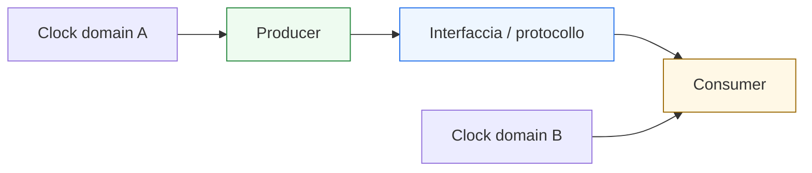
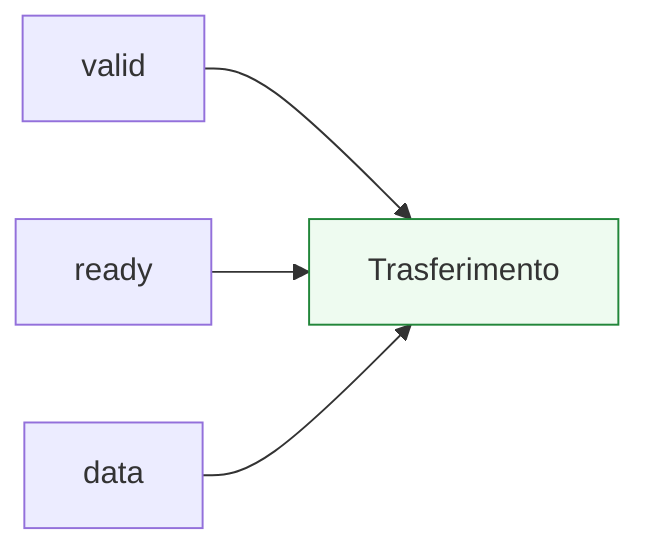
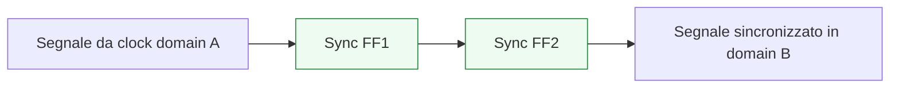

# Interfacce, handshake e CDC

Dopo aver collegato VHDL ai contesti **FPGA** e **ASIC**, il passo successivo naturale è affrontare un tema fondamentale dell’integrazione tra blocchi: il modo in cui i moduli comunicano tra loro. In questa pagina il focus è su tre aspetti strettamente collegati:
- le **interfacce**
- i **protocolli a handshake**
- il **CDC** (*Clock Domain Crossing*)

Questa lezione è molto importante perché un modulo RTL non vive quasi mai isolato. Nella pratica, deve:
- ricevere dati da un altro blocco;
- inviare risultati a un consumer;
- scambiare segnali di controllo;
- coordinarsi con tempi e disponibilità diverse;
- attraversare, in certi casi, confini tra domini di clock differenti.

Dal punto di vista progettuale, questi temi sono centrali perché collegano il linguaggio VHDL a problemi molto reali:
- come definire interfacce leggibili;
- come evitare perdita o duplicazione dei dati;
- come sincronizzare il trasferimento tra produttore e consumatore;
- come gestire il rischio di metastabilità;
- come costruire moduli integrabili in sistemi più grandi.

Questa pagina mantiene il taglio della sezione:
- didattico ma tecnico;
- orientato all’RTL sintetizzabile;
- attento alla relazione tra semantica, timing e integrazione;
- accompagnato da esempi di codice e schemi quando utili.



## 1. Perché questa pagina è importante

La prima domanda utile è: perché interfacce, handshake e CDC meritano una trattazione congiunta?

### 1.1 Perché riguardano tutti l’integrazione
Quando due blocchi comunicano, bisogna capire:
- quali segnali si scambiano;
- con quale regola temporale;
- quando il dato è valido;
- quando può essere accettato;
- se i blocchi condividono o meno lo stesso clock.

### 1.2 Perché l’RTL non basta da solo
Non basta avere un datapath corretto o una FSM ben scritta. Serve anche che il blocco sia capace di:
- dialogare in modo affidabile con l’esterno;
- esportare una interfaccia leggibile;
- evitare comportamenti ambigui o pericolosi.

### 1.3 Perché il CDC cambia la natura del problema
Quando due blocchi sono in domini di clock diversi, non basta più parlare di semplice protocollo. Entra in gioco la robustezza temporale del trasferimento.

---

## 2. Che cos’è una interfaccia

Una **interfaccia** è l’insieme dei segnali e delle regole con cui un modulo comunica con l’esterno.

### 2.1 Significato essenziale
Un’interfaccia non è solo una lista di porte. È anche:
- una convenzione di utilizzo;
- una semantica del dato;
- una regola su quando il dato è valido;
- una struttura di controllo.

### 2.2 Perché è importante
Due blocchi possono avere porte con nomi compatibili ma non essere davvero interoperabili se non condividono le stesse regole di uso.

### 2.3 Esempi tipici di segnali di interfaccia
- dati
- valid
- ready
- request
- acknowledge
- start
- done
- enable
- flag di stato

---

## 3. Interfaccia come contratto tra blocchi

È utile pensare l’interfaccia come un **contratto**.

### 3.1 Che cosa stabilisce il contratto
- chi produce il dato;
- chi lo consuma;
- quando il dato è valido;
- quando può essere accettato;
- come si gestiscono attesa, backpressure o completamento.

### 3.2 Perché questa visione aiuta
Evita di leggere i segnali come fili isolati e aiuta a capirli come parte di un comportamento coordinato.

### 3.3 Perché è importante in VHDL
Nella `entity`, una buona interfaccia dovrebbe già rendere leggibile:
- ruolo dei segnali;
- natura dei dati;
- logica di controllo del trasferimento.

---

## 4. Interfacce semplici e interfacce con protocollo

Non tutte le interfacce hanno la stessa complessità.

### 4.1 Interfacce semplici
In certi casi un modulo ha:
- ingressi dati;
- uscite dati;
- eventualmente un clock comune;

e la comunicazione è relativamente diretta.

### 4.2 Interfacce con protocollo
In altri casi serve una disciplina più ricca:
- il produttore non può inviare sempre;
- il consumatore non è sempre pronto;
- serve una segnalazione di validità;
- il dato deve essere accettato solo in certe condizioni.

### 4.3 Perché è importante
Molti blocchi reali richiedono un protocollo di handshake, non una semplice connessione combinatoria.

---

## 5. Che cos’è un handshake

Un **handshake** è un meccanismo con cui due blocchi coordinano il trasferimento di un’informazione.

### 5.1 Significato essenziale
L’idea di base è che il dato non viene considerato trasferito solo perché “appare su un bus”, ma perché esiste un accordo temporale tra:
- chi lo presenta;
- chi lo accetta.

### 5.2 Perché serve
Serve quando:
- il produttore e il consumatore non sono sempre allineati;
- possono esserci attese;
- il trasferimento deve essere esplicitamente confermato;
- bisogna evitare perdita o duplicazione del dato.

### 5.3 Esempi tipici
- `valid/ready`
- `request/ack`
- `start/done`

---

## 6. Handshake `valid/ready`

Uno dei protocolli più importanti e diffusi è il modello `valid/ready`.

### 6.1 Significato del protocollo
- il produttore mette il dato e alza `valid`
- il consumatore alza `ready` quando può accettare
- il trasferimento si considera avvenuto quando entrambe le condizioni sono soddisfatte nel contesto temporale previsto

### 6.2 Perché è molto utile
Permette di gestire:
- produttore e consumatore indipendenti;
- backpressure;
- trasferimenti continui;
- pipeline e flussi di dati.

### 6.3 Perché è importante in RTL
Driver, FSM, datapath e registri devono tutti essere coerenti con il significato del protocollo.



---

## 7. Handshake `request/ack`

Un altro protocollo classico è `request/ack`.

### 7.1 Significato essenziale
- un blocco alza `request` per chiedere un trasferimento o una operazione
- l’altro segnala `ack` per riconoscere o accettare la richiesta

### 7.2 Dove è utile
Può comparire in:
- controlli semplici;
- protocolli più lenti o orientati agli eventi;
- interazioni di avvio/completamento.

### 7.3 Perché è importante
Mostra una forma più esplicita di coordinamento rispetto a una semplice relazione dati/clock.

---

## 8. Handshake `start/done`

Un altro schema utile, specialmente nei controller, è `start/done`.

### 8.1 Significato
- `start` indica l’avvio di una operazione
- `done` indica il completamento

### 8.2 Perché è importante
È tipico di blocchi che:
- non producono un dato a ogni ciclo;
- lavorano su più cicli;
- espongono una forma di controllo sequenziale piuttosto che un flusso continuo di dati.

### 8.3 Collegamento con FSM
Questo protocollo è spesso governato da una macchina a stati.

---

## 9. Handshake e datapath

Il protocollo di handshake non è solo un dettaglio della control unit. Ha un impatto diretto sul datapath.

### 9.1 Perché
Il dato:
- deve essere presentato nel momento corretto;
- deve essere mantenuto stabile quando richiesto dal protocollo;
- deve avanzare solo quando il trasferimento è considerato valido.

### 9.2 Implicazioni tipiche
- registri di input/output;
- enable di caricamento;
- mux di selezione;
- controllo della pipeline;
- validità del dato.

### 9.3 Perché è importante
Il protocollo cambia il modo in cui il datapath si muove nel tempo.

---

## 10. Handshake e control unit

I protocolli di handshake sono spesso gestiti da una control unit o da una FSM.

### 10.1 Che cosa decide il controllo
- quando alzare `valid` o `request`
- quando considerare un trasferimento completato
- quando aspettare
- quando cambiare stato
- quando generare `done` o `ack`

### 10.2 Perché è importante
Molti problemi di protocollo non nascono dal dato, ma da un controllo temporale sbagliato del trasferimento.

### 10.3 Collegamento con le FSM
Le FSM sono spesso lo strumento naturale per modellare questi comportamenti.

---

## 11. Esempio semplice di interfaccia con `valid/ready`

Vediamo un frammento VHDL molto semplificato dal lato del produttore.

```vhdl
process(clk, reset)
begin
  if reset = '1' then
    valid <= '0';
    data  <= (others => '0');
  elsif rising_edge(clk) then
    if load_new = '1' then
      data  <= data_in;
      valid <= '1';
    elsif valid = '1' and ready = '1' then
      valid <= '0';
    end if;
  end if;
end process;
```

### 11.1 Che cosa mostra
- il blocco carica un dato;
- segnala `valid`;
- rilascia il trasferimento quando il consumer è pronto.

### 11.2 Perché è utile
Mostra il legame tra:
- registro del dato;
- controllo del valid;
- protocollo di accettazione.

### 11.3 Perché non va letto come caso universale
È solo un esempio introduttivo, ma chiarisce bene la logica base di un handshake.

---

## 12. Errori tipici nei protocolli a handshake

I protocolli di interfaccia sono un terreno fertile per bug sottili.

### 12.1 Dato non mantenuto quando necessario
Il produttore cambia il dato troppo presto.

### 12.2 `valid` o `request` gestiti male
Il trasferimento può essere perso o ripetuto.

### 12.3 Consumer che legge fuori dal protocollo
Il blocco accetta o usa il dato nel momento sbagliato.

### 12.4 Controllo poco chiaro
FSM e datapath non sono allineati sul significato del trasferimento.

### 12.5 Perché è importante
Molti bug di integrazione nascono proprio qui, non nella funzione interna del singolo blocco.

---

## 13. Che cos’è il CDC

Il **CDC** (*Clock Domain Crossing*) è il problema del trasferimento di informazione tra due blocchi che appartengono a **domini di clock diversi**.

### 13.1 Significato essenziale
Se due moduli non condividono lo stesso clock, non si può assumere che un segnale generato da uno venga campionato in modo pulito dall’altro.

### 13.2 Perché è importante
In quel caso compaiono rischi come:
- campionamento ambiguo;
- metastabilità;
- perdita di informazione;
- comportamento non ripetibile.

### 13.3 Perché merita attenzione specifica
Il CDC non è un semplice problema di protocollo locale. È un problema di robustezza temporale tra domini asincroni o quasi indipendenti.

---

## 14. Che cos’è la metastabilità

Quando un segnale attraversa un confine di clock senza adeguata sincronizzazione, il circuito può entrare in una condizione temporanea di **metastabilità**.

### 14.1 Significato essenziale
Un flip-flop può non risolversi immediatamente in un valore logico stabile noto.

### 14.2 Perché è pericoloso
Il comportamento risultante può essere:
- non prevedibile;
- non ripetibile;
- difficile da simulare in modo realistico;
- molto pericoloso in un sistema reale.

### 14.3 Perché è importante in questa pagina
Il CDC va affrontato tenendo presente che non basta “collegare un segnale” tra due domini. Serve una struttura di attraversamento robusta.

---

## 15. CDC per segnali di controllo semplici

Nel caso più semplice, si vuole trasferire un singolo segnale di controllo tra due clock domain.

### 15.1 Strategia tipica
Un approccio classico è usare una piccola catena di sincronizzazione nel dominio ricevente.

### 15.2 Idea concettuale
Il segnale non viene usato subito, ma passa attraverso più stadi di registro nel nuovo dominio.



### 15.3 Perché è importante
Questo riduce il rischio che il valore metastabile si propaghi direttamente nella logica del dominio ricevente.

---

## 16. CDC e bus multi-bit

Il problema diventa più delicato quando non si trasferisce un solo bit, ma un insieme di segnali correlati.

### 16.1 Perché è più difficile
Un bus multi-bit non può essere trattato ingenuamente come “più segnali singoli” se serve coerenza tra i bit.

### 16.2 Che cosa può succedere
Bit diversi possono essere campionati in istanti diversi, producendo una combinazione incoerente.

### 16.3 Conseguenza progettuale
Per trasferimenti più ricchi servono protocolli o strutture più robuste:
- handshake;
- bufferizzazione;
- meccanismi di validazione;
- strutture dedicate di attraversamento.

---

## 17. Interfacce e CDC insieme

Molto spesso il CDC non si risolve con un semplice sincronizzatore, ma con una interfaccia ben progettata.

### 17.1 Perché
Quando attraversi un confine di clock, devi chiarire:
- che cosa viene trasferito;
- quando è considerato valido;
- come viene confermato;
- come si evita la perdita di informazione.

### 17.2 Conseguenza
Handshake e CDC spesso si incontrano: il protocollo diventa uno strumento per rendere robusto l’attraversamento.

### 17.3 Perché è importante
Questo mostra che interfaccia e temporizzazione non sono due temi separati.

---

## 18. VHDL e chiarezza delle interfacce

Anche se VHDL non ha qui il focus su costrutti avanzati di interfacing come in altri linguaggi, resta fondamentale definire le interfacce in modo chiaro.

### 18.1 Buone proprietà di una interfaccia ben scritta
- nomi leggibili;
- separazione chiara tra dati e controllo;
- porte organizzate;
- semantica facilmente documentabile;
- compatibilità con verifica e debug.

### 18.2 Perché è importante
Una interfaccia poco chiara rende più difficile:
- integrare i blocchi;
- costruire il testbench;
- leggere le waveform;
- diagnosticare errori di protocollo.

---

## 19. Errori comuni

I temi di questa pagina concentrano molti errori tipici dell’integrazione progettuale.

### 19.1 Considerare una interfaccia come semplice elenco di porte
Si perde la dimensione di protocollo.

### 19.2 Trattare il trasferimento dati come immediato quando serve handshake
Si introducono perdita o duplicazione di informazioni.

### 19.3 Ignorare il rapporto tra controllo e dato
Il protocollo si rompe anche se il datapath interno è corretto.

### 19.4 Attraversare domini di clock senza strategia esplicita
Questo è uno degli errori più pericolosi in assoluto.

### 19.5 Pensare che il CDC sia “solo un dettaglio di implementazione”
In realtà è una parte sostanziale della correttezza del sistema.

---

## 20. Buone pratiche di modellazione

Per affrontare bene interfacce, handshake e CDC in VHDL, alcune linee guida sono particolarmente utili.

### 20.1 Pensare all’interfaccia come contratto
Non solo come lista di segnali.

### 20.2 Separare bene dati e controllo
Questo rende il modulo più leggibile e integrabile.

### 20.3 Modellare esplicitamente il protocollo
Specialmente quando esistono:
- attese;
- backpressure;
- conferma del trasferimento;
- segnali di completamento.

### 20.4 Trattare il CDC come problema strutturale
Non come semplice collegamento di fili tra domini.

### 20.5 Scrivere testbench che riflettano il protocollo
La verifica deve accompagnare la semantica dell’interfaccia, non solo i valori dei segnali.

---

## 21. Collegamento con il resto della sezione

Questa pagina si collega direttamente a:
- **`entity-architecture-and-types.md`**, perché le interfacce nascono dalla `entity`;
- **`fsm.md`**, perché molti protocolli sono controllati da macchine a stati;
- **`datapath-control-and-pipelining.md`**, perché handshake e controllo influenzano il flusso del dato;
- **`timing-and-clocking.md`**, perché i protocolli e soprattutto il CDC sono problemi anche temporali;
- **`verification-and-testbench.md`**, **`stimulus-self-checking-and-simulation.md`** e **`debug-and-waveforms.md`**, perché interfacce e CDC richiedono verifica e debug molto consapevoli.

Questa pagina prepara inoltre molto bene la chiusura della sezione, perché collega VHDL a uno dei livelli più realistici dell’integrazione tra moduli.

---

## 22. In sintesi

Interfacce, handshake e CDC sono temi centrali perché definiscono il modo in cui i moduli VHDL comunicano tra loro in un sistema reale.

- L’**interfaccia** è il contratto tra blocchi.
- L’**handshake** è il meccanismo che coordina il trasferimento dei dati.
- Il **CDC** è il problema del trasferimento affidabile tra domini di clock diversi.

Capire bene questi temi significa fare un passo importante oltre il singolo modulo RTL e iniziare a leggere il progetto come un sistema di blocchi che devono collaborare in modo corretto, leggibile e robusto nel tempo.

## Prossimo passo

Il passo successivo naturale è **`vhdl-vs-verilog-systemverilog.md`**, perché a questo punto conviene chiudere la sezione con una pagina di confronto che chiarisca:
- differenze di stile e semantica
- punti di forza di VHDL
- rapporto con Verilog e SystemVerilog
- quando ciascun linguaggio è più naturale o più usato
