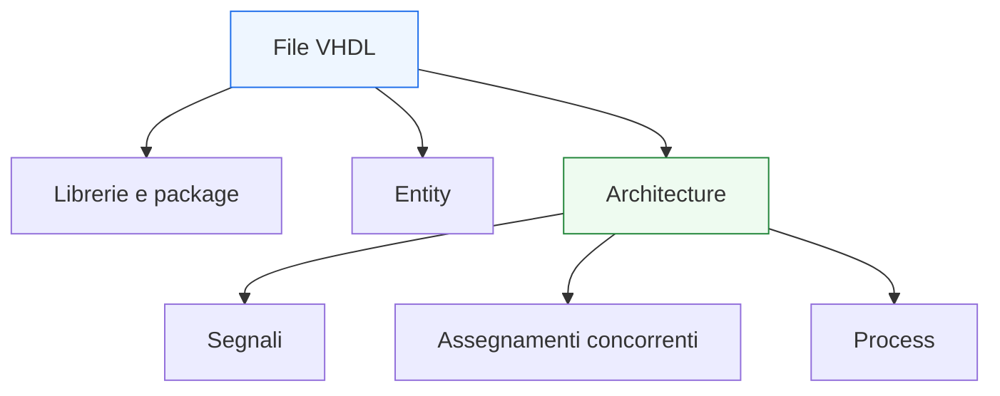
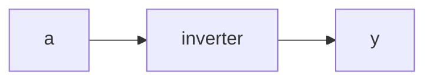
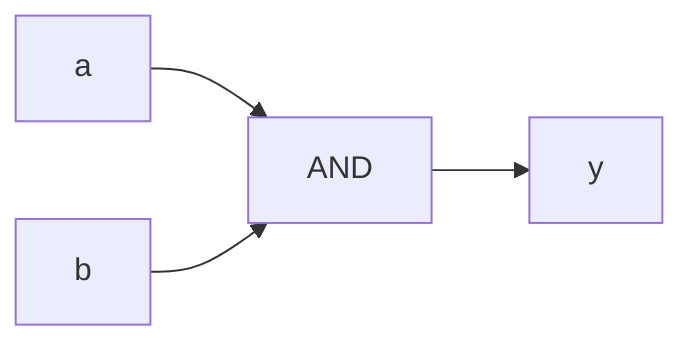

# Basi del linguaggio VHDL

Dopo la panoramica iniziale, il passo successivo naturale è entrare nella forma concreta del linguaggio e chiarire come si presenta un file VHDL, quali sono i suoi elementi sintattici fondamentali e quali regole di lettura conviene adottare fin dall’inizio.

Questa pagina non ha ancora l’obiettivo di esaurire temi come `entity`, `architecture`, `signals` o `process`, che verranno sviluppati nelle lezioni successive. Qui l’obiettivo è più essenziale: costruire una base solida per leggere e scrivere i primi blocchi VHDL senza confondere:
- sintassi;
- semantica;
- significato hardware.

Nel caso di VHDL, questa distinzione è particolarmente importante perché una descrizione apparentemente semplice può avere implicazioni molto diverse a seconda del contesto in cui compare.

Questa lezione mantiene il taglio già definito per la sezione:
- didattico ma tecnico;
- orientato alla progettazione RTL;
- attento alla sintesi e alla leggibilità;
- accompagnato da esempi di codice e schemi quando utili.



## 1. Che cos’è un file VHDL

Un file VHDL contiene la descrizione di uno o più elementi del progetto hardware. In una forma molto comune, un file include:
- dichiarazioni di librerie e package;
- una `entity`;
- una `architecture`.

### 1.1 Visione intuitiva
Si può pensare a questa struttura in modo semplice:
- la **`entity`** descrive l’interfaccia del blocco;
- la **`architecture`** descrive il comportamento o la struttura interna del blocco.

### 1.2 Perché è utile saperlo fin da subito
Anche quando ancora non si conoscono tutti i dettagli del linguaggio, questa distinzione aiuta già a leggere meglio il codice:
- che cosa entra ed esce dal modulo;
- che cosa succede all’interno.

### 1.3 Esempio minimo

```vhdl
library ieee;
use ieee.std_logic_1164.all;

entity and_gate is
  port (
    a : in  std_logic;
    b : in  std_logic;
    y : out std_logic
  );
end entity and_gate;

architecture rtl of and_gate is
begin
  y <= a and b;
end architecture rtl;
```

Questo esempio è volutamente semplice, ma mostra già la forma generale di un modulo VHDL elementare.

---

## 2. Librerie e package

All’inizio di molti file VHDL compaiono dichiarazioni come:

```vhdl
library ieee;
use ieee.std_logic_1164.all;
```

### 2.1 A che cosa servono
Servono a rendere disponibili:
- tipi standard;
- operatori;
- definizioni utili al progetto.

### 2.2 Perché sono importanti
In pratica, permettono di usare tipi come:
- `std_logic`
- `std_logic_vector`

che sono fondamentali nella progettazione digitale moderna in VHDL.

### 2.3 Primo punto di attenzione
In VHDL i tipi contano molto. Non basta “avere un segnale”: bisogna sapere di che tipo è, e quali operatori o conversioni siano leciti.

---

## 3. Sintassi generale: dichiarazioni e corpo

Uno degli aspetti più utili da capire presto è che il linguaggio alterna spesso:
- **parti dichiarative**
- **parti esecutive o descrittive**

### 3.1 Nella `entity`
La `entity` contiene soprattutto dichiarazioni dell’interfaccia:
- nomi delle porte;
- direzione;
- tipo.

### 3.2 Nella `architecture`
L’`architecture` contiene:
- una parte dichiarativa, dove si introducono segnali interni o costanti;
- una parte descrittiva, dove si esprime il comportamento.

### 3.3 Perché questa distinzione conta
Aiuta a leggere con ordine il codice:
- prima si vede che cosa esiste;
- poi si vede come questi elementi vengono collegati o usati.

---

## 4. La `entity`: interfaccia del blocco

La `entity` descrive il punto di contatto del blocco con l’esterno.

### 4.1 Che cosa contiene
Tipicamente contiene:
- nome del blocco;
- porte di ingresso e uscita;
- eventualmente generics, che vedremo più avanti.

### 4.2 Esempio

```vhdl
entity inverter is
  port (
    a : in  std_logic;
    y : out std_logic
  );
end entity inverter;
```

### 4.3 Significato hardware
Questa descrizione non implementa ancora il circuito. Sta solo dichiarando:
- un ingresso `a`
- un’uscita `y`

Si tratta quindi della **forma esterna** del blocco.



---

## 5. La `architecture`: descrizione interna

La `architecture` dice che cosa fa il blocco.

### 5.1 Struttura generale

```vhdl
architecture rtl of inverter is
begin
  y <= not a;
end architecture rtl;
```

### 5.2 Significato del nome
Il nome `rtl` è una convenzione molto comune e utile, perché esplicita che l’architettura è scritta con intento RTL.

### 5.3 Che cosa rappresenta qui
In questo caso, il comportamento è puramente combinatorio:
- l’uscita `y` è il NOT dell’ingresso `a`.

---

## 6. Porte: direzione e tipo

Le porte sono tra i primi elementi sintattici da saper leggere bene.

### 6.1 Direzione
Le direzioni più comuni sono:
- `in`
- `out`

In contesti più avanzati esistono anche altri casi, ma per iniziare questi due sono i più importanti.

### 6.2 Tipo
Ogni porta ha un tipo, per esempio:
- `std_logic`
- `std_logic_vector(7 downto 0)`

### 6.3 Esempio

```vhdl
entity simple_bus is
  port (
    clk  : in  std_logic;
    data : in  std_logic_vector(7 downto 0);
    y    : out std_logic_vector(7 downto 0)
  );
end entity simple_bus;
```

### 6.4 Perché è importante
In VHDL non si può ignorare il tipo dei segnali. La lettura del codice passa sempre anche da lì.

---

## 7. Identificatori, parole chiave e stile di lettura

Per leggere bene VHDL conviene riconoscere subito tre categorie:
- parole chiave del linguaggio;
- identificatori scelti dal progettista;
- simboli di sintassi.

### 7.1 Parole chiave
Per esempio:
- `entity`
- `architecture`
- `begin`
- `end`
- `port`
- `signal`
- `process`

### 7.2 Identificatori
Sono i nomi scelti dal progettista:
- nomi di moduli;
- nomi di segnali;
- nomi di porte;
- nomi di architetture.

### 7.3 Simboli utili da riconoscere
Per esempio:
- `:`
- `;`
- `<=`
- `=>`
- `(` e `)`

### 7.4 Perché è utile
Riconoscere a colpo d’occhio queste categorie rende la lettura del codice molto più rapida.

---

## 8. Assegnamento di segnale: una prima lettura

Uno dei primi costrutti che si incontrano è l’assegnamento di segnale:

```vhdl
y <= a and b;
```

### 8.1 Che cosa vuol dire
Significa che `y` assume il valore dell’espressione `a and b`.

### 8.2 Perché non va letto in modo troppo “software”
Non significa “eseguo questa istruzione e poi passo alla successiva”, ma descrive una relazione hardware o concorrente tra segnali.

### 8.3 Significato hardware
Nel caso più semplice, questa riga corrisponde a logica combinatoria.



---

## 9. Prime espressioni logiche

In VHDL si possono costruire espressioni logiche usando operatori come:
- `and`
- `or`
- `not`

### 9.1 Esempio

```vhdl
y <= (a and b) or c;
```

### 9.2 Perché è utile introdurlo presto
Già da questi esempi si capisce che VHDL permette di esprimere in forma testuale la funzione logica del circuito.

### 9.3 Attenzione importante
Anche quando la sintassi sembra vicina a quella di un linguaggio tradizionale, il significato resta hardware.

---

## 10. Vettori: primi segnali multi-bit

La progettazione reale usa quasi sempre segnali più larghi di un singolo bit.

### 10.1 Esempio di vettore

```vhdl
signal data_in  : std_logic_vector(7 downto 0);
signal data_out : std_logic_vector(7 downto 0);
```

### 10.2 Che cosa vuol dire
Qui si stanno dichiarando due segnali da 8 bit.

### 10.3 Perché compare `downto`
Indica l’ordinamento degli indici del vettore.

### 10.4 Perché è importante
La direzione degli indici in VHDL è un aspetto da tenere sotto controllo fin dall’inizio, perché influisce sulla leggibilità e sull’interpretazione delle slice o dei singoli bit.

---

## 11. Commenti e leggibilità del codice

Una base importante del linguaggio è anche la leggibilità.

### 11.1 Commenti
In VHDL il commento singolo si introduce con:

```vhdl
-- questo è un commento
```

### 11.2 Perché sono utili
I commenti aiutano a esplicitare:
- intenzione progettuale;
- significato del blocco;
- assunzioni;
- note su timing, reset o sintesi.

### 11.3 Attenzione
I commenti devono aiutare a capire il codice, non sostituire un codice scritto male.

---

## 12. Differenza tra descrizione minima e buona descrizione

Un punto importante da fissare subito è che una descrizione minima non è sempre una buona descrizione.

### 12.1 Descrizione minima
Può essere formalmente corretta e magari simulare.

### 12.2 Buona descrizione
Dovrebbe essere anche:
- leggibile;
- coerente con il significato hardware;
- sintetizzabile in modo prevedibile;
- chiara rispetto a clock, reset e intenti RTL.

### 12.3 Perché dirlo già adesso
Questa distinzione sarà fondamentale in tutta la sezione.

---

## 13. Esempio completo molto semplice

Mettiamo insieme i concetti base in un modulo elementare.

```vhdl
library ieee;
use ieee.std_logic_1164.all;

entity logic_block is
  port (
    a : in  std_logic;
    b : in  std_logic;
    c : in  std_logic;
    y : out std_logic
  );
end entity logic_block;

architecture rtl of logic_block is
begin
  y <= (a and b) or c;
end architecture rtl;
```

### 13.1 Che cosa mostra questo esempio
Mostra:
- librerie;
- entity;
- porte;
- architecture;
- assegnamento concorrente;
- semplice funzione combinatoria.

### 13.2 Perché è utile
È una buona base minima per imparare a riconoscere la struttura di un file VHDL.

---

## 14. Prime regole pratiche di lettura

Prima di proseguire nelle lezioni successive, conviene fissare alcune regole molto semplici ma molto utili.

### 14.1 Leggi prima l’interfaccia
Guarda:
- nome del blocco;
- ingressi;
- uscite;
- larghezza dei segnali.

### 14.2 Poi leggi la parte interna
Cerca:
- segnali dichiarati;
- assegnamenti concorrenti;
- eventuali process.

### 14.3 Chiediti sempre che hardware descrive
Ogni volta che incontri una riga di codice, prova a domandarti:
- che tipo di struttura implica?
- combinatoria o sequenziale?
- quale relazione stabilisce tra i segnali?

### 14.4 Perché è una buona abitudine
Questa è una delle basi più forti per imparare davvero a leggere RTL.

---

## 15. Errori iniziali da evitare

Anche in una lezione introduttiva conviene segnalare alcuni errori tipici.

### 15.1 Pensare che tutto sia sequenziale
In VHDL non tutto si legge come “prima questo, poi quello”.

### 15.2 Ignorare i tipi
I tipi sono parte sostanziale del significato del codice.

### 15.3 Concentrarsi solo sulla sintassi
Senza collegamento al significato hardware, la sintassi da sola serve poco.

### 15.4 Trascurare la forma del file
Sapere dove si trovano dichiarazioni, interfaccia e comportamento è essenziale per orientarsi.

---

## 16. Buone pratiche iniziali

Per partire bene con VHDL, alcune buone abitudini aiutano molto.

### 16.1 Usare nomi chiari
Per blocchi, segnali e porte.

### 16.2 Tenere ordinata la struttura del file
Librerie, entity e architecture devono risultare leggibili a colpo d’occhio.

### 16.3 Commentare con misura
Spiegare l’intenzione, non ripetere banalmente la sintassi.

### 16.4 Pensare sempre in termini hardware
Anche negli esempi più piccoli.

---

## 17. Collegamento con il resto della sezione

Questa pagina prepara direttamente le lezioni successive, in particolare:
- **`entity-architecture-and-types.md`**, che approfondirà la struttura del modulo e i tipi principali;
- **`signals-variables-and-semantics.md`**, che chiarirà la semantica dei segnali e la differenza rispetto alle variabili;
- **`process-and-concurrent-statements.md`**, che introdurrà più a fondo la distinzione tra descrizione concorrente e descrizione dentro i process.

Serve quindi come base sintattica e concettuale per tutto il resto del percorso.

---

## 18. In sintesi

Le basi del linguaggio VHDL ruotano attorno a una struttura semplice ma importante:
- librerie e package;
- `entity` come interfaccia;
- `architecture` come descrizione interna;
- segnali e assegnamenti come primi elementi del comportamento hardware.

L’aspetto più importante da portare con sé da questa lezione è che il codice VHDL va letto sempre su due piani:
- quello della sintassi;
- quello del significato hardware.

Questa doppia lettura è la chiave per affrontare correttamente tutto il resto della sezione.

## Prossimo passo

Il passo successivo naturale è **`entity-architecture-and-types.md`**, perché adesso conviene approfondire in modo ordinato:
- struttura di `entity` e `architecture`
- dichiarazione delle porte
- tipi più usati nei moduli RTL
- prime scelte che influenzano chiarezza e sintetizzabilità del codice
