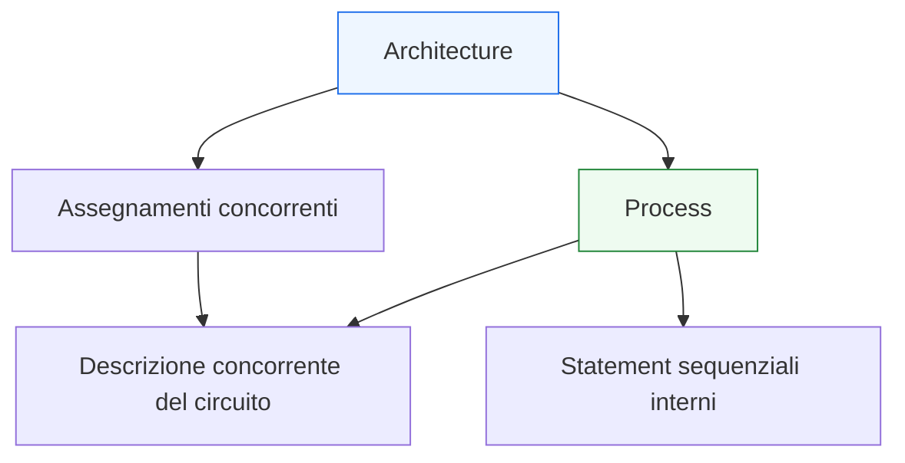
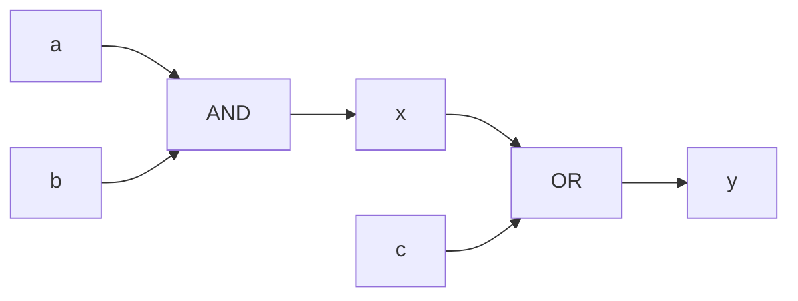
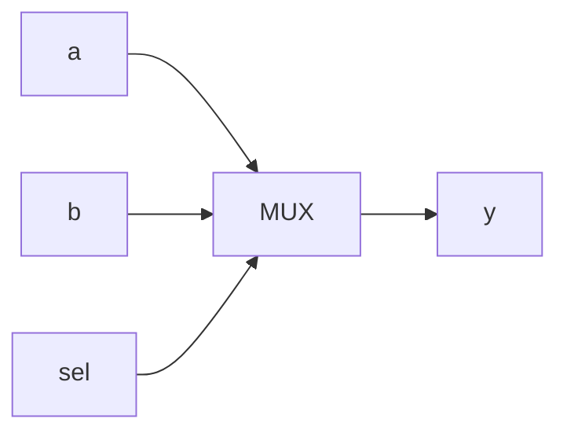

# Process e assegnamenti concorrenti

Dopo aver chiarito la differenza tra **segnali**, **variabili** e semantica del linguaggio, il passo successivo naturale è affrontare il contesto in cui questi elementi acquistano significato pieno: il rapporto tra **descrizione concorrente** e **`process`**.

Questa pagina è una delle più importanti dell’intera sezione VHDL, perché molti dubbi iniziali sul linguaggio nascono proprio qui. In particolare, è comune:
- leggere tutto il codice come se fosse puramente sequenziale;
- non capire che cosa appartenga al livello concorrente del linguaggio;
- usare un `process` senza coglierne il ruolo reale;
- non distinguere il “come si scrive” dal “che hardware si sta descrivendo”.

Dal punto di vista progettuale, questo tema è fondamentale perché in VHDL la descrizione dell’hardware nasce dall’interazione tra:
- costrutti concorrenti;
- process;
- segnali;
- semantica temporale;
- uso corretto di logica combinatoria e sequenziale.

Questa lezione mantiene il taglio della sezione:
- didattico ma tecnico;
- orientato alla progettazione RTL;
- attento al significato hardware;
- accompagnato da esempi di codice e schemi quando aiutano davvero.



## 1. Perché questa pagina è così importante

La prima domanda utile è: perché `process` e statement concorrenti meritano una trattazione dedicata?

### 1.1 Perché definiscono il modello mentale corretto di VHDL
Un codice VHDL ben letto non si interpreta come una lista lineare di istruzioni, ma come una combinazione di:
- relazioni concorrenti;
- blocchi procedurali che vivono dentro il modello concorrente del linguaggio.

### 1.2 Perché gli errori iniziali sono spesso concettuali
Molti problemi nascono da idee sbagliate come:
- “il process è una funzione software”
- “tutto quello che compare nel file è eseguito in ordine”
- “un assegnamento fuori dal process è solo una forma abbreviata di codice sequenziale”

### 1.3 Perché questo tema prepara tutta la modellazione RTL
Capire bene questo punto rende poi molto più naturali:
- logica combinatoria;
- logica sequenziale;
- registri;
- FSM;
- pipeline;
- testbench.

---

## 2. Che cosa significa “descrizione concorrente”

Uno dei concetti più importanti in VHDL è la **concorrenza**.

### 2.1 Significato intuitivo
In hardware, più parti del circuito esistono e operano contemporaneamente. Non c’è un’unica sequenza lineare di esecuzione come in un programma classico.

### 2.2 Implicazione sul linguaggio
Per questo, in VHDL, molti costrutti descrivono relazioni che devono essere lette come attive nello stesso tempo dal punto di vista del modello hardware.

### 2.3 Primo esempio

```vhdl
x <= a and b;
y <= x or c;
```

### 2.4 Come leggerlo
Queste due righe non vanno lette come:
- prima calcolo `x`
- poi calcolo `y`

nel senso di una routine software locale.

Vanno lette come:
- esiste una relazione tra `x` e `a`, `b`
- esiste una relazione tra `y` e `x`, `c`

Queste relazioni appartengono entrambe alla descrizione concorrente del circuito.

---

## 3. Che cos’è un `process`

Il `process` è un costrutto concorrente che contiene al suo interno una descrizione **sequenziale**.

### 3.1 Questa frase va capita bene
- Il `process` vive dentro il mondo concorrente della `architecture`
- Ma il suo contenuto viene scritto come sequenza di istruzioni

### 3.2 Perché è importante
Questo significa che il `process` non annulla la concorrenza del linguaggio. Piuttosto, introduce un modo strutturato per descrivere certe parti del comportamento usando una forma procedurale locale.

### 3.3 Esempio minimo

```vhdl
process(a, b, c)
begin
  y <= (a and b) or c;
end process;
```

### 3.4 Come leggerlo
Il `process` è un oggetto concorrente della `architecture`, ma il corpo interno viene espresso in forma sequenziale.

---

## 4. Fuori dal `process`: statement concorrenti

Gli assegnamenti fuori dai process appartengono direttamente al livello concorrente.

### 4.1 Esempio

```vhdl
architecture rtl of example is
begin
  x <= a and b;
  y <= x or c;
end architecture rtl;
```

### 4.2 Significato
Questa è una descrizione concorrente di una rete logica.

### 4.3 Significato hardware
Dal punto di vista strutturale, si può leggere come:
- una porta AND che genera `x`
- una porta OR che usa `x` e `c` per generare `y`



### 4.4 Perché è utile
Questa forma è molto diretta quando si vuole descrivere relazioni combinatorie semplici e leggibili.

---

## 5. Dentro il `process`: statement sequenziali

Dentro un process, invece, il linguaggio usa una forma sequenziale.

### 5.1 Esempio

```vhdl
process(a, b, c)
  variable tmp : std_logic;
begin
  tmp := a and b;
  y   <= tmp or c;
end process;
```

### 5.2 Che cosa significa
All’interno del process:
- le istruzioni sono lette nell’ordine locale del blocco;
- le variabili possono essere usate come appoggi di calcolo;
- il significato resta comunque legato al modello hardware complessivo.

### 5.3 Punto chiave
La forma sequenziale del process non trasforma VHDL in un linguaggio software. È solo un modo locale di organizzare la descrizione.

---

## 6. Il `process` non è una funzione software

Questo è uno degli equivoci più frequenti.

### 6.1 Somiglianza apparente
Un process assomiglia a una routine o a un blocco procedurale, perché:
- ha un corpo;
- contiene istruzioni;
- può usare variabili;
- si legge dall’alto verso il basso.

### 6.2 Differenza fondamentale
Il suo significato resta però hardware:
- descrive comportamento del circuito;
- si inserisce in una `architecture` concorrente;
- usa segnali con la loro semantica;
- può rappresentare logica combinatoria o sequenziale.

### 6.3 Perché questo è importante
Se si legge il process come software, si sbagliano:
- semantica dei segnali;
- significato del clock;
- inferenza di latch o registri;
- comportamento simulativo.

---

## 7. Perché usare un `process`

La domanda naturale è: se esistono gli assegnamenti concorrenti, perché usare un process?

### 7.1 Per descrivere logica più articolata
Un process è comodo quando:
- il comportamento richiede più passi locali;
- si vogliono usare `if`, `case` o variabili;
- si vuole descrivere logica combinatoria complessa;
- si vuole descrivere logica sincrona.

### 7.2 Per modellare registri e macchine a stati
I process sono particolarmente naturali per:
- descrizioni al fronte di clock;
- next-state logic;
- FSM;
- logica combinatoria con decisioni ramificate.

### 7.3 Per migliorare leggibilità
In molti casi un process rende più chiara una descrizione che, scritta solo con assegnamenti concorrenti, risulterebbe più dispersiva.

---

## 8. Sensitivity list: quando il `process` si rivaluta

Un process include spesso una sensitivity list.

### 8.1 Esempio

```vhdl
process(a, b, c)
begin
  y <= (a and b) or c;
end process;
```

### 8.2 Significato intuitivo
Il process viene rivalutato quando cambiano i segnali indicati nella sensitivity list.

### 8.3 Perché è importante
La sensitivity list influisce sul comportamento simulativo del process e, nei process combinatori, deve essere coerente con i segnali letti.

### 8.4 Collegamento con la modellazione RTL
Una sensitivity list incompleta può portare a simulazioni fuorvianti o a descrizioni poco corrette dal punto di vista della logica attesa.

---

## 9. Process combinatorio

Uno degli usi più comuni del process è la descrizione di logica combinatoria.

### 9.1 Esempio

```vhdl
process(a, b, sel)
begin
  if sel = '0' then
    y <= a;
  else
    y <= b;
  end if;
end process;
```

### 9.2 Significato hardware
Questa descrizione corrisponde a un multiplexer 2:1.



### 9.3 Perché il process è utile qui
La forma con `if` rende il mux più leggibile rispetto a una rete espressa solo con operatori logici.

---

## 10. Process sequenziale

Un altro uso fondamentale del process è la descrizione di logica sincrona.

### 10.1 Esempio

```vhdl
process(clk)
begin
  if rising_edge(clk) then
    q <= d;
  end if;
end process;
```

### 10.2 Significato hardware
Questa è la descrizione di un registro aggiornato sul fronte attivo del clock.

### 10.3 Perché il process è il contenitore naturale
La logica sequenziale richiede una forma che esprima chiaramente:
- fronte di clock;
- eventuale reset;
- comportamento registrato.

---

## 11. Concorrente fuori, sequenziale dentro

Questa è probabilmente la frase più importante dell’intera pagina.

### 11.1 Regola fondamentale
- Gli statement nella `architecture`, fuori dai process, sono **concorrenti**
- Gli statement dentro un `process` sono scritti in forma **sequenziale**

### 11.2 Ma con una precisazione fondamentale
Il `process` stesso è un oggetto **concorrente** rispetto agli altri statement della `architecture`.

### 11.3 Perché questa frase va memorizzata bene
È uno dei pilastri per leggere correttamente VHDL in ottica RTL.

---

## 12. Confronto diretto: forma concorrente e forma con process

Vediamo due descrizioni della stessa idea.

### 12.1 Forma concorrente

```vhdl
y <= a when sel = '0' else b;
```

### 12.2 Forma con process

```vhdl
process(a, b, sel)
begin
  if sel = '0' then
    y <= a;
  else
    y <= b;
  end if;
end process;
```

### 12.3 Che cosa si impara
Entrambe possono descrivere lo stesso multiplexer, ma:
- la prima è una forma concorrente diretta;
- la seconda usa un process con descrizione sequenziale interna.

### 12.4 Perché è utile saperlo
Aiuta a capire che VHDL offre più modi di descrivere lo stesso hardware, ma il progettista deve scegliere quello più chiaro e più adatto al contesto.

---

## 13. Process e segnali

Dentro un process si leggono e si assegnano spesso segnali, ma con la loro semantica propria.

### 13.1 Esempio

```vhdl
process(a, b, c)
begin
  tmp <= a and b;
  y   <= tmp or c;
end process;
```

immaginando `tmp` come segnale.

### 13.2 Perché è delicato
Qui non bisogna ragionare come se `tmp` fosse una variabile locale immediatamente aggiornata.

### 13.3 Collegamento con la pagina precedente
Questo è esattamente il motivo per cui era essenziale chiarire prima:
- segnali;
- variabili;
- semantica.

---

## 14. Process e variabili

Le variabili trovano il loro uso più naturale proprio dentro i process.

### 14.1 Esempio

```vhdl
process(a, b, c)
  variable tmp : std_logic;
begin
  tmp := a and b;
  y   <= tmp or c;
end process;
```

### 14.2 Perché è utile
La variabile permette di costruire in modo lineare un calcolo locale.

### 14.3 Buona regola
Usa la variabile quando serve un valore intermedio locale.  
Usa il segnale quando il valore deve esistere come parte esplicita del modulo.

---

## 15. Quando scegliere uno statement concorrente

Gli statement concorrenti sono molto utili quando la relazione hardware è semplice e diretta.

### 15.1 Casi tipici
- assegnamenti combinatori semplici
- relazioni strutturali tra segnali
- multiplexing semplice
- collegamenti tra sottoblocchi
- descrizioni molto leggibili a livello di rete

### 15.2 Vantaggi
- immediatezza
- chiarezza strutturale
- leggibilità per funzioni combinatorie semplici

### 15.3 Limite
Quando la logica diventa più articolata, l’uso esclusivo di statement concorrenti può rendere il codice meno leggibile.

---

## 16. Quando scegliere un `process`

Il process è utile quando la descrizione richiede più struttura.

### 16.1 Casi tipici
- logica combinatoria con `if` o `case`
- logica sincrona con clock e reset
- next-state logic di FSM
- calcolo intermedio con variabili
- comportamento più facile da esprimere in forma procedurale locale

### 16.2 Vantaggi
- maggiore controllo sulla leggibilità
- migliore organizzazione del flusso locale
- naturalezza per sequenziale e logica di controllo

### 16.3 Attenzione
Un process usato male può diventare più opaco di una descrizione concorrente chiara.

---

## 17. Significato hardware: stessa sintassi, hardware diverso a seconda del contesto

Un punto molto importante è che lo stesso costrutto superficiale non basta da solo a dire che hardware si sta descrivendo.

### 17.1 Esempio
Un assegnamento dentro un process:
- può contribuire a logica combinatoria
- oppure a logica registrata

a seconda del contesto del process.

### 17.2 Che cosa determina il significato
Conta:
- sensitivity list
- presenza del clock
- uso di `rising_edge`
- struttura di `if` e `case`
- completezza delle assegnazioni

### 17.3 Perché è importante
Questa è una delle ragioni per cui VHDL va sempre letto con attenzione al contesto, non solo riga per riga.

---

## 18. Errori comuni

Questo tema è pieno di errori tipici, soprattutto all’inizio.

### 18.1 Leggere tutto come software sequenziale
Errore concettuale di base.

### 18.2 Dimenticare che il process è concorrente rispetto al resto
Il contenuto è sequenziale, ma il process vive nel mondo concorrente della `architecture`.

### 18.3 Usare un process combinatorio con sensitivity list sbagliata
Questo genera simulazioni poco affidabili.

### 18.4 Usare un process quando uno statement concorrente sarebbe più chiaro
Il codice può diventare inutilmente pesante.

### 18.5 Usare statement concorrenti per logiche complesse in modo poco leggibile
Anche questo peggiora la qualità RTL.

---

## 19. Buone pratiche iniziali

Per usare bene process e statement concorrenti, alcune regole aiutano molto.

### 19.1 Chiediti sempre che cosa stai descrivendo
- una relazione combinatoria semplice?
- un blocco di controllo?
- un registro?
- una logica di prossima uscita o prossimo stato?

### 19.2 Usa lo statement concorrente quando è la forma più diretta
Soprattutto per logica semplice e strutturale.

### 19.3 Usa il process quando porta chiarezza reale
Soprattutto per:
- sequenziale
- mux con condizioni articolate
- FSM
- calcoli locali più ricchi

### 19.4 Mantieni leggibile il codice
La scelta tra forma concorrente e process deve migliorare il progetto, non complicarlo.

---

## 20. Collegamento con il resto della sezione

Questa pagina si collega direttamente a:
- **`signals-variables-and-semantics.md`**, che ha chiarito il comportamento degli oggetti usati dentro e fuori i process;
- **`combinational-vs-sequential.md`**, dove la distinzione tra process combinatori e sincroni diventerà esplicita;
- **`registers-mux-enables-reset.md`**, che mostrerà applicazioni tipiche dei process nella modellazione RTL;
- **`fsm.md`**, dove il process sarà uno degli strumenti principali di descrizione.

---

## 21. In sintesi

In VHDL convivono due livelli fondamentali:
- **descrizione concorrente**, che caratterizza la `architecture`;
- **descrizione sequenziale locale**, che compare dentro i `process`.

Il punto chiave è che il `process` non sostituisce la concorrenza del linguaggio: la incapsula in una forma locale più ordinata e più utile per certe descrizioni RTL.

Capire bene questo rapporto significa compiere uno dei passi più importanti nell’apprendimento corretto di VHDL.

## Prossimo passo

Il passo successivo naturale è **`combinational-vs-sequential.md`**, perché adesso conviene usare ciò che abbiamo chiarito su process e statement concorrenti per distinguere in modo rigoroso:
- logica combinatoria
- logica sequenziale
- process combinatori
- process sincroni
- implicazioni su sintesi, timing e correttezza RTL
