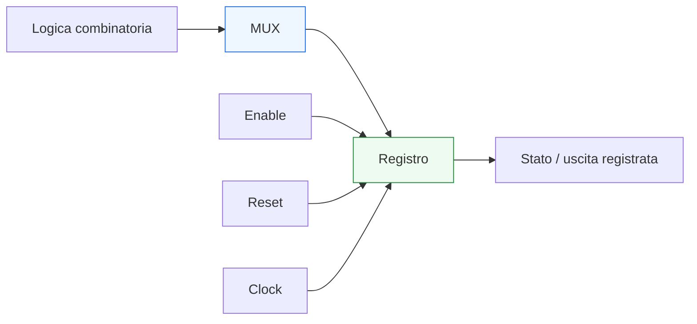
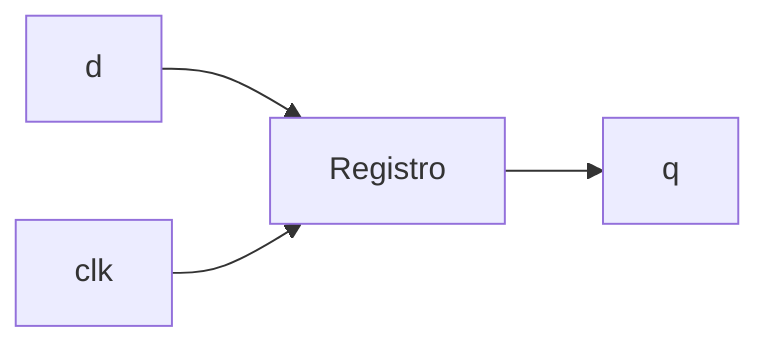
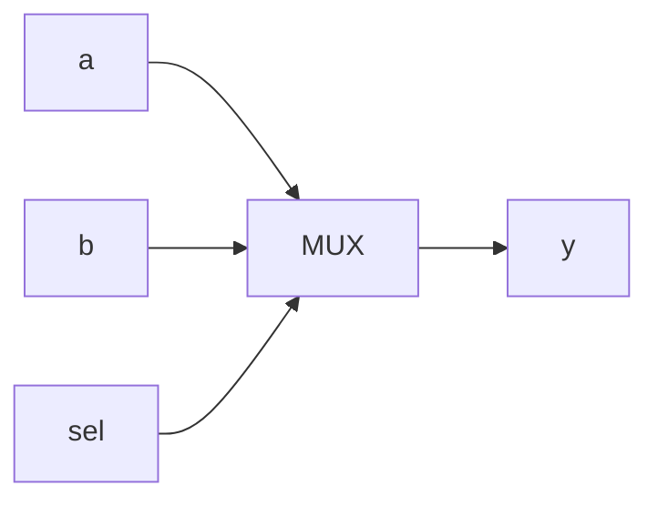
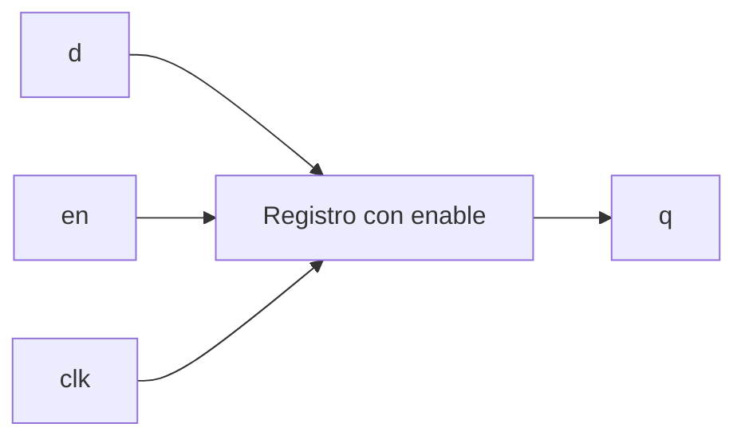
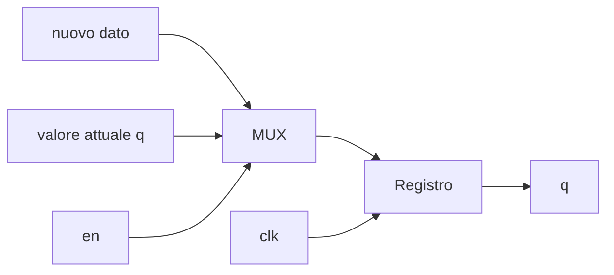
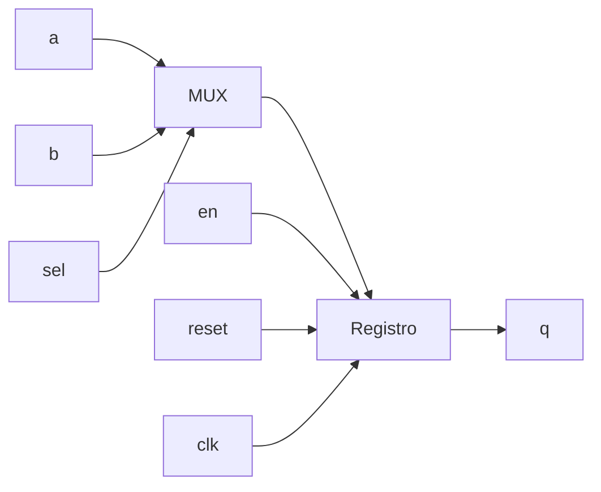

# Registri, mux, enable e reset

Dopo aver distinto in modo rigoroso **logica combinatoria** e **logica sequenziale**, il passo successivo naturale è vedere come questa distinzione si traduca nei pattern RTL più frequenti della progettazione digitale reale. In questa pagina il focus è su quattro elementi che compaiono continuamente nei moduli VHDL:
- **registri**
- **multiplexer**
- **enable**
- **reset**

Questi elementi non sono solo costrutti ricorrenti di codice. Sono strutture hardware fondamentali che collegano il linguaggio VHDL a ciò che verrà poi sintetizzato e implementato. Per questo motivo, saperli riconoscere e modellare bene è essenziale per:
- scrivere RTL leggibile;
- evitare inferenze indesiderate;
- ragionare correttamente su timing e stato;
- costruire FSM, datapath e pipeline in modo ordinato;
- preparare codice robusto per FPGA e ASIC.

Dal punto di vista didattico, questa pagina è anche una buona cerniera tra i fondamenti del linguaggio e la modellazione RTL vera e propria.

Questa lezione mantiene il taglio della sezione:
- didattico ma tecnico;
- orientato all’RTL sintetizzabile;
- attento al significato hardware;
- accompagnato da esempi di codice e schemi quando utili.



## 1. Perché questi quattro elementi sono così importanti

La prima domanda utile è: perché proprio registri, mux, enable e reset?

### 1.1 Perché compaiono ovunque
In un modulo RTL reale è molto comune trovare:
- selezione tra più sorgenti di dato;
- memorizzazione sincronizzata;
- aggiornamento condizionato dello stato;
- inizializzazione o recovery tramite reset.

### 1.2 Perché sono il ponte tra codice e hardware
Questi costrutti sono tra i più immediati da collegare a strutture fisiche:
- il **mux** seleziona un percorso dati;
- il **registro** memorizza lo stato;
- l’**enable** controlla quando lo stato cambia;
- il **reset** riporta il sistema a una condizione nota.

### 1.3 Perché influenzano tutto il resto
FSM, datapath, pipeline e controllo del flusso si appoggiano continuamente a questi elementi.

---

## 2. Che cos’è un registro

Un **registro** è un elemento sequenziale che memorizza un valore e lo aggiorna tipicamente in corrispondenza di un fronte di clock.

### 2.1 Significato essenziale
A differenza della logica combinatoria, il registro introduce memoria:
- il valore corrente dipende anche dal passato;
- l’uscita non cambia continuamente con gli ingressi;
- il nuovo valore viene campionato in un istante definito dal clock.

### 2.2 Perché è fondamentale
Senza registri non esisterebbero:
- stato;
- pipeline;
- contatori;
- FSM;
- sincronizzazione temporale ordinata del circuito.

### 2.3 Esempio minimo

```vhdl
process(clk)
begin
  if rising_edge(clk) then
    q <= d;
  end if;
end process;
```

### 2.4 Significato hardware
Questa descrizione corrisponde a un flip-flop o a un banco di flip-flop.



---

## 3. Registro a singolo bit e registro vettoriale

I registri possono memorizzare un solo bit oppure parole più larghe.

### 3.1 Registro a singolo bit

```vhdl
signal q : std_logic;
```

con process sincrono associato.

### 3.2 Registro multi-bit

```vhdl
signal q : std_logic_vector(7 downto 0);
```

### 3.3 Perché è importante
Nella pratica, molti registri RTL sono vettoriali:
- dati;
- contatori;
- stato codificato;
- registri di configurazione;
- stadi di pipeline.

### 3.4 Esempio

```vhdl
process(clk)
begin
  if rising_edge(clk) then
    q <= d;
  end if;
end process;
```

dove `q` e `d` sono vettori da 8 bit.

---

## 4. Che cos’è un multiplexer

Un **multiplexer** seleziona uno tra più ingressi e lo inoltra in uscita in funzione di un segnale di controllo.

### 4.1 Significato essenziale
Il mux è una delle strutture combinatorie più comuni in assoluto.

### 4.2 Perché è importante
Viene usato continuamente per:
- scegliere il prossimo valore di un registro;
- selezionare percorsi dati;
- implementare decisioni di controllo;
- costruire datapath e FSM.

### 4.3 Esempio semplice

```vhdl
process(a, b, sel)
begin
  if sel = '0' then
    y <= a;
  else
    y <= b;
  end if;
end process;
```

### 4.4 Significato hardware
Questa descrizione corrisponde a un mux 2:1.



---

## 5. Mux come costrutto centrale dell’RTL

Uno dei punti più importanti da capire è che il multiplexer compare spesso anche quando non viene “nominato” esplicitamente.

### 5.1 Esempio tipico
Quando un process seleziona tra due valori per assegnare un segnale, molto spesso sta descrivendo un mux.

### 5.2 Perché conta
Questo aiuta a leggere il codice RTL non solo come testo, ma come struttura di selezione del percorso dati.

### 5.3 Esempio

```vhdl
if load = '1' then
  next_q <= d;
else
  next_q <= q;
end if;
```

### 5.4 Significato hardware
Qui compare implicitamente un mux che sceglie tra:
- `d`
- `q`

---

## 6. Che cos’è un enable

L’**enable** è un segnale che controlla se un certo registro debba aggiornarsi oppure mantenere il suo valore corrente.

### 6.1 Significato essenziale
Se l’enable è attivo:
- il registro carica un nuovo valore

Se l’enable non è attivo:
- il registro mantiene il valore precedente

### 6.2 Perché è molto usato
L’enable compare in:
- datapath;
- FSM;
- contatori;
- pipeline controllate;
- registri di configurazione;
- logica di handshake.

### 6.3 Esempio

```vhdl
process(clk)
begin
  if rising_edge(clk) then
    if en = '1' then
      q <= d;
    end if;
  end if;
end process;
```

### 6.4 Significato hardware
Questo descrive un registro con enable.



---

## 7. Come leggere l’enable dal punto di vista hardware

L’enable si può leggere come una condizione che decide se aggiornare o meno lo stato.

### 7.1 Visione strutturale
Dal punto di vista concettuale, un registro con enable può essere visto come:
- un mux
- che sceglie tra il nuovo dato e il vecchio contenuto
- seguito da un registro

### 7.2 Esempio concettuale



### 7.3 Perché è utile questa lettura
Aiuta a capire che:
- l’enable non è “magia”
- è una struttura hardware concreta con impatto su area e timing

---

## 8. Che cos’è il reset

Il **reset** serve a portare un circuito in una condizione iniziale nota.

### 8.1 Significato essenziale
Il reset permette di:
- inizializzare registri;
- riportare il sistema a uno stato definito;
- garantire una partenza controllata;
- supportare recovery o riavvio.

### 8.2 Perché è importante
Dal punto di vista hardware e progettuale, il reset è centrale per:
- robustezza del sistema;
- correttezza dell’avvio;
- leggibilità del comportamento sequenziale;
- verifica e debug.

### 8.3 Esempio

```vhdl
process(clk, reset)
begin
  if reset = '1' then
    q <= (others => '0');
  elsif rising_edge(clk) then
    q <= d;
  end if;
end process;
```

---

## 9. Reset sincrono e reset asincrono

Fin da questa fase conviene introdurre almeno la distinzione di base.

### 9.1 Reset asincrono
È quello in cui il reset compare come condizione che può avere effetto indipendentemente dal fronte di clock, secondo il pattern di modellazione adottato.

### 9.2 Reset sincrono
È quello in cui il reset viene valutato nel contesto del fronte di clock.

### 9.3 Perché questa distinzione conta
Le due scelte influenzano:
- stile di codifica;
- comportamento simulativo;
- sintesi;
- integrazione nel progetto.

### 9.4 In questa pagina
Manteniamo il focus sui pattern RTL di base. Le strategie di reset saranno riprese in modo più ampio nella pagina dedicata a reset e clocking.

---

## 10. Esempio: registro con reset e enable

Questo è uno dei pattern più frequenti in assoluto.

```vhdl
process(clk, reset)
begin
  if reset = '1' then
    q <= (others => '0');
  elsif rising_edge(clk) then
    if en = '1' then
      q <= d;
    end if;
  end if;
end process;
```

### 10.1 Che cosa descrive
Un registro che:
- va a zero in reset;
- carica `d` quando `en` è attivo;
- mantiene il valore precedente quando `en` non è attivo.

### 10.2 Perché è un pattern fondamentale
Riassume in una forma compatta:
- stato;
- clock;
- reset;
- aggiornamento condizionato.

### 10.3 Dove compare
Questo schema è molto comune in:
- datapath;
- registri di stato;
- pipeline controllate;
- controller.

---

## 11. Mux davanti al registro: il pattern del “prossimo valore”

Molte descrizioni RTL possono essere lette con questo schema mentale:
- una logica combinatoria costruisce il **prossimo valore**
- un registro lo campiona al clock

### 11.1 Esempio

```vhdl
process(a, q, sel)
begin
  if sel = '1' then
    next_q <= a;
  else
    next_q <= q;
  end if;
end process;

process(clk)
begin
  if rising_edge(clk) then
    q <= next_q;
  end if;
end process;
```

### 11.2 Significato hardware
Qui si vede molto chiaramente:
- un mux combinatorio che produce `next_q`
- un registro che carica `next_q`

### 11.3 Perché è una buona struttura mentale
È il cuore di moltissimi schemi RTL:
- FSM;
- load-enable;
- accumulo controllato;
- pipeline con selezione del dato.

---

## 12. Registri e timing

Il registro non è solo uno stato logico: è anche un punto di riferimento temporale.

### 12.1 Perché
Nei circuiti sincronizzati, i registri delimitano i percorsi temporali più importanti.

### 12.2 Cammino tipico
Un cammino molto comune è:

FF → logica combinatoria → FF

### 12.3 Perché questo conta
Il mux e la logica davanti al registro contribuiscono al:
- cammino critico;
- frequenza massima;
- complessità del timing.

### 12.4 Messaggio importante
Anche un semplice enable o mux può influenzare il timing del progetto.

---

## 13. Registri, reset e stato di sistema

I registri sono il luogo in cui il sistema “ricorda” e per questo il reset li riguarda in modo diretto.

### 13.1 Perché
Quando si applica reset, si vuole che certi registri:
- tornino a zero;
- tornino a una configurazione nota;
- riportino FSM e datapath in una condizione coerente.

### 13.2 Perché è importante nella modellazione
Un reset ben modellato rende più leggibile:
- lo stato iniziale del blocco;
- la strategia di recovery;
- la relazione tra stato, clock e controllo.

---

## 14. Mux ed enable nelle FSM e nei datapath

Anche se in questa pagina non entriamo ancora nei dettagli di FSM e pipeline, conviene anticipare una lettura molto utile.

### 14.1 FSM
In una FSM compaiono spesso:
- registri di stato;
- mux che selezionano il prossimo stato;
- enable o condizioni di aggiornamento;
- reset dello stato iniziale.

### 14.2 Datapath
Nei datapath compaiono:
- registri dati;
- mux tra sorgenti multiple;
- enable di caricamento;
- reset di inizializzazione.

### 14.3 Perché è utile saperlo subito
Questi quattro elementi sono i veri mattoni costruttivi di gran parte della modellazione RTL.

---

## 15. Esempio combinato più completo

Vediamo un esempio che mette insieme mux, registro, enable e reset.

```vhdl
library ieee;
use ieee.std_logic_1164.all;

entity reg_select is
  port (
    clk   : in  std_logic;
    reset : in  std_logic;
    en    : in  std_logic;
    sel   : in  std_logic;
    a     : in  std_logic_vector(7 downto 0);
    b     : in  std_logic_vector(7 downto 0);
    q     : out std_logic_vector(7 downto 0)
  );
end entity reg_select;

architecture rtl of reg_select is
  signal q_reg  : std_logic_vector(7 downto 0);
  signal d_next : std_logic_vector(7 downto 0);
begin
  d_next <= a when sel = '0' else b;

  process(clk, reset)
  begin
    if reset = '1' then
      q_reg <= (others => '0');
    elsif rising_edge(clk) then
      if en = '1' then
        q_reg <= d_next;
      end if;
    end if;
  end process;

  q <= q_reg;
end architecture rtl;
```

### 15.1 Che cosa mostra questo esempio
Si vedono chiaramente:
- un mux combinatorio (`d_next`)
- un registro (`q_reg`)
- un enable (`en`)
- un reset (`reset`)

### 15.2 Perché è un buon esempio RTL
La separazione tra logica combinatoria e logica registrata è leggibile e ordinata.

### 15.3 Significato hardware
Il blocco seleziona tra `a` e `b`, poi carica il risultato nel registro se `en` è attivo, con reset a zero.



---

## 16. Errori comuni

Questi pattern sono molto frequenti, ma anche facili da scrivere male se non si presta attenzione.

### 16.1 Latch involontari nei mux
Se il mux non assegna sempre un valore, può emergere memoria non desiderata.

### 16.2 Reset trattato in modo incoerente
Reset scritto in modo poco chiaro o non coerente con il resto della logica.

### 16.3 Enable confuso con logica combinatoria generica
L’enable è un pattern preciso e conviene riconoscerlo come tale.

### 16.4 Registro e prossimo valore mescolati senza struttura
Questo rende il codice più difficile da leggere e da verificare.

### 16.5 Mux troppo annidati o espressi male
La leggibilità crolla rapidamente se la logica di selezione non è organizzata bene.

---

## 17. Buone pratiche di modellazione

Per usare bene registri, mux, enable e reset in VHDL, alcune linee guida sono particolarmente utili.

### 17.1 Separare combinatoria e sequenziale quando migliora la chiarezza
Per esempio:
- prossimo valore in logica combinatoria
- stato in logica registrata

### 17.2 Riconoscere i pattern
Vedere chiaramente nel codice dove sono:
- mux
- registri
- enable
- reset

### 17.3 Usare nomi leggibili
Per esempio:
- `q_reg`
- `d_next`
- `state_next`

### 17.4 Tenere il reset esplicito e coerente
Il reset va trattato come parte importante della semantica del blocco.

### 17.5 Pensare anche al timing
Ogni mux e ogni logica prima del registro impatta il cammino critico.

---

## 18. Collegamento con il resto della sezione

Questa pagina si collega direttamente a:
- **`combinational-vs-sequential.md`**, che ha introdotto la distinzione di fondo;
- **`fsm.md`**, dove registri, mux e reset saranno centrali per la modellazione dello stato;
- **`datapath-control-and-pipelining.md`**, dove questi pattern verranno letti a livello architetturale;
- **`timing-and-clocking.md`**, dove il ruolo dei registri nel timing verrà approfondito;
- **`reset-strategies.md`** e **`clocking-and-clock-enable.md`**, che svilupperanno in modo più specifico reset e clock enable.

---

## 19. In sintesi

Registri, mux, enable e reset sono quattro dei pattern più importanti della modellazione RTL in VHDL.

- Il **mux** seleziona il percorso del dato.
- Il **registro** introduce stato e sincronizzazione.
- L’**enable** controlla quando aggiornare quel dato.
- Il **reset** riporta il sistema a una condizione nota.

Capire bene questi elementi significa disporre dei primi veri mattoni con cui si costruiscono moduli RTL realistici, leggibili e sintetizzabili.

## Prossimo passo

Il passo successivo naturale è **`fsm.md`**, perché adesso conviene vedere come questi pattern si combinano nella modellazione di una macchina a stati finiti:
- registro di stato
- logica di prossimo stato
- logica di uscita
- reset e controllo del comportamento nel tempo
