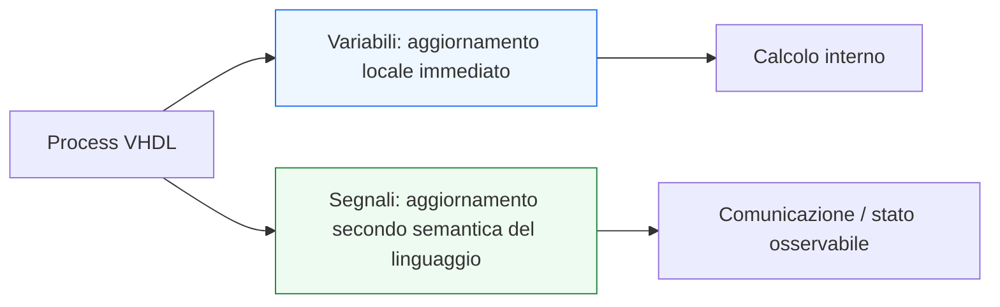
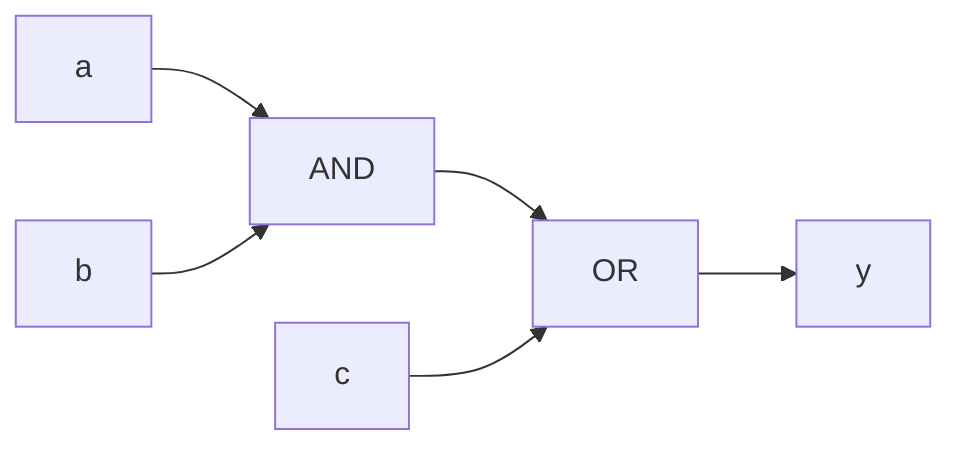

# Segnali, variabili e semantica del linguaggio

Dopo aver chiarito la struttura di **`entity`**, **`architecture`** e il ruolo dei **tipi**, il passo successivo naturale è affrontare uno dei temi più importanti e più spesso fraintesi di tutto VHDL: la differenza tra **segnali** e **variabili**, insieme alla loro **semantica**.

Questa pagina è centrale perché molti errori iniziali in VHDL non dipendono dalla sintassi, ma dal fatto che il codice viene letto con un modello mentale sbagliato. In particolare, è molto comune:
- leggere un’assegnazione a segnale come se fosse immediata;
- trattare una variabile come se fosse equivalente a un segnale;
- non distinguere tra ciò che cambia “subito” dentro un process e ciò che viene aggiornato secondo le regole dei segnali;
- confondere il significato simulativo del codice con il suo effetto hardware atteso.

Dal punto di vista progettuale, capire bene segnali, variabili e semantica è fondamentale per:
- scrivere RTL leggibile;
- evitare mismatch tra ciò che si intende e ciò che il simulatore mostra;
- costruire process combinatori e sequenziali corretti;
- leggere in modo corretto clock, reset e flusso dei dati;
- evitare errori sottili di modellazione.

Questa lezione mantiene il taglio della sezione:
- didattico ma tecnico;
- orientato all’RTL;
- attento alla simulazione e alla sintesi;
- accompagnato da esempi di codice e schemi quando aiutano davvero.



## 1. Perché questa pagina è così importante

La prima domanda utile è: perché segnali e variabili meritano una pagina dedicata?

### 1.1 Perché sembrano simili ma non lo sono
A prima vista, entrambi permettono di “tenere un valore”, ma il loro comportamento è diverso e questa differenza ha un impatto enorme sul significato del codice.

### 1.2 Perché la semantica conta più della sintassi
Due assegnazioni che sembrano quasi uguali possono produrre effetti diversi a seconda che coinvolgano:
- segnali;
- variabili;
- process;
- descrizione concorrente;
- logica combinatoria;
- logica sequenziale.

### 1.3 Perché questo tema attraversa tutta la sezione
Una volta compreso bene questo punto, diventano molto più leggibili anche:
- process;
- FSM;
- datapath;
- pipeline;
- testbench;
- debug.

---

## 2. Che cos’è un segnale

Un **segnale** rappresenta un oggetto di comunicazione o di stato nel modello hardware VHDL.

### 2.1 Dove compare
I segnali possono essere:
- porte della `entity`;
- segnali interni dichiarati in una `architecture`;
- collegamenti tra blocchi;
- elementi usati per rappresentare stato registrato o relazioni combinatorie.

### 2.2 Significato intuitivo
Dal punto di vista hardware, il segnale è vicino all’idea di:
- filo;
- linea di collegamento;
- bus;
- uscita di una rete logica;
- stato osservabile di un registro.

### 2.3 Esempio

```vhdl
signal a   : std_logic;
signal b   : std_logic;
signal y   : std_logic;
signal tmp : std_logic_vector(7 downto 0);
```

### 2.4 Perché è importante
Un segnale non è solo un contenitore di valore: è un oggetto con una semantica precisa di aggiornamento.

---

## 3. Che cos’è una variabile

Una **variabile** è un oggetto usato tipicamente all’interno di un `process` per rappresentare un valore intermedio locale.

### 3.1 Dove compare
In RTL introduttivo, una variabile compare soprattutto:
- dentro un process;
- come supporto a un calcolo interno;
- come elemento temporaneo di costruzione del risultato.

### 3.2 Significato intuitivo
La variabile è più vicina all’idea di:
- valore locale di calcolo;
- appoggio interno;
- risultato intermedio non necessariamente esposto come segnale del modulo.

### 3.3 Esempio

```vhdl
process(a, b, c)
  variable tmp : std_logic;
begin
  tmp := a and b;
  y   <= tmp or c;
end process;
```

### 3.4 Perché è importante
La variabile ha una semantica diversa dal segnale, e proprio lì nasce gran parte del valore didattico di questa lezione.

---

## 4. Assegnazione a segnale e assegnazione a variabile

Una differenza fondamentale è già visibile nel simbolo usato.

### 4.1 Assegnazione a segnale
Per i segnali si usa:

```vhdl
<=
```

Esempio:

```vhdl
y <= a and b;
```

### 4.2 Assegnazione a variabile
Per le variabili si usa:

```vhdl
:=
```

Esempio:

```vhdl
tmp := a and b;
```

### 4.3 Perché non è una semplice differenza sintattica
Il simbolo diverso segnala una differenza di semantica, non solo di forma.

---

## 5. Primo punto chiave: la variabile si aggiorna localmente “subito”

Questa è la prima grande idea da fissare.

### 5.1 Che cosa significa
Dentro un process, quando assegni a una variabile, il nuovo valore è disponibile subito per le istruzioni successive dello stesso process.

### 5.2 Esempio

```vhdl
process(a, b, c)
  variable tmp : std_logic;
begin
  tmp := a and b;
  y   <= tmp or c;
end process;
```

### 5.3 Come leggerlo
La variabile `tmp` viene aggiornata localmente e il valore aggiornato viene subito usato nella riga successiva.

### 5.4 Perché è utile
La variabile è molto comoda per costruire un calcolo interno passo per passo.

---

## 6. Secondo punto chiave: il segnale non si legge come assegnazione immediata locale

Qui sta la differenza più importante.

### 6.1 Esempio

```vhdl
process(a, b, c)
begin
  tmp <= a and b;
  y   <= tmp or c;
end process;
```

Immaginando `tmp` come segnale.

### 6.2 Errore intuitivo tipico
Si potrebbe pensare:
- prima aggiorno `tmp`
- poi uso il nuovo `tmp` per calcolare `y`

Ma questa non è la lettura corretta del segnale in VHDL.

### 6.3 Significato corretto
L’assegnazione al segnale non va letta come aggiornamento locale immediato disponibile alla riga successiva nello stesso modo in cui accade per una variabile.

### 6.4 Perché è fondamentale
Questa differenza è la radice di moltissimi errori di interpretazione.

---

## 7. Segnali e comunicazione tra blocchi o tra parti del modello

Un modo utile per capire i segnali è vederli come il linguaggio naturale della comunicazione hardware.

### 7.1 I segnali descrivono relazioni osservabili
Per esempio:
- un ingresso che arriva dall’esterno;
- un’uscita prodotta dal modulo;
- un collegamento tra due sottoblocchi;
- uno stato registrato.

### 7.2 Le variabili invece restano locali
Una variabile è di solito utile dentro un certo contesto procedurale, ma non è la scelta naturale per rappresentare una interfaccia o uno stato che il resto del design debba osservare.

### 7.3 Regola intuitiva iniziale
- **segnale**: comunicazione, stato o collegamento
- **variabile**: calcolo locale interno

Questa regola non spiega tutto, ma è un ottimo punto di partenza.

---

## 8. Esempio combinatorio con segnale

Vediamo un esempio molto semplice con segnali.

```vhdl
architecture rtl of comb_example is
  signal ab_and : std_logic;
begin
  ab_and <= a and b;
  y      <= ab_and or c;
end architecture rtl;
```

### 8.1 Che cosa descrive
Qui si descrivono due relazioni concorrenti:
- `ab_and` dipende da `a` e `b`
- `y` dipende da `ab_and` e `c`

### 8.2 Significato hardware
Questa è una rete combinatoria con:
- una porta AND
- una porta OR



### 8.3 Punto importante
Qui il codice va letto come descrizione di relazioni hardware concorrenti, non come algoritmo sequenziale locale.

---

## 9. Esempio combinatorio con variabile dentro un process

Vediamo ora una forma equivalente ma espressa con una variabile locale.

```vhdl
process(a, b, c)
  variable ab_and : std_logic;
begin
  ab_and := a and b;
  y      <= ab_and or c;
end process;
```

### 9.1 Che cosa cambia
La struttura hardware attesa può essere la stessa, ma il modo di esprimere il calcolo è diverso.

### 9.2 Che ruolo ha la variabile
`ab_and` è un valore intermedio locale usato per rendere il processo più leggibile.

### 9.3 Perché è utile
Questo esempio mostra bene che le variabili non sono “sbagliate” in RTL: sono utili quando usate con chiarezza e disciplina.

---

## 10. Segnali e variabili in process combinatori

Nei process combinatori, la distinzione è particolarmente istruttiva.

### 10.1 Variabili
Sono spesso utili per:
- costruire risultati intermedi;
- semplificare espressioni lunghe;
- organizzare meglio il calcolo interno.

### 10.2 Segnali
Sono più naturali quando il valore deve:
- esistere come oggetto del modulo;
- essere riusato altrove;
- rappresentare una relazione esplicita del circuito;
- collegare blocchi o sottoblocchi.

### 10.3 Buona regola pratica
Dentro un process combinatorio:
- usa variabili per appoggi locali;
- usa segnali quando il valore ha significato strutturale nel modulo.

---

## 11. Segnali e variabili in process sequenziali

Anche nei process sincroni la distinzione resta importante.

### 11.1 Esempio di registro con segnale

```vhdl
process(clk)
begin
  if rising_edge(clk) then
    q <= d;
  end if;
end process;
```

### 11.2 Significato
Qui `q` è un segnale che rappresenta uno stato registrato.

### 11.3 Uso di variabili nei process sincroni
Le variabili possono essere utili per:
- calcolo locale del prossimo valore;
- costruzione di logica intermedia;
- migliorare chiarezza in datapath o FSM.

### 11.4 Ma con attenzione
Bisogna sempre ricordare che:
- la variabile aiuta il calcolo locale;
- il segnale rappresenta ciò che il resto del modulo o del design osserva come stato o uscita.

---

## 12. Un esempio sincrono con variabile locale

```vhdl
process(clk)
  variable next_q : std_logic_vector(7 downto 0);
begin
  if rising_edge(clk) then
    next_q := d xor mask;
    q      <= next_q;
  end if;
end process;
```

### 12.1 Come leggerlo
Dentro il fronte di clock:
- si calcola prima il valore locale `next_q`
- poi quel valore viene assegnato al segnale `q`

### 12.2 Perché può essere utile
Questa struttura è chiara quando il prossimo valore richiede più passi di calcolo.

### 12.3 Messaggio importante
La variabile non sostituisce il segnale di stato: lo prepara o lo aiuta.

---

## 13. Semantica del linguaggio: il vero cuore del problema

Fin qui abbiamo introdotto il comportamento intuitivo. Ora conviene esplicitare il punto generale.

### 13.1 La semantica dice come leggere il codice
In VHDL non conta solo:
- che istruzione compare
ma anche:
- in quale contesto compare
- quale oggetto coinvolge
- con quali regole temporali deve essere interpretata

### 13.2 Perché è così importante
Due descrizioni simili possono portare a comportamenti di simulazione diversi se non si capisce bene:
- processo concorrente;
- assegnazione a segnale;
- uso locale di una variabile.

### 13.3 Collegamento con il resto della sezione
Questo sarà decisivo quando parleremo di:
- process;
- combinatoria vs sequenziale;
- FSM;
- testbench;
- debug delle waveform.

---

## 14. Segnali e tempo di simulazione

Senza entrare ancora troppo a fondo nei delta cycle, è utile introdurre un’idea molto semplice.

### 14.1 Perché il tempo conta
VHDL descrive sistemi che evolvono nel tempo di simulazione e in cui l’ordine apparente delle righe non basta a spiegare tutto.

### 14.2 Segnali e aggiornamento
Quando si lavora con i segnali, bisogna sempre ricordare che il loro comportamento si inserisce nella semantica temporale del linguaggio.

### 14.3 Perché questa anticipazione è utile
Nella prossima pagina sui process e sugli statement concorrenti questo punto diventerà ancora più chiaro.

---

## 15. Un confronto diretto: stessa idea, semantica diversa

### 15.1 Con variabile

```vhdl
process(a, b, c)
  variable tmp : std_logic;
begin
  tmp := a and b;
  y   <= tmp or c;
end process;
```

### 15.2 Con segnale interno

```vhdl
architecture rtl of example is
  signal tmp : std_logic;
begin
  tmp <= a and b;
  y   <= tmp or c;
end architecture rtl;
```

### 15.3 Perché questo confronto è importante
A livello concettuale entrambe le descrizioni possono rappresentare logica simile, ma:
- la prima usa un valore locale dentro un process;
- la seconda esprime una relazione concorrente tra segnali del modulo.

### 15.4 Differenza di stile
La seconda è più strutturale, la prima più procedurale. Entrambe possono essere utili, ma non vanno confuse.

---

## 16. Quando conviene usare un segnale

Una buona regola pratica è usare un segnale quando il valore deve avere identità nel modulo.

### 16.1 Casi tipici
- porte della `entity`
- stato registrato
- collegamento tra parti della logica
- valore che deve comparire come relazione strutturale del design
- oggetto che deve essere osservato o riutilizzato da più punti

### 16.2 Perché è una buona scelta
I segnali rendono più esplicita la struttura del circuito.

---

## 17. Quando conviene usare una variabile

Una buona regola pratica è usare una variabile quando serve un appoggio locale nel calcolo.

### 17.1 Casi tipici
- espressioni intermedie dentro un process
- organizzazione del calcolo combinatorio
- costruzione del prossimo stato o del prossimo dato
- miglioramento della leggibilità di una procedura interna

### 17.2 Perché è utile
Le variabili rendono più lineare il ragionamento locale dentro un process, soprattutto quando il calcolo non è banale.

---

## 18. Errori comuni

Questo tema è uno di quelli in cui si sbaglia più facilmente.

### 18.1 Pensare che segnale e variabile siano equivalenti
Non lo sono, né sintatticamente né semanticamente.

### 18.2 Aspettarsi che il segnale si comporti come una variabile locale
Errore molto comune e molto importante.

### 18.3 Usare variabili senza capire il contesto
Questo può rendere il codice meno leggibile o più difficile da interpretare.

### 18.4 Non chiedersi che cosa rappresenti davvero un oggetto
Ogni volta conviene chiedersi:
- è uno stato o una connessione del modulo?
- oppure è solo un appoggio locale di calcolo?

---

## 19. Buone pratiche iniziali

Per lavorare bene con segnali e variabili in VHDL, alcune abitudini sono molto utili.

### 19.1 Distinguere sempre il ruolo dell’oggetto
Prima di scrivere, chiediti:
- questo valore deve essere osservabile come segnale?
- oppure mi serve solo dentro il process?

### 19.2 Non usare variabili solo perché “sembrano più immediate”
Vanno usate quando migliorano chiarezza e modellazione, non per imitare un linguaggio software.

### 19.3 Leggere sempre il codice anche dal punto di vista hardware
- il segnale corrisponde a una relazione o a uno stato del circuito
- la variabile corrisponde a un passaggio locale del ragionamento interno

### 19.4 Curare la leggibilità
Se una variabile chiarisce un calcolo, può essere una buona scelta. Se invece nasconde il significato del circuito, è meglio ripensare la struttura.

---

## 20. Collegamento con il resto della sezione

Questa pagina si collega direttamente a:
- **`entity-architecture-and-types.md`**, che ha chiarito dove segnali e tipi vengono dichiarati;
- **`process-and-concurrent-statements.md`**, che svilupperà il contesto in cui segnali e variabili vengono usati davvero;
- **`combinational-vs-sequential.md`**, dove questa distinzione diventerà ancora più importante;
- le future pagine su FSM, pipeline, verifica e debug, dove la corretta lettura semantica sarà essenziale.

---

## 21. In sintesi

Segnali e variabili in VHDL non sono due modi equivalenti di scrivere la stessa cosa.

- Il **segnale** rappresenta una relazione, una connessione o uno stato osservabile nel modello hardware.
- La **variabile** rappresenta invece un valore locale utile al calcolo interno, tipicamente dentro un process.

Capire bene questa differenza significa capire uno dei fondamenti più profondi del linguaggio, e prepararsi a leggere correttamente tutto il resto:
- process;
- combinatoria;
- sequenziale;
- simulazione;
- sintesi;
- debug.

## Prossimo passo

Il passo successivo naturale è **`process-and-concurrent-statements.md`**, perché adesso conviene chiarire in modo diretto:
- che cos’è un `process`
- che cosa significa descrizione concorrente
- come convivono i due livelli in VHDL
- perché questo è il vero contesto in cui segnali e variabili acquistano significato pieno
