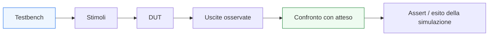

# Stimoli, self-checking e simulazione

Dopo aver introdotto la struttura di base del **testbench VHDL**, il passo successivo naturale è renderlo più utile e più maturo dal punto di vista della verifica. In questa pagina il focus è su tre aspetti strettamente collegati:
- la costruzione degli **stimoli**
- l’introduzione del **self-checking**
- il ruolo della **simulazione** come strumento reale di validazione del DUT

Questa lezione è molto importante perché un testbench che si limita a generare qualche valore sugli ingressi e a produrre waveform può essere utile solo fino a un certo punto. Quando i moduli crescono, serve una struttura di verifica che sappia:
- applicare casi di prova significativi;
- confrontare il comportamento osservato con quello atteso;
- segnalare automaticamente errori;
- rendere più rapido il debug;
- preparare il terreno a regressione, manutenzione e riuso.

Dal punto di vista progettuale, questa è la pagina in cui il testbench smette di essere solo un “generatore di segnali” e inizia a diventare un ambiente di verifica di base.

Questa lezione mantiene il taglio della sezione:
- didattico ma tecnico;
- orientato alla verifica funzionale;
- attento al legame tra DUT, testbench e simulazione;
- accompagnato da esempi di codice e schemi quando utili.



## 1. Perché questa pagina è importante

La prima domanda utile è: perché non basta un testbench con pochi stimoli manuali?

### 1.1 Perché osservare non basta
Guardare una waveform può essere utile, ma non sempre è sufficiente per stabilire in modo chiaro:
- se il DUT ha davvero funzionato;
- se tutti i casi attesi sono stati verificati;
- se un errore è stato riconosciuto automaticamente;
- se il test è ripetibile e manutenibile.

### 1.2 Perché il self-checking migliora la qualità della verifica
Un testbench con controlli automatici:
- riduce l’ambiguità;
- accelera il debug;
- rende la simulazione più utile;
- prepara il codice a una verifica più sistematica.

### 1.3 Perché la simulazione va letta come strumento di verifica
La simulazione non è solo “muovere i segnali”. È il contesto in cui il comportamento del DUT viene osservato e validato rispetto a un’attesa progettuale.

---

## 2. Che cosa sono gli stimoli

Gli **stimoli** sono i valori e le sequenze temporali che il testbench applica agli ingressi del DUT.

### 2.1 Significato essenziale
Gli stimoli rappresentano:
- ingressi di prova;
- scenari funzionali;
- casi nominali;
- casi limite;
- condizioni di reset, clock, handshake o controllo.

### 2.2 Perché sono importanti
Il valore della verifica dipende molto da:
- quali ingressi si applicano;
- in quale ordine;
- in quale momento;
- con quale relazione rispetto al clock.

### 2.3 Perché non sono solo “dati”
Uno stimolo ben progettato è una piccola ipotesi di comportamento del sistema.

---

## 3. Stimoli poveri e stimoli significativi

Uno dei primi punti da capire è che non tutti gli stimoli hanno lo stesso valore.

### 3.1 Stimoli poveri
Sono sequenze che:
- coprono pochi casi;
- non toccano le condizioni interessanti;
- verificano solo il percorso più ovvio.

### 3.2 Stimoli significativi
Sono stimoli che cercano di coprire:
- casi nominali;
- casi limite;
- cambi di stato;
- reset;
- combinazioni funzionalmente importanti;
- pattern che possono rivelare errori strutturali.

### 3.3 Perché è importante
Il testbench non va valutato solo dalla sua presenza, ma dalla qualità degli scenari che applica.

---

## 4. Stimoli per logica combinatoria

Nel caso della logica combinatoria, gli stimoli sono spesso più semplici.

### 4.1 Che cosa serve
Tipicamente:
- si applicano combinazioni di ingressi;
- si attende un tempo sufficiente di stabilizzazione;
- si osserva l’uscita.

### 4.2 Esempio

```vhdl
stim_proc : process
begin
  a <= '0'; b <= '0';
  wait for 10 ns;

  a <= '0'; b <= '1';
  wait for 10 ns;

  a <= '1'; b <= '0';
  wait for 10 ns;

  a <= '1'; b <= '1';
  wait for 10 ns;

  wait;
end process;
```

### 4.3 Perché è utile
Questo è il livello minimo di stimolazione per una rete combinatoria semplice.

---

## 5. Stimoli per logica sequenziale

Per un DUT sequenziale, gli stimoli devono rispettare il tempo del sistema.

### 5.1 Che cosa serve
Tipicamente:
- clock;
- reset;
- applicazione degli ingressi in istanti coerenti;
- osservazione delle uscite rispetto ai fronti di clock.

### 5.2 Esempio

```vhdl
stim_proc : process
begin
  wait until reset = '0';
  wait until rising_edge(clk);

  d <= "0001";
  wait until rising_edge(clk);

  d <= "0010";
  wait until rising_edge(clk);

  d <= "0011";
  wait;
end process;
```

### 5.3 Perché è importante
Uno stimolo sincronizzato rende la verifica più coerente con il comportamento reale di un sistema sincrono.

---

## 6. Che cos’è il self-checking

Il **self-checking** è la capacità del testbench di verificare automaticamente se il comportamento osservato coincide con quello atteso.

### 6.1 Significato essenziale
Invece di limitarsi a mostrare i segnali, il testbench:
- calcola o conosce il risultato atteso;
- confronta l’uscita del DUT con quel risultato;
- segnala un errore se i valori divergono.

### 6.2 Perché è importante
Il self-checking trasforma il testbench da strumento di osservazione a strumento di validazione.

### 6.3 Benefici pratici
- riduce dipendenza dall’analisi manuale delle waveform;
- rende il test più ripetibile;
- facilita regressione e manutenzione;
- accelera il debug.

---

## 7. Il ruolo di `assert`

In VHDL, uno degli strumenti più semplici e potenti per il self-checking è `assert`.

### 7.1 Che cos’è
`assert` permette di verificare una condizione e segnalare un errore se la condizione non è soddisfatta.

### 7.2 Esempio semplice

```vhdl
assert y = '1'
  report "Errore: uscita non corretta"
  severity error;
```

### 7.3 Perché è utile
Rende il testbench capace di dire in modo esplicito:
- che cosa si aspettava;
- quando il DUT ha fallito;
- in quale punto della sequenza di test è emerso il problema.

---

## 8. Esempio self-checking per logica combinatoria

Vediamo un testbench semplice per una porta AND con controllo automatico.

```vhdl
library ieee;
use ieee.std_logic_1164.all;

entity tb_and_gate is
end entity tb_and_gate;

architecture sim of tb_and_gate is
  signal a : std_logic := '0';
  signal b : std_logic := '0';
  signal y : std_logic;
begin

  dut : entity work.and_gate
    port map (
      a => a,
      b => b,
      y => y
    );

  stim_proc : process
  begin
    a <= '0'; b <= '0';
    wait for 10 ns;
    assert y = '0'
      report "Errore per a=0, b=0"
      severity error;

    a <= '0'; b <= '1';
    wait for 10 ns;
    assert y = '0'
      report "Errore per a=0, b=1"
      severity error;

    a <= '1'; b <= '0';
    wait for 10 ns;
    assert y = '0'
      report "Errore per a=1, b=0"
      severity error;

    a <= '1'; b <= '1';
    wait for 10 ns;
    assert y = '1'
      report "Errore per a=1, b=1"
      severity error;

    wait;
  end process;

end architecture sim;
```

### 8.1 Che cosa mostra
- stimoli;
- osservazione dell’uscita;
- controllo automatico con `assert`.

### 8.2 Perché è un passo importante
Questo testbench non richiede più un’interpretazione completamente manuale delle waveform per capire se la funzione è corretta.

---

## 9. Self-checking e atteso

Il cuore del self-checking è il concetto di **atteso**.

### 9.1 Che cosa significa
Per ogni stimolo rilevante, il testbench deve poter stabilire quale uscita o comportamento sia corretto.

### 9.2 Come si ottiene l’atteso
A seconda del caso, l’atteso può derivare da:
- una formula semplice;
- un valore noto nel caso di prova;
- una tabella di riferimento;
- una logica di confronto nel testbench.

### 9.3 Perché è importante
Un testbench diventa veramente utile quando rende esplicito il legame tra:
- ingresso applicato;
- uscita attesa;
- esito del controllo.

---

## 10. Stimoli nominali e casi limite

Una buona verifica non si ferma al caso “che probabilmente funziona”.

### 10.1 Casi nominali
Sono quelli che rappresentano il comportamento atteso nella situazione standard.

### 10.2 Casi limite
Sono quelli che mettono in difficoltà il DUT o rivelano errori nascosti:
- valori estremi;
- combinazioni poco frequenti;
- reset vicino a eventi significativi;
- passaggi di stato;
- enable e select nelle transizioni critiche.

### 10.3 Perché è importante
Molti bug reali emergono non nel caso più ovvio, ma nei casi di bordo.

---

## 11. Stimoli ordinati e leggibilità del testbench

Uno stimolo ben progettato non deve solo “coprire casi”, ma essere leggibile.

### 11.1 Buona struttura
Conviene organizzare il testbench in modo che sia chiaro:
- quale caso si sta applicando;
- che cosa ci si aspetta;
- quando avviene il controllo.

### 11.2 Esempio pratico
Si possono raggruppare i casi per:
- funzionalità;
- modalità operative;
- scenari di reset;
- transizioni di stato;
- condizioni di protocollo.

### 11.3 Perché è importante
Un testbench leggibile si estende e si corregge molto più facilmente.

---

## 12. Simulazione come verifica temporale

La simulazione non serve solo a verificare valori logici, ma anche il comportamento nel tempo.

### 12.1 Cosa permette di vedere
- fronti di clock;
- propagazione degli stimoli;
- risposta del DUT;
- reset;
- latenza;
- sequenza degli eventi.

### 12.2 Perché è importante
Molti errori non riguardano solo “il valore finale”, ma:
- quando arriva;
- in quale ciclo;
- in che relazione con gli ingressi o col reset.

### 12.3 Collegamento con il timing
La simulazione non sostituisce l’analisi temporale fisica, ma è essenziale per capire la coerenza funzionale nel tempo.

---

## 13. Simulazione e waveform

Le waveform restano uno strumento molto importante anche in presenza di self-checking.

### 13.1 Perché
Le `assert` dicono **che qualcosa è andato storto**, ma le waveform aiutano a capire:
- quando;
- con quali segnali;
- in quale sequenza di eventi;
- in quale rapporto tra input, stato e uscita.

### 13.2 Perché non bisogna contrapporli
- `assert` → segnala
- waveform → spiega e aiuta il debug

### 13.3 Buona visione
Un buon testbench usa entrambe:
- controlli automatici;
- osservazione ordinata nel tempo.

---

## 14. Stimoli per FSM e moduli di controllo

Quando il DUT contiene una FSM o una control unit, gli stimoli devono essere pensati come **scenari**, non solo come valori isolati.

### 14.1 Che cosa significa
Bisogna verificare:
- sequenze di ingresso;
- transizioni di stato;
- comportamento con reset;
- permanenza in certi stati;
- condizioni di uscita o di completamento.

### 14.2 Perché è importante
Una FSM non si verifica bene con input “casuali” o non ordinati nel tempo.

### 14.3 Collegamento con il testbench
Il banco di prova deve accompagnare il DUT lungo traiettorie di comportamento, non solo attraverso singole combinazioni logiche.

---

## 15. Stimoli per datapath e pipeline

Anche per datapath e pipeline la verifica richiede attenzione specifica.

### 15.1 Datapath
Conviene testare:
- valori nominali;
- casi limite;
- selezioni dei mux;
- enable;
- comportamento con reset.

### 15.2 Pipeline
Conviene testare:
- progressione del dato tra stadi;
- latenza attesa;
- dati consecutivi;
- eventuale allineamento tra dato e controllo.

### 15.3 Perché è importante
Nei moduli pipelined, il caso giusto non è solo “il dato è corretto”, ma anche:
- “compare nel ciclo giusto?”

---

## 16. Errori comuni

Alcuni errori ricorrono molto spesso nei primi testbench con stimoli e self-checking.

### 16.1 Stimoli casuali ma poco significativi
Muovono i segnali, ma non costruiscono veri casi di verifica.

### 16.2 Assert poco chiari
Messaggi troppo generici rendono il debug più difficile.

### 16.3 Nessuna distinzione tra caso nominale e casi limite
Il testbench resta superficiale.

### 16.4 Controlli fatti troppo presto o troppo tardi
Nei DUT sequenziali o pipelined questo è un errore importante.

### 16.5 Dipendere solo dalle waveform
Senza controllo automatico, il test resta più fragile e meno scalabile.

---

## 17. Buone pratiche di modellazione

Per costruire bene questa prima forma di verifica in VHDL, alcune linee guida sono particolarmente utili.

### 17.1 Costruire stimoli con significato funzionale
Ogni sequenza dovrebbe rappresentare un caso preciso.

### 17.2 Usare `assert` in modo leggibile
Il messaggio di errore dovrebbe aiutare a capire:
- quale caso è fallito;
- che cosa ci si aspettava;
- che cosa si sta controllando.

### 17.3 Distinguere i test combinatori dai test sequenziali
Nel caso sequenziale, il clock deve guidare davvero il ragionamento del testbench.

### 17.4 Preparare il testbench al debug
Un buon banco di prova aiuta a localizzare rapidamente l’errore.

### 17.5 Pensare già in ottica di evoluzione
Anche un testbench semplice può essere scritto in modo da diventare:
- più strutturato;
- più automatico;
- più riusabile.

---

## 18. Collegamento con il resto della sezione

Questa pagina si collega direttamente a:
- **`verification-and-testbench.md`**, che ha introdotto la struttura di base del banco di prova;
- **`fsm.md`**, **`datapath-control-and-pipelining.md`** e **`timing-and-clocking.md`**, perché gli stimoli devono riflettere la natura del DUT;
- la prossima pagina **`debug-and-waveforms.md`**, che mostrerà come leggere in modo più sistematico la simulazione e le waveform per localizzare gli errori;
- il resto del ramo di integrazione progettuale, dove il testbench diventa sempre più importante per confrontare moduli e casi reali.

---

## 19. In sintesi

Stimoli, self-checking e simulazione sono il passo che trasforma il testbench da semplice generatore di segnali a vero strumento di verifica.

- Gli **stimoli** definiscono i casi di prova.
- Il **self-checking** confronta il comportamento osservato con quello atteso.
- La **simulazione** permette di osservare il DUT nel tempo e di localizzare gli errori.

Capire bene questi tre elementi significa costruire una base molto più solida per la verifica dei moduli VHDL, sia combinatori sia sequenziali.

## Prossimo passo

Il passo successivo naturale è **`debug-and-waveforms.md`**, perché adesso conviene chiarire come leggere la simulazione in modo davvero utile al progetto:
- come interpretare le waveform
- come localizzare errori nel DUT o nel testbench
- come usare clock, reset, stato e segnali interni per fare debug in modo ordinato
