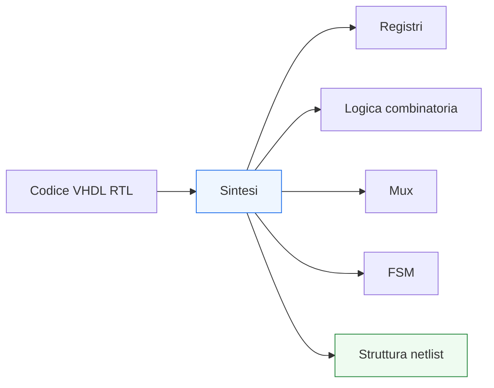

# Sintesi RTL in VHDL

Dopo aver costruito le basi della modellazione VHDL — dai **process** alle **FSM**, dai **registri** alle **pipeline**, fino a **generic** e **generate** — il passo successivo naturale è chiarire come tutto questo venga interpretato nel flusso reale di progetto: il tema della **sintesi RTL**.

La sintesi è il passaggio in cui la descrizione VHDL smette di essere soltanto un modello simulabile e diventa una rappresentazione concreta dell’hardware che verrà implementato. È il momento in cui il tool cerca di rispondere, in modo sistematico, a una domanda fondamentale:

- **che struttura hardware corrisponde a questo codice RTL?**

Dal punto di vista progettuale, capire la sintesi è essenziale perché permette di leggere e scrivere VHDL in modo più maturo. Non basta infatti che il codice:
- sia sintatticamente corretto;
- simuli in modo plausibile;
- sembri leggibile.

Serve anche che descriva hardware in modo:
- prevedibile;
- coerente con l’intenzione progettuale;
- sintetizzabile in modo pulito;
- ragionevole dal punto di vista di area, timing e struttura.

Questa pagina introduce la sintesi VHDL con un taglio coerente con il resto della sezione:
- didattico ma tecnico;
- centrato sul rapporto tra codice RTL e hardware risultante;
- attento al legame con timing, controllo e datapath;
- orientato a chiarire che la sintesi non è una “magia del tool”, ma una lettura strutturata del codice.



## 1. Che cos’è la sintesi

La **sintesi** è il processo con cui una descrizione RTL viene tradotta in una rappresentazione strutturale dell’hardware.

### 1.1 Significato essenziale
Il tool di sintesi legge il codice e cerca di inferire:
- registri;
- logica combinatoria;
- mux;
- operatori aritmetici;
- reti di controllo;
- strutture ripetute;
- eventuali FSM.

### 1.2 Che cosa produce
Il risultato è tipicamente una **netlist**, cioè una descrizione più vicina agli elementi hardware concreti che verranno poi implementati.

### 1.3 Perché è importante
La sintesi è il passaggio che collega:
- intenzione progettuale;
- codice RTL;
- hardware finale.

---

## 2. Perché la sintesi è un tema centrale in VHDL

La prima domanda utile è: perché conviene studiare la sintesi già mentre si impara il linguaggio?

### 2.1 Perché VHDL non è solo un linguaggio simulativo
Una descrizione può simulare, ma non essere una buona descrizione RTL.

### 2.2 Perché il progettista deve scrivere con consapevolezza hardware
Ogni costrutto dovrebbe essere letto anche in termini di:
- area;
- stato;
- cammini combinatori;
- timing;
- struttura fisica attesa.

### 2.3 Perché migliora la qualità del codice
Chi ragiona in termini di sintesi scrive codice:
- più prevedibile;
- più leggibile;
- più robusto;
- più vicino all’architettura reale.

---

## 3. Sintesi e RTL: il livello giusto di descrizione

Questa pagina si concentra sulla sintesi di descrizioni **RTL**.

### 3.1 Che cosa significa RTL qui
Significa descrizioni in cui il comportamento è espresso in termini di:
- registri;
- trasferimento dei dati;
- logica combinatoria tra registri;
- controllo del flusso tramite FSM o segnali di controllo.

### 3.2 Perché è il livello naturale
L’RTL è il punto di incontro tra:
- intenzione funzionale;
- struttura sintetizzabile;
- timing;
- verifica.

### 3.3 Che cosa non è il focus qui
Non ci concentreremo su descrizioni troppo astratte o non orientate alla sintesi. Il punto è capire come i pattern VHDL visti fin qui si trasformano in hardware.

---

## 4. Il principio fondamentale: la sintesi inferisce hardware

Il tool di sintesi non “esegue” il codice come farebbe un interprete software. **Inferisce** strutture hardware.

### 4.1 Che cosa significa inferire
Significa riconoscere pattern nel codice e associarli a strutture come:
- registro;
- mux;
- adder;
- comparatore;
- logica di stato;
- replicazione strutturale.

### 4.2 Perché è importante
Il codice VHDL ben scritto aiuta il tool a inferire in modo chiaro la struttura desiderata.

### 4.3 Perché non è una magia
La sintesi segue regole e convenzioni abbastanza prevedibili. Più il codice è chiaro, più il risultato è coerente con l’intenzione.

---

## 5. Esempio: inferenza di un registro

Uno dei pattern più classici è il registro.

```vhdl
process(clk)
begin
  if rising_edge(clk) then
    q <= d;
  end if;
end process;
```

### 5.1 Che cosa inferisce il tool
Il tool riconosce questo schema come un registro sincronizzato al clock.

### 5.2 Perché il pattern è importante
Questa forma è uno dei modi più standard e leggibili per guidare la sintesi verso una struttura sequenziale ben definita.

### 5.3 Significato hardware
Il risultato atteso è un flip-flop o un banco di flip-flop.

---

## 6. Esempio: inferenza di logica combinatoria

Vediamo ora un pattern combinatorio semplice.

```vhdl
y <= a and b;
```

### 6.1 Che cosa inferisce il tool
Una funzione combinatoria equivalente a una porta AND o a una rete logica equivalente.

### 6.2 Perché è importante
Questo mostra che la sintesi legge il codice in termini di funzione logica, non di esecuzione software.

### 6.3 Significato hardware
La struttura risultante è una rete combinatoria senza memoria.

---

## 7. Esempio: inferenza di un mux

Un altro pattern classico è il multiplexer.

```vhdl
process(a, b, sel)
begin
  if sel = '0' then
    y <= a;
  else
    y <= b;
  end if;
end process;
```

### 7.1 Che cosa inferisce il tool
Un mux 2:1.

### 7.2 Perché è utile riconoscerlo
Molte strutture di controllo del dato sono, di fatto, mux anche quando il codice le esprime con `if` o `case`.

### 7.3 Significato progettuale
Capire questo aiuta a leggere la sintesi dei datapath e dei next-state path.

---

## 8. Esempio: enable e mux implicito

Un registro con enable è un altro caso molto importante.

```vhdl
process(clk)
begin
  if rising_edge(clk) then
    if en = '1' then
      q <= d;
    end if;
  end if;
end process;
```

### 8.1 Che cosa inferisce il tool
Tipicamente:
- un registro
- con una logica che permette di mantenere il valore o caricare `d`

### 8.2 Lettura hardware utile
Concettualmente si può leggere come:
- un mux tra il dato nuovo e il valore corrente
- seguito dal registro

### 8.3 Perché è importante
Mostra come strutture apparentemente semplici nascondano una microarchitettura ben precisa.

---

## 9. Esempio: reset e inferenza dello stato iniziale

Anche il reset è un pattern che la sintesi interpreta in modo specifico.

```vhdl
process(clk, reset)
begin
  if reset = '1' then
    q <= (others => '0');
  elsif rising_edge(clk) then
    q <= d;
  end if;
end process;
```

### 9.1 Che cosa inferisce il tool
Un registro con comportamento di reset coerente con il pattern descritto.

### 9.2 Perché è importante
Il reset non è solo una condizione di simulazione: è una parte concreta della struttura sequenziale risultante.

### 9.3 Collegamento progettuale
La scelta del pattern di reset influenza:
- leggibilità;
- integrazione;
- sintesi;
- comportamento atteso del modulo.

---

## 10. Sintesi e process combinatori

La sintesi di un process combinatorio dipende molto dalla completezza e chiarezza della descrizione.

### 10.1 Caso corretto
Se tutte le uscite vengono assegnate in tutti i casi rilevanti, il tool inferisce una rete combinatoria.

### 10.2 Caso problematico
Se una assegnazione manca in certi casi, il tool può dover inferire memoria per “ricordare” il valore precedente.

### 10.3 Perché è importante
È uno dei punti in cui un errore di modellazione si traduce direttamente in hardware non voluto.

---

## 11. Latch involontari: un caso classico di sintesi indesiderata

Uno degli errori più noti nella sintesi RTL è l’inferenza involontaria di latch.

### 11.1 Esempio problematico

```vhdl
process(a, b, sel)
begin
  if sel = '1' then
    y <= a and b;
  end if;
end process;
```

### 11.2 Che cosa manca
Non viene specificato che cosa succede a `y` quando `sel = '0'`.

### 11.3 Conseguenza
Il tool può inferire un elemento di memoria per mantenere il valore precedente di `y`.

### 11.4 Perché è un problema
Se non era voluto, il codice non descrive più una rete puramente combinatoria.

---

## 12. Sintesi e tipi enumerativi nelle FSM

Le FSM scritte con tipi enumerativi sono molto leggibili e si prestano bene alla sintesi.

### 12.1 Esempio concettuale

```vhdl
type state_t is (IDLE, RUN, DONE);
signal state, next_state : state_t;
```

### 12.2 Che cosa inferisce il tool
Una codifica concreta dello stato e la logica necessaria per:
- memorizzare lo stato corrente;
- calcolare il prossimo stato;
- generare le uscite.

### 12.3 Perché è importante
Questo mostra che il tool può partire da una descrizione molto leggibile e produrre comunque una struttura hardware concreta.

---

## 13. Sintesi di datapath e control unit

Quando il modulo cresce, la sintesi deve inferire una struttura più ricca.

### 13.1 Datapath
Inferisce tipicamente:
- registri;
- mux;
- operatori;
- percorsi combinatori.

### 13.2 Control unit
Inferisce:
- stato;
- logica di transizione;
- segnali di enable e selezione;
- eventuale controllo temporale del blocco.

### 13.3 Perché è importante
Questo è il punto in cui il codice RTL si traduce davvero in microarchitettura sintetizzata.

---

## 14. Sintesi e pipeline

Anche la pipeline è letta dal tool come struttura concreta.

### 14.1 Che cosa vede il tool
Se il codice contiene:
- registri intermedi;
- stadi di logica separati;
- flusso dei dati distribuito nel tempo

il tool inferisce una pipeline corrispondente.

### 14.2 Perché è importante
La pipeline non è una “ottimizzazione misteriosa” del tool: è una scelta architetturale che il progettista esprime nel codice.

### 14.3 Beneficio
Questo rende più controllabile il rapporto tra:
- latenza;
- timing;
- throughput.

---

## 15. Sintesi e `generic`

I moduli parametrizzati tramite `generic` non descrivono un solo circuito, ma una famiglia di configurazioni possibili.

### 15.1 Che cosa succede in sintesi
Per una certa configurazione scelta del parametro, il tool sintetizza la struttura corrispondente.

### 15.2 Esempio
Se `WIDTH = 8`, si sintetizza un modulo a 8 bit.  
Se `WIDTH = 32`, si sintetizza un modulo a 32 bit.

### 15.3 Perché è importante
Questo mostra che il VHDL parametrico è uno strumento molto potente per il riuso, ma il risultato della sintesi resta sempre una struttura concreta per una configurazione specifica.

---

## 16. Sintesi e `generate`

Il costrutto `generate` aiuta il tool a costruire strutture ripetute o condizionali.

### 16.1 Che cosa succede
La sintesi “espande” la struttura generata e la interpreta come hardware reale.

### 16.2 Esempio concettuale
Se una catena di registri viene generata `N` volte, la sintesi vede effettivamente:
- `N` registri
- i relativi collegamenti
- la logica che li circonda

### 16.3 Perché è importante
Conferma che `generate` è una descrizione di struttura hardware, non un meccanismo runtime.

---

## 17. Sintesi e leggibilità del codice

Un punto molto importante è che codice più leggibile produce spesso una sintesi più prevedibile.

### 17.1 Perché
Un tool di sintesi è più efficace quando il pattern RTL è chiaro:
- process sincroni riconoscibili;
- process combinatori completi;
- FSM ben separate;
- nomi leggibili;
- reset e enable espliciti.

### 17.2 Beneficio per il progettista
Anche il debug e l’analisi post-sintesi diventano più semplici.

### 17.3 Messaggio importante
Scrivere bene VHDL non è solo una questione estetica: migliora la controllabilità del risultato sintetizzato.

---

## 18. Sintesi e area

La sintesi non determina solo la correttezza della struttura, ma anche la sua dimensione hardware.

### 18.1 Che cosa significa
Scelte RTL diverse possono produrre:
- più registri;
- più mux;
- logica più profonda;
- hardware duplicato;
- strutture più o meno compatte.

### 18.2 Perché è importante
Il codice influenza l’area, cioè quante risorse hardware saranno richieste.

### 18.3 Collegamento con l’architettura
Una descrizione più pulita o più condivisa può portare a una sintesi più efficiente.

---

## 19. Sintesi e timing

La sintesi è anche strettamente collegata al timing.

### 19.1 Perché
La struttura inferita determina:
- lunghezza dei cammini combinatori;
- profondità dei mux;
- presenza e posizione dei registri;
- complessità della logica tra un registro e l’altro.

### 19.2 Perché è importante
Un RTL formalmente corretto può comunque essere debole dal punto di vista del timing.

### 19.3 Collegamento con la pagina successiva
Per questo, dopo la sintesi, il passo naturale è capire meglio:
- clock;
- cammino critico;
- effetto delle scelte RTL sul tempo di propagazione.

---

## 20. Sintesi e simulazione: perché non bastano “buoni risultati in simulazione”

Una delle lezioni più importanti per chi impara VHDL è questa:
- simulare bene non basta;
- bisogna anche sintetizzare bene.

### 20.1 Perché
Un codice può simulare correttamente ma:
- essere ambiguo;
- inferire hardware indesiderato;
- risultare poco efficiente;
- complicare timing e verifica.

### 20.2 Perché questa consapevolezza è centrale
La qualità dell’RTL non si misura solo dal fatto che “sembra funzionare”, ma dal fatto che:
- il comportamento è chiaro;
- la sintesi è prevedibile;
- la struttura risultante è coerente con il progetto.

---

## 21. Errori comuni

Alcuni errori ricorrono spesso quando si inizia a ragionare sulla sintesi.

### 21.1 Pensare che il tool capisca sempre l’intenzione
La sintesi legge il codice, non la volontà implicita del progettista.

### 21.2 Scrivere process combinatori incompleti
Questo porta facilmente a latch non desiderati.

### 21.3 Mescolare in modo poco chiaro combinatorio e sequenziale
Il risultato sintetizzato diventa meno prevedibile.

### 21.4 Usare parametrizzazione senza chiarezza strutturale
Il riuso peggiora invece di migliorare.

### 21.5 Trascurare l’impatto su timing e area
Una descrizione corretta può comunque essere una cattiva scelta architetturale.

---

## 22. Buone pratiche di modellazione

Per scrivere VHDL che si sintetizzi bene, alcune linee guida sono particolarmente utili.

### 22.1 Rendere espliciti i pattern RTL
Registri, mux, enable, reset e FSM dovrebbero essere riconoscibili a colpo d’occhio.

### 22.2 Separare bene combinatorio e sequenziale
Questo aiuta sia il progettista sia il tool.

### 22.3 Scrivere process combinatori completi
Per evitare inferenze indesiderate di latch.

### 22.4 Parametrizzare con buon senso
I `generic` devono riflettere vere scelte architetturali.

### 22.5 Pensare sempre all’hardware risultante
Ogni riga di RTL dovrebbe essere letta anche in termini di:
- struttura;
- area;
- cammino combinatorio;
- registri;
- timing.

---

## 23. Collegamento con il resto della sezione

Questa pagina si collega direttamente a:
- **`registers-mux-enables-reset.md`**, perché questi sono i pattern che la sintesi inferisce più spesso;
- **`fsm.md`**, per l’inferenza della logica di controllo;
- **`datapath-control-and-pipelining.md`**, per il rapporto tra codice e microarchitettura;
- **`generics-and-generate.md`**, per la sintesi di strutture parametriche;
- **`timing-and-clocking.md`**, che approfondirà l’impatto temporale delle strutture inferite;
- più avanti, a **`common-pitfalls.md`**, dove molti errori di sintesi saranno riletti come errori di coding style o di semantica RTL.

---

## 24. In sintesi

La sintesi RTL in VHDL è il processo che traduce il codice in una struttura hardware concreta:
- registri;
- logica combinatoria;
- mux;
- FSM;
- datapath;
- pipeline;
- reti strutturali più complesse.

Capire bene la sintesi significa imparare a leggere e scrivere VHDL in modo più maturo: non solo come linguaggio corretto, ma come descrizione di hardware prevedibile, pulito e coerente con i vincoli del progetto.

## Prossimo passo

Il passo successivo naturale è **`timing-and-clocking.md`**, perché adesso conviene chiarire come le strutture inferite dalla sintesi si riflettano su:
- clock
- cammino critico
- profondità della logica combinatoria
- ruolo dei registri nel controllo del timing
