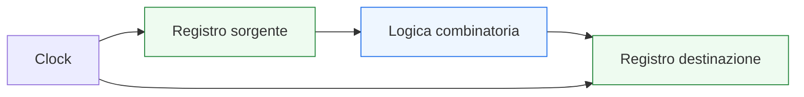
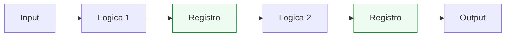

# Timing, clock e cammino critico

Dopo aver introdotto la **sintesi RTL in VHDL**, il passo successivo naturale è affrontare il tema che più direttamente collega l’RTL al comportamento fisico del circuito: il **timing**. In questo contesto diventano centrali:
- il **clock**
- i **registri**
- la **logica combinatoria**
- il **cammino critico**

Questa pagina è molto importante perché un progetto digitale non deve solo essere funzionalmente corretto. Deve anche essere in grado di operare alla frequenza desiderata, con margini temporali coerenti con il flusso di implementazione. In altre parole, non basta che il codice descriva “l’hardware giusto”: deve anche descrivere un hardware che possa lavorare nei tempi richiesti.

Dal punto di vista progettuale, questo tema è essenziale per capire:
- perché i registri scandiscono il tempo del sistema;
- come la logica combinatoria tra registri influenzi la frequenza massima;
- perché pipeline e suddivisione del datapath siano spesso decisioni di timing prima ancora che di funzione;
- come leggere il codice VHDL in termini di percorsi temporali e non solo di comportamento logico.

Questa lezione mantiene il taglio della sezione:
- didattico ma tecnico;
- orientato all’RTL sintetizzabile;
- attento al significato architetturale e temporale;
- accompagnato da esempi di codice e schemi quando utili.



## 1. Perché il timing è un tema centrale

La prima domanda utile è: perché il timing merita una pagina specifica in un corso VHDL orientato all’RTL?

### 1.1 Perché un circuito non vive fuori dal tempo
Nel mondo reale, i segnali non cambiano in modo istantaneo e la logica non produce risultati senza ritardo. Ogni rete combinatoria ha un tempo di propagazione.

### 1.2 Perché il clock impone una cadenza
Nei sistemi sincroni, il clock stabilisce ogni quanto il sistema possa aggiornare i propri registri. Se la logica tra due registri è troppo lenta, il circuito non riesce a rispettare il periodo di clock richiesto.

### 1.3 Perché il progettista RTL influenza il timing
Le scelte di codifica e di microarchitettura influiscono su:
- profondità della logica;
- numero di registri;
- posizione degli stadi di pipeline;
- complessità delle reti di controllo;
- struttura dei datapath.

---

## 2. Che cos’è il clock

Il **clock** è il segnale che sincronizza il comportamento delle parti sequenziali del circuito.

### 2.1 Significato essenziale
Nei sistemi sincroni, il clock stabilisce gli istanti in cui:
- i registri catturano nuovi valori;
- lo stato viene aggiornato;
- il sistema avanza da una configurazione temporale alla successiva.

### 2.2 Perché è così importante
Il clock dà ritmo al progetto:
- se aumenta la frequenza, diminuisce il tempo disponibile tra due fronti;
- se diminuisce la frequenza, aumenta il tempo disponibile.

### 2.3 Esempio RTL classico

```vhdl
process(clk)
begin
  if rising_edge(clk) then
    q <= d;
  end if;
end process;
```

### 2.4 Significato hardware
Questo pattern descrive un registro aggiornato al fronte attivo del clock.

---

## 3. Che cos’è il timing in un progetto digitale

Il **timing** riguarda il rispetto dei vincoli temporali con cui i segnali devono propagarsi e stabilizzarsi nel circuito.

### 3.1 Significato essenziale
In un sistema sincrono, tra due fronti di clock consecutivi deve esserci abbastanza tempo perché:
- il dato parta da un registro;
- attraversi la logica combinatoria;
- arrivi stabile al registro successivo.

### 3.2 Che cosa significa in pratica
Il progettista deve chiedersi:
- quanto è lungo il percorso tra un registro e l’altro?
- quanta logica combinatoria c’è in mezzo?
- il periodo di clock è sufficiente?

### 3.3 Perché è importante
Questo collega direttamente:
- codice RTL;
- struttura sintetizzata;
- frequenza operativa del progetto.

---

## 4. Il percorso temporale fondamentale

Uno dei modelli più importanti da fissare è il seguente:

**Registro → Logica combinatoria → Registro**

### 4.1 Perché è il modello base
Gran parte del timing nei sistemi sincroni può essere letta come una rete di percorsi che partono da un registro e arrivano a un altro.

### 4.2 Che cosa contiene il percorso
Tra i due registri possono esserci:
- mux;
- adder;
- comparatori;
- decodifica;
- logica di controllo;
- funzioni del datapath.

### 4.3 Perché è importante
Il ritardo totale di questo percorso determina se il progetto potrà lavorare al clock desiderato.

---

## 5. Che cos’è il cammino critico

Il **cammino critico** è il percorso temporale più lento tra quelli rilevanti nel circuito.

### 5.1 Significato essenziale
È il cammino che richiede più tempo per propagare il dato tra due elementi sequenziali.

### 5.2 Perché conta così tanto
Il cammino critico limita la frequenza massima del sistema:
- se è troppo lungo, il clock deve essere rallentato;
- se si vuole aumentare la frequenza, bisogna accorciare quel percorso.

### 5.3 Perché il progettista VHDL deve pensarci
Anche se il timing viene analizzato con tool specifici, il cammino critico nasce dalle scelte RTL.

---

## 6. Esempio concettuale di cammino critico

Supponiamo di avere questa catena:


### 6.1 Che cosa mostra
Tra `Registro A` e `Registro B` il dato attraversa:
- un adder;
- un mux;
- un comparatore.

### 6.2 Perché è utile
Aiuta a capire che il ritardo non nasce da una singola istruzione VHDL, ma dalla struttura combinatoria complessiva inferita dal codice.

### 6.3 Implicazione progettuale
Se questa catena è troppo profonda, può diventare il cammino critico del blocco.

---

## 7. Clock period e frequenza

Il timing si collega direttamente al periodo del clock e quindi alla frequenza.

### 7.1 Relazione di base
- periodo più corto → frequenza più alta
- periodo più lungo → frequenza più bassa

### 7.2 Perché il periodo conta
Il periodo di clock rappresenta il tempo disponibile per far attraversare al dato la logica tra due registri.

### 7.3 Messaggio importante
Se il percorso combinatorio richiede più tempo del periodo disponibile, il circuito non soddisfa il vincolo di timing.

---

## 8. Registri come delimitatori temporali

I registri non servono solo a memorizzare informazioni. Servono anche a spezzare il tempo del sistema in intervalli controllati.

### 8.1 Significato architetturale
Ogni registro introduce un punto di campionamento del dato:
- prima del registro c’è un certo tratto di logica;
- dopo il registro inizia un nuovo tratto.

### 8.2 Perché è importante
I registri delimitano i percorsi temporali e aiutano a controllare la lunghezza della logica combinatoria.

### 8.3 Collegamento con la progettazione RTL
Quando si inserisce un registro, non si sta solo aggiungendo stato: si sta anche modificando il timing del progetto.

---

## 9. Logica combinatoria e ritardo

Ogni porzione di logica combinatoria aggiunge ritardo al percorso temporale.

### 9.1 Esempi tipici
Contribuiscono al ritardo:
- operatori aritmetici;
- reti di mux;
- comparatori;
- decodifica;
- logica di controllo complessa;
- funzioni annidate.

### 9.2 Perché è importante
Anche un modulo apparentemente semplice può diventare lento se il dato attraversa troppe trasformazioni in un singolo ciclo.

### 9.3 Messaggio progettuale
La qualità dell’RTL non dipende solo da “che cosa fa”, ma anche da “quanta logica concentra tra due registri”.

---

## 10. Esempio RTL: tratto combinatorio semplice

```vhdl
y <= (a and b) or c;
```

### 10.1 Significato temporale
Questo è un tratto combinatorio relativamente semplice.

### 10.2 Impatto
Se però questo tipo di logica viene concatenata molte volte o combinata con operatori più costosi, il ritardo cresce.

### 10.3 Perché è utile ricordarlo
Anche i pezzi più elementari diventano importanti quando si accumulano dentro lo stesso cammino.

---

## 11. Esempio RTL: tratto più articolato

```vhdl
process(a, b, c, d, sel1, sel2)
begin
  if sel1 = '1' then
    tmp1 <= a + b;
  else
    tmp1 <= c + d;
  end if;

  if sel2 = '1' then
    y <= tmp1;
  else
    y <= not tmp1;
  end if;
end process;
```

### 11.1 Lettura architetturale
Questa descrizione può implicare:
- addizione;
- selezione mux;
- eventuale negazione;
- altro mux o logica di scelta.

### 11.2 Perché è importante
Il blocco non è “solo un process”: è una rete combinatoria che può pesare sul timing.

### 11.3 Messaggio importante
Per leggere il timing bisogna tradurre mentalmente il codice nella struttura hardware risultante.

---

## 12. Pipeline come risposta al timing

Quando la logica tra registri diventa troppo profonda, una delle soluzioni principali è la **pipeline**.

### 12.1 Che cosa significa
Si inseriscono registri intermedi per dividere il percorso lungo in più tratti più brevi.

### 12.2 Effetto
- si riduce la lunghezza del cammino critico;
- si può aumentare la frequenza massima;
- si aumenta la latenza complessiva.

### 12.3 Perché è importante
La pipeline è uno degli strumenti più forti per trasformare un RTL corretto ma lento in un RTL più adatto al timing.



---

## 13. Timing e FSM

Anche le FSM hanno un impatto sul timing.

### 13.1 Perché
Il percorso tipico è:

Registro di stato → logica di transizione / uscita → registro di stato o uscita registrata

### 13.2 Quando può diventare critico
Se la logica di controllo:
- ha molte condizioni;
- usa comparazioni complesse;
- governa molti mux o enable;
- cresce troppo in dimensione.

### 13.3 Perché è importante
Il timing non riguarda solo datapath numerici. Anche il controllo può diventare un punto limitante.

---

## 14. Timing e datapath

Il datapath è spesso il luogo in cui il cammino critico si manifesta in modo più evidente.

### 14.1 Perché
Il datapath contiene tipicamente:
- addizioni;
- sottrazioni;
- confronti;
- shift;
- reti di selezione;
- percorsi attraverso più operatori.

### 14.2 Perché conta
Queste operazioni possono introdurre ritardi significativi, soprattutto quando sono concatenate nello stesso ciclo.

### 14.3 Collegamento con la microarchitettura
La decisione su:
- dove inserire registri;
- come segmentare il calcolo;
- quanto controllare il percorso dati

è anche una decisione di timing.

---

## 15. Timing e enable

Anche un enable può avere un impatto sul timing.

### 15.1 Perché
Un enable spesso implica:
- una logica di selezione;
- un mux implicito sul percorso del dato;
- una rete di controllo che si inserisce prima del registro.

### 15.2 Perché è importante
Segnali che sembrano “semplici” dal punto di vista funzionale possono contribuire al ritardo complessivo del percorso.

### 15.3 Messaggio utile
Leggere l’RTL dal punto di vista timing significa anche riconoscere questi effetti indiretti.

---

## 16. Timing e reset

Il reset è soprattutto un tema di correttezza e inizializzazione, ma ha anche un ruolo strutturale nel circuito.

### 16.1 Perché citarlo qui
La presenza di reset:
- modifica la struttura dei registri;
- può influenzare lo stile RTL;
- va considerata nella coerenza complessiva del blocco.

### 16.2 Perché non è il focus principale
Il tema del reset è già stato introdotto altrove nella sezione, ma qui è utile ricordare che il progettista non deve mai ragionare sul timing ignorando la struttura completa del registro e del suo controllo.

---

## 17. Esempio: stesso comportamento, timing diverso

Una delle lezioni più importanti in RTL è questa:
- due moduli funzionalmente equivalenti possono avere comportamento temporale molto diverso.

### 17.1 Caso 1
Tutta la logica in un solo ciclo:
- più bassa latenza;
- cammino critico più lungo.

### 17.2 Caso 2
Logica divisa da un registro intermedio:
- maggiore latenza;
- cammino critico più corto.

### 17.3 Perché è fondamentale
Il progettista RTL deve spesso scegliere un compromesso tra:
- frequenza;
- latenza;
- area;
- semplicità della struttura.

---

## 18. Timing e scelte di coding style

Lo stile di scrittura del codice può aiutare o peggiorare la leggibilità temporale del progetto.

### 18.1 Codice leggibile
Rende più semplice vedere:
- dove stanno i registri;
- quale logica è combinatoria;
- quali segnali sono next-state o next-data;
- dove passano i percorsi critici.

### 18.2 Codice confuso
Mescolare troppi livelli nello stesso process o usare strutture poco chiare rende più difficile capire il timing del modulo.

### 18.3 Perché è importante
Anche il timing si progetta meglio quando l’RTL è leggibile.

---

## 19. Errori comuni

Il timing è uno dei temi in cui il progettista inesperto tende più facilmente a sbagliare approccio.

### 19.1 Pensare che il timing sia “solo un problema del tool”
In realtà il tool misura e ottimizza, ma il cammino critico nasce dalle scelte RTL.

### 19.2 Ignorare la profondità della logica combinatoria
Questo porta a moduli che funzionano, ma non raggiungono la frequenza desiderata.

### 19.3 Aggiungere registri senza una logica architetturale chiara
La pipeline aiuta, ma deve essere introdotta con criterio.

### 19.4 Leggere il codice solo funzionalmente
Senza una lettura temporale dell’RTL si perde metà del significato progettuale.

### 19.5 Trascurare il controllo
Anche la logica di controllo, non solo il datapath, può pesare sul timing.

---

## 20. Buone pratiche di modellazione

Per scrivere VHDL con buona consapevolezza di timing, alcune linee guida sono particolarmente utili.

### 20.1 Pensare sempre in termini di registro → logica → registro
È il modello mentale base del timing sincrono.

### 20.2 Tenere separati i ruoli nel codice
- stato registrato
- logica combinatoria
- controllo
- prossimi valori

### 20.3 Inserire pipeline quando serve davvero
La pipeline va letta come scelta architetturale, non solo come trucco di sintesi.

### 20.4 Curare la leggibilità del datapath e della FSM
Più è chiara la struttura, più è leggibile anche il timing.

### 20.5 Ragionare su frequenza e latenza insieme
Migliorare il timing può richiedere più stadi, quindi maggiore latenza. Bisogna valutare il compromesso.

---

## 21. Collegamento con il resto della sezione

Questa pagina si collega direttamente a:
- **`synthesis.md`**, che ha spiegato come il codice VHDL venga tradotto in hardware;
- **`datapath-control-and-pipelining.md`**, perché datapath e pipeline sono il luogo naturale del ragionamento temporale;
- **`fsm.md`**, per l’impatto del controllo sul cammino critico;
- **`vhdl-for-fpga-and-asic.md`**, dove il timing sarà riletto nei due principali contesti implementativi;
- **`common-pitfalls.md`**, dove molti errori di coding style saranno riletti anche in termini di effetti temporali.

---

## 22. In sintesi

Il timing in un progetto VHDL sincrono nasce dal rapporto tra:
- clock;
- registri;
- logica combinatoria;
- cammino critico.

Capire bene questi elementi significa imparare a leggere il codice RTL non solo come comportamento funzionale, ma come struttura temporale reale del circuito. Questo è il passaggio che collega davvero:
- sintesi;
- microarchitettura;
- frequenza di funzionamento;
- qualità del progetto.

## Prossimo passo

Il passo successivo naturale è **`common-pitfalls.md`**, perché adesso conviene raccogliere e ordinare gli errori di codifica e modellazione più comuni rileggendoli alla luce di:
- semantica VHDL
- sintesi
- timing
- correttezza RTL
