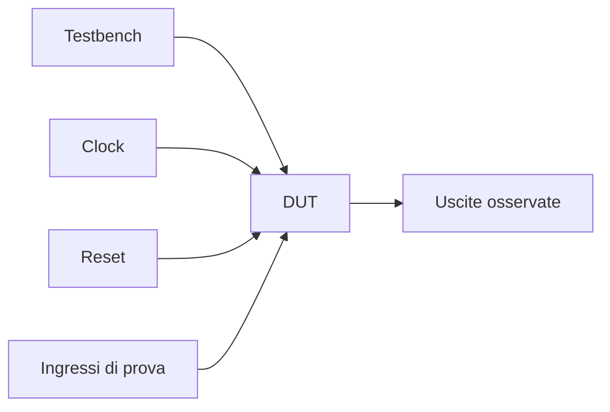

# Verifica di base e testbench in VHDL

Dopo aver costruito il blocco dedicato alla modellazione RTL — dai fondamenti del linguaggio fino a sintesi, timing e principali errori di codifica — il passo successivo naturale è spostare l’attenzione sul lato della **verifica**. In questa pagina il focus è sulla struttura di base di un **testbench VHDL** e sul modo in cui esso permette di osservare, stimolare e validare il comportamento di un DUT.

Questa lezione è molto importante perché scrivere un modulo RTL non basta. Un progetto serio richiede anche la capacità di:
- applicare stimoli significativi;
- osservare uscite e stati rilevanti;
- verificare che il comportamento del DUT sia coerente con l’atteso;
- gestire clock, reset e scenari di prova;
- costruire una base ordinata per il debug e per le pagine successive su simulazione e self-checking.

Dal punto di vista progettuale, il testbench è il primo luogo in cui la descrizione VHDL viene messa davvero alla prova. È anche il punto in cui diventa evidente una distinzione importante:
- il **DUT** descrive l’hardware che si vuole verificare;
- il **testbench** descrive l’ambiente di prova che genera stimoli e osserva il DUT.

Questa lezione mantiene il taglio della sezione:
- didattico ma tecnico;
- orientato alla progettazione RTL e alla verifica funzionale;
- attento al legame tra simulazione, leggibilità e debug;
- accompagnato da esempi di codice e schemi quando utili.


## 1. Perché serve un testbench

La prima domanda utile è: perché non basta simulare semplicemente il modulo RTL?

### 1.1 Perché il DUT da solo non “si mette in moto”
Un modulo VHDL, da solo, descrive il comportamento del blocco, ma non genera automaticamente:
- clock;
- reset;
- ingressi;
- sequenze di prova;
- casi nominali e casi limite.

### 1.2 Perché la verifica richiede un contesto
Per capire se il DUT funziona correttamente, serve un ambiente che:
- lo istanzi;
- applichi gli stimoli;
- osservi il risultato;
- confronti, in modo esplicito o implicito, il comportamento con quello atteso.

### 1.3 Perché è il primo passo verso una verifica seria
Anche un testbench molto semplice aiuta già a:
- evitare errori banali;
- validare casi di base;
- leggere correttamente le waveform;
- impostare un flusso di simulazione ordinato.

---

## 2. Che cos’è un testbench

Un **testbench** è una descrizione VHDL che rappresenta l’ambiente di prova del modulo da verificare.

### 2.1 Significato essenziale
Il testbench:
- istanzia il DUT;
- genera segnali di ingresso;
- produce clock e reset se necessari;
- osserva le uscite;
- può includere controlli, report o assert.

### 2.2 Che cosa non è
Il testbench non è il circuito da sintetizzare. È un ambiente di simulazione usato per validare il circuito.

### 2.3 Perché è importante
Questo significa che il testbench può usare costrutti e stili di descrizione pensati per la verifica, non necessariamente per la sintesi RTL.

---

## 3. Differenza tra DUT e testbench

Questa distinzione è fondamentale.

### 3.1 Il DUT
Il DUT, cioè **Design Under Test**, è il modulo RTL che si vuole verificare.

### 3.2 Il testbench
Il testbench è il contesto esterno che:
- guida il DUT;
- lo osserva;
- ne valuta il comportamento.

### 3.3 Perché è importante tenerli distinti
Aiuta a non confondere:
- la logica da implementare;
- con la logica di prova usata solo in simulazione.



---

## 4. Struttura minima di un testbench

Un testbench VHDL di base contiene tipicamente:
- librerie;
- dichiarazione dell’entity del testbench;
- architecture del testbench;
- segnali interni collegati al DUT;
- istanziazione del DUT;
- process per clock, reset e stimoli.

### 4.1 Una caratteristica importante
Spesso la `entity` del testbench non ha porte, perché il testbench è il livello più esterno della simulazione.

### 4.2 Esempio di forma generale

```vhdl
entity tb_example is
end entity tb_example;

architecture sim of tb_example is
begin
  -- segnali, DUT, process di stimolo
end architecture sim;
```

### 4.3 Perché è utile saperlo subito
Questa forma è la base di gran parte dei testbench VHDL introduttivi e professionali di base.

---

## 5. Entity del testbench

L’`entity` del testbench è di solito molto semplice.

### 5.1 Esempio

```vhdl
entity tb_and_gate is
end entity tb_and_gate;
```

### 5.2 Perché non ha porte
Perché il testbench non rappresenta un blocco da inserire in un altro sistema. È il contenitore esterno della simulazione.

### 5.3 Significato progettuale
Questo aiuta a distinguere il testbench da un modulo sintetizzabile normale.

---

## 6. Segnali del testbench

Dentro l’`architecture` del testbench si dichiarano i segnali che verranno collegati al DUT.

### 6.1 Che cosa rappresentano
Questi segnali sono il punto di contatto tra:
- i process di stimolo del testbench;
- le porte del DUT.

### 6.2 Esempio

```vhdl
architecture sim of tb_and_gate is
  signal a : std_logic := '0';
  signal b : std_logic := '0';
  signal y : std_logic;
begin
end architecture sim;
```

### 6.3 Perché è importante
Il testbench pilota `a` e `b`, mentre osserva `y`.

---

## 7. Istanziazione del DUT

Una volta dichiarati i segnali, il testbench deve istanziare il modulo da verificare.

### 7.1 Esempio

```vhdl
dut : entity work.and_gate
  port map (
    a => a,
    b => b,
    y => y
  );
```

### 7.2 Che cosa significa
Il blocco `and_gate` viene inserito nel testbench e collegato ai segnali locali.

### 7.3 Perché è fondamentale
Questo è il momento in cui il testbench “aggancia” il circuito reale che si vuole verificare.

---

## 8. Stimoli di base

Il testbench deve poi applicare valori agli ingressi del DUT.

### 8.1 Esempio semplice

```vhdl
stim_proc : process
begin
  a <= '0'; b <= '0';
  wait for 10 ns;

  a <= '0'; b <= '1';
  wait for 10 ns;

  a <= '1'; b <= '0';
  wait for 10 ns;

  a <= '1'; b <= '1';
  wait for 10 ns;

  wait;
end process;
```

### 8.2 Che cosa mostra
Il process:
- applica una sequenza di combinazioni;
- aspetta tra uno stimolo e il successivo;
- termina con un `wait` finale.

### 8.3 Perché è un buon esempio iniziale
Mostra la struttura base di uno stimolo temporizzato.

---

## 9. Esempio completo: testbench per una porta AND

Vediamo un esempio completo e molto semplice.

```vhdl
library ieee;
use ieee.std_logic_1164.all;

entity tb_and_gate is
end entity tb_and_gate;

architecture sim of tb_and_gate is
  signal a : std_logic := '0';
  signal b : std_logic := '0';
  signal y : std_logic;
begin

  dut : entity work.and_gate
    port map (
      a => a,
      b => b,
      y => y
    );

  stim_proc : process
  begin
    a <= '0'; b <= '0';
    wait for 10 ns;

    a <= '0'; b <= '1';
    wait for 10 ns;

    a <= '1'; b <= '0';
    wait for 10 ns;

    a <= '1'; b <= '1';
    wait for 10 ns;

    wait;
  end process;

end architecture sim;
```

### 9.1 Che cosa mostra
Si vedono chiaramente:
- `entity` del testbench;
- segnali locali;
- istanziazione del DUT;
- process di stimolo.

### 9.2 Perché è importante
È il primo modello completo e minimale di banco di prova.

---

## 10. Testbench per logica sequenziale: clock e reset

Quando il DUT è sequenziale, il testbench deve anche generare:
- clock;
- reset;
- eventuali sequenze sincronizzate.

### 10.1 Clock generator

```vhdl
clk_proc : process
begin
  while true loop
    clk <= '0';
    wait for 5 ns;
    clk <= '1';
    wait for 5 ns;
  end loop;
end process;
```

### 10.2 Reset iniziale

```vhdl
rst_proc : process
begin
  reset <= '1';
  wait for 20 ns;
  reset <= '0';
  wait;
end process;
```

### 10.3 Perché è importante
Per DUT sincroni, il clock è la base temporale della verifica e il reset stabilisce la condizione iniziale del comportamento.

---

## 11. Stimoli sincronizzati al clock

Per blocchi sequenziali è spesso utile che gli stimoli siano applicati in modo coerente con il clock.

### 11.1 Esempio

```vhdl
stim_proc : process
begin
  wait until reset = '0';
  wait until rising_edge(clk);

  d <= "0001";
  wait until rising_edge(clk);

  d <= "0010";
  wait until rising_edge(clk);

  d <= "0011";
  wait;
end process;
```

### 11.2 Perché è utile
Questa forma rende il testbench più vicino al comportamento reale di un sistema sincrono.

### 11.3 Beneficio
La lettura delle waveform e l’interpretazione temporale del DUT risultano più chiare.

---

## 12. Osservare non basta: bisogna anche valutare

Un testbench non dovrebbe limitarsi a “far muovere i segnali”. Dovrebbe aiutare a capire se il DUT si comporta correttamente.

### 12.1 Livello base
Anche senza self-checking completo, un buon testbench dovrebbe già:
- coprire i casi principali;
- rendere leggibili clock, reset e input;
- permettere di osservare facilmente l’uscita.

### 12.2 Livello successivo
Si possono introdurre:
- confronti espliciti;
- `assert`;
- messaggi di errore;
- sequenze di validazione più strutturate.

### 12.3 Collegamento con la prossima pagina
Questo sarà sviluppato meglio nella lezione successiva su stimoli, self-checking e simulazione.

---

## 13. Testbench combinatorio e testbench sequenziale

È utile distinguere subito questi due casi.

### 13.1 Testbench per logica combinatoria
Tipicamente:
- non serve clock;
- si applicano combinazioni di ingressi;
- si osserva la risposta del DUT.

### 13.2 Testbench per logica sequenziale
Tipicamente:
- serve clock;
- spesso serve reset;
- gli stimoli devono essere applicati in modo temporale coerente;
- l’osservazione va fatta in relazione ai fronti di clock.

### 13.3 Perché è importante
Aiuta a progettare il banco di prova in modo coerente con la natura del modulo.

---

## 14. Testbench e waveform

Uno dei primi usi pratici del testbench è la generazione di waveform leggibili.

### 14.1 Perché
Le waveform permettono di osservare:
- comportamento del DUT nel tempo;
- risposta agli stimoli;
- relazione tra clock, reset, ingressi e uscite;
- eventuali errori di temporizzazione o di sequenza.

### 14.2 Perché il testbench è decisivo
Un testbench scritto male produce waveform:
- rumorose;
- poco significative;
- difficili da leggere.

### 14.3 Buona pratica
Progettare gli stimoli in modo che le waveform aiutino davvero il debug.

---

## 15. Testbench e leggibilità

Anche il testbench, come il DUT, deve essere leggibile.

### 15.1 Perché
Un banco di prova poco chiaro rende difficile capire:
- che cosa si sta verificando;
- in quale ordine;
- con quale ipotesi;
- quale comportamento ci si aspetta.

### 15.2 Segnali e nomi
Conviene usare nomi chiari per:
- clock;
- reset;
- segnali di input;
- stimoli;
- segnali osservati.

### 15.3 Struttura
Una buona divisione tra:
- generazione clock;
- reset;
- stimoli principali;
- eventuali controlli

migliora molto il riuso e il debug.

---

## 16. Errori comuni

Ci sono alcuni errori molto frequenti nei primi testbench VHDL.

### 16.1 Non distinguere DUT e ambiente di prova
Questo porta a confusione tra logica da sintetizzare e logica usata solo per simulazione.

### 16.2 Stimoli poco ordinati
Waveform e casi di test diventano difficili da interpretare.

### 16.3 Clock e reset gestiti in modo incoerente
Il comportamento del DUT diventa ambiguo o poco realistico.

### 16.4 Fermarsi all’osservazione manuale
Guardare solo le waveform può bastare all’inizio, ma presto diventa limitante.

### 16.5 Test troppo poveri
Se si verifica solo il caso nominale, molti errori restano nascosti.

---

## 17. Buone pratiche di modellazione

Per costruire un testbench VHDL di base solido, alcune linee guida sono particolarmente utili.

### 17.1 Tenere il testbench ordinato
Separare bene:
- segnali;
- DUT;
- clock;
- reset;
- stimoli.

### 17.2 Rendere chiaro il caso di prova
Ogni sequenza di stimolo dovrebbe avere un senso funzionale leggibile.

### 17.3 Sincronizzare correttamente i test sequenziali
Usare il clock in modo coerente con la natura del DUT.

### 17.4 Preparare la strada al self-checking
Anche se il testbench è inizialmente semplice, conviene scriverlo in modo che possa evolvere verso controlli automatici.

### 17.5 Pensare al debug
Un buon testbench aiuta a interpretare:
- output;
- transizioni;
- reset;
- errori di modellazione del DUT.

---

## 18. Collegamento con il resto della sezione

Questa pagina si collega direttamente a:
- **`common-pitfalls.md`**, perché molti errori RTL emergono chiaramente nel testbench;
- **`timing-and-clocking.md`**, per il corretto uso del clock nei test sequenziali;
- **`fsm.md`**, **`registers-mux-enables-reset.md`** e **`datapath-control-and-pipelining.md`**, perché questi moduli richiedono tutti una verifica coerente;
- la prossima pagina **`stimulus-self-checking-and-simulation.md`**, che estenderà il testbench verso:
  - controlli automatici
  - assert
  - simulazione più strutturata

---

## 19. In sintesi

Il testbench in VHDL è l’ambiente di prova che permette di:
- istanziare il DUT;
- generare clock e reset;
- applicare stimoli;
- osservare il comportamento nel tempo;
- costruire la base della verifica funzionale.

Capire bene la struttura di un testbench significa compiere il primo passo serio verso la validazione dei moduli RTL sviluppati nella sezione. È il punto in cui il progetto smette di essere solo una descrizione del circuito e diventa anche un oggetto da testare in modo ordinato.

## Prossimo passo

Il passo successivo naturale è **`stimulus-self-checking-and-simulation.md`**, perché adesso conviene rendere il testbench più maturo chiarendo:
- come costruire stimoli più significativi
- come introdurre controlli automatici
- come usare `assert` e confronto atteso/osservato
- come leggere la simulazione come vero strumento di verifica
