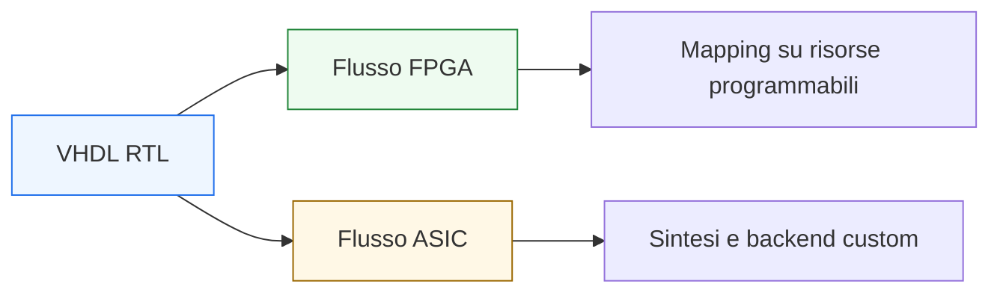

# VHDL per FPGA e ASIC

Dopo aver costruito il percorso su **linguaggio**, **modellazione RTL**, **sintesi**, **timing** e **verifica**, il passo successivo naturale è collocare VHDL nei due grandi contesti implementativi della progettazione digitale: **FPGA** e **ASIC**.

Questa pagina è molto importante perché lo stesso codice VHDL, pur restando formalmente un RTL, viene letto e valutato in ambienti progettuali che hanno priorità, vincoli e sensibilità in parte diverse. In altre parole, VHDL non cambia come linguaggio, ma cambia il modo in cui il progettista deve ragionare su:
- risorse hardware disponibili;
- timing;
- reset e clocking;
- struttura del datapath;
- qualità del codice;
- verificabilità;
- costo degli errori progettuali.

Dal punto di vista didattico, questa è una pagina di raccordo molto utile, perché permette di collegare la sezione VHDL alle altre aree già costruite nella documentazione, in particolare:
- FPGA
- ASIC
- SystemVerilog
- temi generali di microarchitettura RTL

Questa lezione mantiene il taglio della sezione:
- didattico ma tecnico;
- orientato alla progettazione reale;
- attento alla continuità tra codice RTL e implementazione;
- accompagnato da esempi e schemi concettuali quando utili.

## 1. Perché confrontare FPGA e ASIC

La prima domanda utile è: perché ha senso dedicare una pagina specifica a questo confronto?

### 1.1 Perché il linguaggio è lo stesso ma il contesto cambia
Un modulo VHDL può descrivere correttamente la stessa funzione in entrambi i mondi, ma il progettista non lo giudica con gli stessi criteri in ogni contesto.

### 1.2 Perché cambiano priorità e compromessi
In un caso possono pesare di più:
- rapidità di sviluppo;
- disponibilità di risorse fisse della piattaforma;
- facilità di iterazione.

Nell’altro pesano di più:
- qualità estrema dell’RTL;
- pulizia per sintesi e backend;
- costo di area, potenza e signoff;
- robustezza dell’intero flusso.

### 1.3 Perché questo aiuta a leggere meglio VHDL
Capire il contesto implementativo aiuta a scrivere codice RTL con maggiore consapevolezza progettuale.

---

## 2. Che cosa resta uguale tra FPGA e ASIC

Prima di guardare le differenze, conviene chiarire ciò che resta comune.

### 2.1 Il ruolo di VHDL
In entrambi i casi, VHDL viene usato come linguaggio RTL per descrivere:
- datapath;
- controllo;
- registri;
- pipeline;
- interfacce;
- blocchi gerarchici.

### 2.2 Restano centrali gli stessi principi RTL
In entrambi i mondi contano:
- chiarezza tra combinatorio e sequenziale;
- gestione corretta di clock e reset;
- leggibilità di FSM e datapath;
- prevedibilità della sintesi;
- attenzione al timing.

### 2.3 Perché questo è importante
Significa che la qualità di base del VHDL non dipende dal target finale. Un RTL scritto male resta scritto male sia in FPGA sia in ASIC.

---

## 3. Dove cambia davvero il contesto

Il punto importante è che FPGA e ASIC non cambiano il linguaggio, ma cambiano il significato pratico delle scelte progettuali.

### 3.1 In FPGA
Il progetto viene mappato su una architettura programmabile già esistente, con risorse discrete e vincoli propri della piattaforma.

### 3.2 In ASIC
Il progetto entra in un flusso che porta a una realizzazione custom o semicustom, in cui area, potenza, timing, DFT e backend diventano molto più critici.

### 3.3 Conseguenza progettuale
Lo stesso RTL può essere:
- perfettamente accettabile in FPGA;
- troppo debole, ambiguo o poco pulito per un flusso ASIC serio.

---

## 4. VHDL in contesto FPGA

Vediamo prima il lato FPGA.

### 4.1 Punto di vista generale
Nel mondo FPGA, VHDL è spesso apprezzato per:
- chiarezza strutturale;
- robustezza tipologica;
- leggibilità del codice RTL;
- buon adattamento a flussi didattici e industriali consolidati.

### 4.2 Obiettivi tipici
Molti progetti FPGA cercano un buon equilibrio tra:
- funzionalità;
- timing sufficiente;
- rapidità di sviluppo;
- facilità di debug e iterazione;
- sfruttamento delle risorse della piattaforma.

### 4.3 Perché questo incide sull’RTL
Il progettista FPGA tende spesso a ragionare in termini di:
- mapping su registri e LUT;
- uso di risorse dedicate;
- timing closure sulla piattaforma;
- iterazione relativamente rapida del progetto.

---

## 5. VHDL in contesto ASIC

Nel mondo ASIC, la sensibilità progettuale è generalmente più severa.

### 5.1 Punto di vista generale
Il codice RTL entra in un flusso in cui diventano centrali:
- qualità della sintesi;
- area;
- potenza;
- timing;
- testabilità;
- backend fisico;
- robustezza del signoff.

### 5.2 Obiettivi tipici
Nel caso ASIC, si cerca spesso una qualità RTL che sia:
- molto pulita;
- fortemente prevedibile;
- coerente con le metodologie di sintesi e verifica;
- adatta a un flusso in cui le correzioni tardive costano molto.

### 5.3 Perché questo incide sull’RTL
Il progettista ASIC tende a essere più sensibile a:
- disciplina del reset;
- chiarezza dei clock domain;
- struttura delle FSM;
- qualità dei path di timing;
- impatto dell’RTL su area, potenza e backend.

---

## 6. Differenza di sensibilità sul timing

Il timing è importante in entrambi i mondi, ma il suo peso progettuale viene spesso percepito in modo diverso.

### 6.1 In FPGA
Il timing va chiuso sul dispositivo e sulle sue risorse:
- LUT;
- registri;
- reti di routing;
- clocking specifico della piattaforma.

Il progettista tende a ragionare molto sul fatto che:
- la piattaforma è fissa;
- il routing ha un forte peso;
- la pipeline è spesso uno strumento naturale per chiudere la frequenza.

### 6.2 In ASIC
Il timing entra in una catena molto più ampia:
- sintesi;
- ottimizzazione;
- floorplanning;
- place and route;
- CTS;
- signoff.

### 6.3 Conseguenza progettuale
In ASIC, la qualità dell’RTL rispetto al timing viene letta spesso con una severità ancora maggiore, perché ogni problema si propaga lungo tutto il backend.

---

## 7. Differenza di sensibilità su area e risorse

Anche il tema dell’area viene percepito in modo diverso.

### 7.1 In FPGA
Il progettista ragiona spesso in termini di:
- occupazione di LUT;
- flip-flop;
- blocchi RAM;
- DSP;
- risorse della piattaforma disponibile.

### 7.2 In ASIC
L’area è una metrica diretta molto più legata al costo e alla qualità della realizzazione finale.

### 7.3 Conseguenza progettuale
In un flusso ASIC, duplicazioni inutili di logica, mux troppo profondi o strutture poco pulite possono avere un peso progettuale più severo.

---

## 8. Differenza di sensibilità sul reset

Il reset è un altro tema in cui il contesto conta molto.

### 8.1 In FPGA
Il reset resta importante per chiarezza, inizializzazione e controllo del comportamento, ma il progettista ragiona anche tenendo conto del comportamento della piattaforma e del flusso implementativo specifico.

### 8.2 In ASIC
Reset e inizializzazione sono spesso letti in modo molto disciplinato perché si collegano a:
- robustezza del sistema;
- verificabilità;
- clocking;
- integrazione fisica;
- metodologia complessiva.

### 8.3 Conseguenza progettuale
In ASIC, uno stile di reset ambiguo o poco rigoroso tende a essere percepito più negativamente.

---

## 9. Differenza di sensibilità sul clocking

Anche il clocking ha implicazioni differenti.

### 9.1 In FPGA
Il progettista lavora con una infrastruttura di clock del dispositivo e tende a essere molto attento a:
- uso corretto delle reti di clock;
- timing closure sulla piattaforma;
- rapporto tra pipeline e frequenza.

### 9.2 In ASIC
Il clocking si inserisce in temi come:
- CTS;
- skew;
- qualità della distribuzione del clock;
- impatto fisico dei domini di clock.

### 9.3 Conseguenza progettuale
Nel mondo ASIC, la pulizia del RTL rispetto a clock e domini temporali è un requisito ancora più sensibile.

---

## 10. Differenza di sensibilità sulla qualità dell’RTL

Questa è forse una delle differenze più utili da capire.

### 10.1 In FPGA
Un RTL chiaro e ordinato è molto importante, ma il flusso consente spesso una iterazione relativamente rapida, quindi alcuni problemi vengono affrontati con un ciclo di correzione più agile.

### 10.2 In ASIC
L’RTL tende a essere valutato con una disciplina più stretta perché ogni ambiguità può propagarsi in:
- sintesi;
- verifica;
- DFT;
- floorplanning;
- PnR;
- signoff.

### 10.3 Conseguenza progettuale
Nel mondo ASIC, il margine per un RTL “approssimativo ma funzionante” è in genere molto più ridotto.

---

## 11. VHDL e datapath nei due contesti

Il datapath è centrale sia in FPGA sia in ASIC, ma con accenti diversi.

### 11.1 In FPGA
Si tende spesso a ragionare in termini di:
- uso efficiente delle risorse del dispositivo;
- pipeline per sostenere la frequenza;
- mapping ordinato della logica.

### 11.2 In ASIC
Si guarda con più severità a:
- area;
- profondità del cammino critico;
- consumo;
- pulizia dell’architettura;
- efficienza complessiva del datapath.

### 11.3 Conseguenza progettuale
La stessa idea di datapath può essere valida in entrambi i mondi, ma il livello di ottimizzazione richiesto può cambiare molto.

---

## 12. VHDL e control unit nei due contesti

Anche la control unit cambia peso progettuale a seconda del contesto.

### 12.1 In FPGA
Una FSM chiara, robusta e ben verificabile è già un risultato molto importante, soprattutto in flussi con forte attenzione a funzionalità e tempo di sviluppo.

### 12.2 In ASIC
La stessa FSM deve essere letta anche in termini di:
- qualità della sintesi;
- codifica dello stato;
- timing della logica di controllo;
- integrazione con il resto del backend.

### 12.3 Conseguenza progettuale
Più il contesto è severo, più la chiarezza della FSM diventa un requisito non solo logico ma metodologico.

---

## 13. VHDL e verifica nei due contesti

Il testbench è importante in entrambi i mondi, ma il suo ruolo si inserisce in contesti più ampi.

### 13.1 In FPGA
La verifica spesso si accompagna molto da vicino a:
- bring-up;
- debug iterativo;
- confronto rapido tra simulazione e implementazione;
- osservazione pratica del comportamento sul dispositivo.

### 13.2 In ASIC
La verifica si inserisce in una catena molto più ampia e strutturata, dove l’RTL deve essere estremamente affidabile già prima del backend.

### 13.3 Conseguenza progettuale
In entrambi i casi la verifica è essenziale, ma in ASIC il costo di un errore tardo tende a essere molto più alto.

---

## 14. Esempio concettuale: stesso modulo, sensibilità diversa

Supponiamo di avere un modulo VHDL con:
- datapath a 32 bit;
- FSM di controllo;
- pipeline leggera;
- reset e clock unici.

### 14.1 In FPGA
Il progettista si chiede soprattutto:
- entra nelle risorse del dispositivo?
- chiude il timing richiesto?
- è comodo da debuggare?
- si integra bene con gli altri blocchi del progetto?

### 14.2 In ASIC
Il progettista si chiede anche:
- l’RTL è abbastanza pulito per sintesi e backend?
- area e potenza sono ragionevoli?
- clock e reset sono ben strutturati?
- la verifica è adeguata al rischio del flusso?

### 14.3 Perché è utile questo esempio
Mostra che la differenza non è nel linguaggio, ma nella profondità con cui certe scelte vengono giudicate.

---

## 15. VHDL come linguaggio “serio” in entrambi i mondi

Una delle idee importanti da conservare è che VHDL non è un linguaggio “solo didattico” o “solo FPGA”.

### 15.1 Perché
Il suo valore sta nella capacità di esprimere:
- interfacce chiare;
- tipi ben definiti;
- FSM leggibili;
- datapath ordinati;
- RTL disciplinato.

### 15.2 Perché questo è importante
Queste qualità sono utili in FPGA e restano preziose in ASIC.

### 15.3 Conseguenza
Studiare VHDL con una prospettiva progettuale ampia significa costruire competenze utili in entrambi i contesti.

---

## 16. Errori comuni di impostazione

Ci sono alcuni errori di prospettiva che conviene evitare.

### 16.1 Pensare che basti “far funzionare” il modulo
Un RTL corretto funzionalmente ma poco pulito può creare problemi seri, soprattutto in contesto ASIC.

### 16.2 Pensare che FPGA e ASIC richiedano due linguaggi diversi
Il linguaggio è lo stesso; cambia il livello di disciplina progettuale richiesto.

### 16.3 Trascurare il contesto implementativo
Un buon codice VHDL deve essere scritto sapendo dove andrà a vivere.

### 16.4 Leggere il progetto solo in termini di sintassi
In realtà bisogna sempre pensare in termini di:
- struttura hardware;
- timing;
- verifica;
- implementazione.

---

## 17. Buone pratiche progettuali

Per scrivere VHDL adatto sia a FPGA sia a ASIC, alcune linee guida sono particolarmente utili.

### 17.1 Curare la chiarezza dell’RTL
Separare bene:
- combinatorio;
- sequenziale;
- stato;
- prossimo stato;
- datapath;
- controllo.

### 17.2 Rendere il codice prevedibile per la sintesi
Registri, mux, enable, reset e FSM devono essere leggibili a colpo d’occhio.

### 17.3 Pensare al timing fin dall’RTL
La struttura del modulo deve aiutare la chiusura temporale, non ostacolarla.

### 17.4 Scrivere per la verifica
Un buon RTL è più facile da testare, osservare e debuggare.

### 17.5 Evitare scorciatoie opache
Un codice breve ma ambiguo è quasi sempre peggiore di un codice leggermente più esplicito ma architetturalmente chiaro.

---

## 18. Collegamento con il resto della sezione

Questa pagina si collega direttamente a:
- **`synthesis.md`**
- **`timing-and-clocking.md`**
- **`common-pitfalls.md`**
- **`verification-and-testbench.md`**
- **`stimulus-self-checking-and-simulation.md`**
- **`debug-and-waveforms.md`**

e più in generale alle sezioni già costruite su:
- **FPGA**
- **ASIC**
- **SystemVerilog**

perché il punto di questa lezione è proprio mostrare come il VHDL si inserisca in modo coerente dentro quei mondi.

---

## 19. In sintesi

VHDL può essere usato con piena dignità sia in contesto **FPGA** sia in contesto **ASIC**, ma il progettista deve essere consapevole che il contesto implementativo cambia la sensibilità con cui l’RTL viene letto e valutato.

In entrambi i mondi restano centrali:
- chiarezza dell’RTL;
- correttezza di sintesi;
- attenzione al timing;
- qualità della verifica.

Ciò che cambia davvero è il peso progettuale di questi aspetti e il costo delle ambiguità o delle debolezze architetturali.

Capire bene questo punto significa fare un passo importante verso una visione più matura del VHDL come linguaggio di progetto reale.

## Prossimo passo

Il passo successivo naturale è **`interfaces-handshake-and-cdc.md`**, perché adesso conviene collegare il VHDL ai problemi di integrazione tra blocchi, affrontando:
- interfacce
- protocolli a handshake
- sincronizzazione tra domini di clock
- errori tipici nelle connessioni tra moduli
