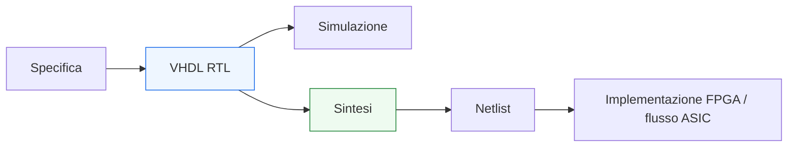
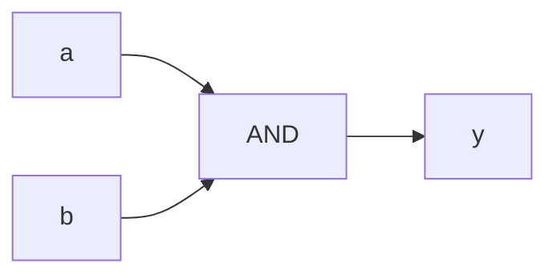

# Panoramica di VHDL

Dopo l’introduzione generale della sezione, il passo successivo naturale è chiarire che cosa sia davvero **VHDL** nel contesto della progettazione digitale. Questa pagina ha proprio questo scopo: fornire una visione d’insieme del linguaggio prima di entrare nei dettagli di sintassi, semantica e modellazione RTL.

VHDL non va letto come un linguaggio di programmazione tradizionale usato per “eseguire istruzioni” in sequenza, ma come un linguaggio di descrizione hardware con cui si modellano:
- strutture digitali;
- relazioni tra segnali;
- comportamento combinatorio;
- comportamento sequenziale;
- componenti gerarchici;
- sistemi che evolvono nel tempo sotto l’effetto di clock e reset.

Dal punto di vista progettuale, VHDL è importante perché permette di esprimere il progetto a livello **RTL** in una forma che può essere:
- simulata;
- verificata;
- sintetizzata;
- implementata su FPGA;
- inserita in un flusso ASIC.

Questa pagina introduce VHDL con un taglio coerente con il resto della documentazione:
- didattico ma tecnico;
- centrato sul rapporto tra linguaggio e hardware;
- attento alla prospettiva di sintesi, timing e verifica;
- orientato a chiarire lo stile con cui il linguaggio verrà trattato nel resto della sezione.



## 1. Che cos’è VHDL

VHDL è un **linguaggio di descrizione hardware** usato per descrivere sistemi digitali a diversi livelli di astrazione, ma particolarmente importante nel lavoro **RTL**.

### 1.1 Significato del linguaggio
Con VHDL si descrivono:
- interfacce;
- moduli;
- segnali;
- processi concorrenti;
- logica combinatoria;
- logica sequenziale;
- strutture gerarchiche.

### 1.2 Perché non va confuso con un linguaggio software
Anche se la sintassi contiene elementi che ricordano i linguaggi classici, il significato è diverso:
- non si stanno descrivendo solo operazioni;
- si stanno descrivendo circuiti e relazioni hardware.

### 1.3 Perché questo è importante
Gran parte degli errori iniziali in VHDL nasce proprio dal leggere il codice come se fosse un programma software sequenziale.

## 2. Dove si colloca VHDL nel flusso di progetto

Per capire bene il ruolo del linguaggio, conviene collocarlo nel flusso reale di progettazione digitale.

### 2.1 Punto di partenza
Il progetto nasce da:
- specifica funzionale;
- vincoli architetturali;
- requisiti di timing;
- obiettivi di area, potenza o throughput.

### 2.2 Livello RTL
VHDL viene usato per descrivere il comportamento del blocco a livello di registri, percorsi dati e logica di controllo.

### 2.3 Dopo la descrizione RTL
Il codice può essere:
- simulato per verificare il comportamento;
- sintetizzato in una netlist;
- implementato su FPGA;
- inserito in un flusso di backend ASIC.

### 2.4 Perché questo conta
Significa che una descrizione VHDL utile non deve essere solo “corretta sintatticamente”, ma deve essere anche:
- simulabile in modo sensato;
- sintetizzabile;
- coerente con il comportamento hardware atteso.

## 3. VHDL come linguaggio RTL

In questa sezione il focus principale sarà VHDL come linguaggio **RTL**.

### 3.1 Che cosa significa RTL
RTL significa **Register Transfer Level**. In pratica, interessa descrivere:
- come i dati si muovono tra registri;
- quali trasformazioni combinatorie avvengono;
- come il clock scandisce l’evoluzione del sistema;
- come il reset riporta il circuito in uno stato noto.

### 3.2 Perché è il livello giusto
Il livello RTL è quello in cui si incontrano:
- architettura del blocco;
- sintesi;
- timing;
- verifica funzionale.

### 3.3 Che cosa non sarà il focus principale
Non ci concentreremo su usi troppo astratti o poco rilevanti per la progettazione reale, ma soprattutto su ciò che serve per:
- progettare;
- leggere codice sintetizzabile;
- capire il significato hardware delle scelte di modellazione.

## 4. VHDL e concorrenza

Uno dei temi più importanti da capire fin da subito è che VHDL descrive un mondo **concorrente**.

### 4.1 Che cosa significa
In hardware, più segnali e più blocchi possono evolvere “insieme”, in funzione delle dipendenze logiche e del tempo di simulazione.

### 4.2 Implicazione sul linguaggio
Per questo VHDL include:
- assegnamenti concorrenti;
- process;
- segnali con semantica temporale specifica;
- descrizioni che non vanno lette come una semplice sequenza di istruzioni software.

### 4.3 Perché è essenziale capirlo
Se non si capisce la concorrenza, diventa difficile interpretare correttamente:
- process;
- segnali;
- delta cycle;
- logica combinatoria;
- logica sequenziale.

## 5. VHDL e significato hardware del codice

Uno dei principi guida dell’intera sezione sarà questo: **ogni costrutto verrà letto in relazione alla struttura hardware che implica**.

### 5.1 Esempio semplice
Un assegnamento concorrente può descrivere logica combinatoria.

```vhdl
y <= a and b;
```

Questo, in una lettura hardware, corrisponde a una porta logica o a una funzione combinatoria equivalente.



### 5.2 Esempio sequenziale
Un process sensibile al fronte di clock descrive invece logica registrata.

```vhdl
process(clk)
begin
  if rising_edge(clk) then
    q <= d;
  end if;
end process;
```

Qui il significato non è “eseguo questa istruzione quando capita”, ma “descrivo un registro aggiornato sul fronte di clock”.

### 5.3 Perché insistere su questo punto
Perché il vero valore della lettura RTL nasce dal collegamento continuo tra:
- linguaggio;
- struttura hardware;
- timing;
- sintesi.

## 6. Punti di forza di VHDL

VHDL ha caratteristiche che lo rendono particolarmente adatto a certi contesti.

### 6.1 Forte tipizzazione
Il linguaggio è rigoroso nella gestione dei tipi, e questo può aiutare a:
- evitare ambiguità;
- esplicitare meglio le intenzioni progettuali;
- costruire modelli più chiari.

### 6.2 Struttura esplicita
La separazione tra:
- `entity`
- `architecture`

e l’uso di package, tipi e costrutti ben formalizzati favoriscono una modellazione ordinata.

### 6.3 Apprezzamento in contesti progettuali seri
Per questi motivi VHDL è spesso apprezzato in:
- ambienti FPGA consolidati;
- progetti con forte disciplina documentale;
- contesti in cui chiarezza e struttura hanno grande valore.

## 7. Aspetti che richiedono attenzione

Proprio perché VHDL è rigoroso, richiede anche una certa disciplina.

### 7.1 Semantica dei segnali
Non basta vedere un’assegnazione: bisogna capire:
- quando il nuovo valore sarà visibile;
- in quale contesto si sta lavorando;
- che differenza c’è rispetto a variabili e process.

### 7.2 Sintesi vs simulazione
Una descrizione che “simula” non è automaticamente una descrizione buona per la sintesi.

### 7.3 Lettura troppo software-oriented
È uno degli errori più comuni:
- scrivere codice formalmente valido;
- ma poco adatto a una modellazione hardware ordinata.

## 8. VHDL in FPGA e ASIC

Anche se la sezione non sarà tool-specific, è importante chiarire che VHDL si colloca bene in entrambi i mondi.

### 8.1 In FPGA
VHDL è molto usato per:
- logica di controllo;
- datapath;
- interfacce;
- moduli parametrizzabili;
- sviluppo didattico e industriale.

### 8.2 In ASIC
Viene usato in contesti in cui contano molto:
- pulizia della modellazione RTL;
- integrazione con flussi di sintesi e verifica;
- disciplina sul coding style;
- consapevolezza di timing, reset e strutture hardware.

### 8.3 Perché è utile dirlo subito
Nel corso della sezione, quando parleremo di RTL, sintesi o timing, manterremo sempre una consapevolezza trasversale verso:
- implementazione su FPGA;
- flusso ASIC.

## 9. Che cosa studieremo nella sezione

Questa panoramica serve anche a inquadrare il percorso.

### 9.1 Fondamenti del linguaggio
Studieremo:
- struttura di `entity` e `architecture`;
- tipi essenziali;
- segnali, variabili e semantica;
- process e costrutti concorrenti.

### 9.2 Modellazione RTL
Passeremo poi a:
- logica combinatoria e sequenziale;
- registri;
- mux;
- reset;
- FSM;
- datapath;
- pipeline;
- parametrizzazione con generics e generate.

### 9.3 Sintesi, timing e verifica
Infine collegheremo il linguaggio a:
- sintesi;
- clock e timing;
- testbench;
- simulazione;
- waveform;
- debug;
- contesti progettuali FPGA e ASIC.

## 10. Il ruolo degli esempi di codice

Nel corso della sezione introdurremo esempi di codice in modo progressivo.

### 10.1 Non solo sintassi
Ogni esempio servirà a chiarire:
- significato del costrutto;
- struttura hardware implicata;
- possibile impatto su sintesi o timing.

### 10.2 Esempi brevi ma significativi
L’idea non è riempire le pagine di listati lunghi, ma usare esempi che siano:
- leggibili;
- sintetizzabili;
- coerenti con un flusso reale di progetto.

### 10.3 Beneficio
Questo rende la sezione più concreta e più utile anche come materiale di studio o ripasso.

## 11. Il ruolo degli schemi

Accanto al codice useremo schemi e diagrammi quando aiutano a chiarire meglio un concetto.

### 11.1 Quando sono più utili
Per esempio:
- rapporto tra ingressi e uscite;
- struttura di registri e datapath;
- pipeline;
- FSM;
- relazioni tra blocchi;
- flusso di simulazione o sintesi.

### 11.2 Perché servono
VHDL descrive hardware, quindi è naturale affiancare al testo e al codice anche una vista strutturale.

## 12. Come conviene studiare VHDL

Per seguire bene la sezione, conviene leggere ogni argomento su tre livelli.

### 12.1 Livello linguistico
Che costrutto è? Qual è la sua sintassi di base?

### 12.2 Livello hardware
Che cosa rappresenta davvero nel circuito?

### 12.3 Livello progettuale
È una scelta buona dal punto di vista di:
- sintesi;
- timing;
- leggibilità;
- verifica;
- riuso?

### 12.4 Perché questo approccio è importante
Aiuta a evitare una comprensione troppo superficiale o troppo “manualistica” del linguaggio.

## 13. Errori iniziali da evitare

Prima di entrare nei dettagli, è utile mettere in evidenza alcuni equivoci frequenti.

### 13.1 Pensare che VHDL sia solo sintassi
In realtà la parte difficile e interessante è la semantica.

### 13.2 Pensare che tutto il codice corretto sia automaticamente buono RTL
Una descrizione può essere formalmente corretta ma:
- poco leggibile;
- poco sintetizzabile;
- fragile in simulazione;
- progettualmente debole.

### 13.3 Leggere i process come routine software
È uno degli errori più comuni e più dannosi per l’apprendimento corretto del linguaggio.

## 14. Collegamento con le altre sezioni

Questa sezione VHDL si collegherà in modo naturale anche alle altre aree della documentazione già costruite.

### 14.1 Collegamento con FPGA
Quando parleremo di sintesi, risorse, timing e implementazione, il legame con la sezione FPGA sarà naturale.

### 14.2 Collegamento con ASIC
Quando parleremo di qualità dell’RTL, reset, timing e buone pratiche, emergeranno anche i collegamenti con la progettazione ASIC.

### 14.3 Collegamento con Verilog e SystemVerilog
Alla fine della sezione sarà più semplice confrontare VHDL con gli altri linguaggi RTL già trattati.

## 15. In sintesi

VHDL è un linguaggio di descrizione hardware che, in questa sezione, verrà trattato soprattutto come strumento di modellazione **RTL**. Il suo valore progettuale emerge quando lo si legge non come semplice sintassi, ma come linguaggio che descrive:
- strutture hardware;
- comportamento temporale;
- registri e logica;
- relazioni tra protocollo, sintesi, timing e verifica.

Nel resto della sezione, ogni costrutto verrà quindi collegato a:
- significato hardware;
- esempi di codice;
- schemi quando utili;
- implicazioni progettuali concrete.

## Prossimo passo

Il passo successivo naturale è **`language-basics.md`**, che introdurrà in modo più diretto:
- struttura minima di un file VHDL
- lessico e forma generale del linguaggio
- elementi sintattici di base
- prime regole di lettura corrette dal punto di vista RTL
