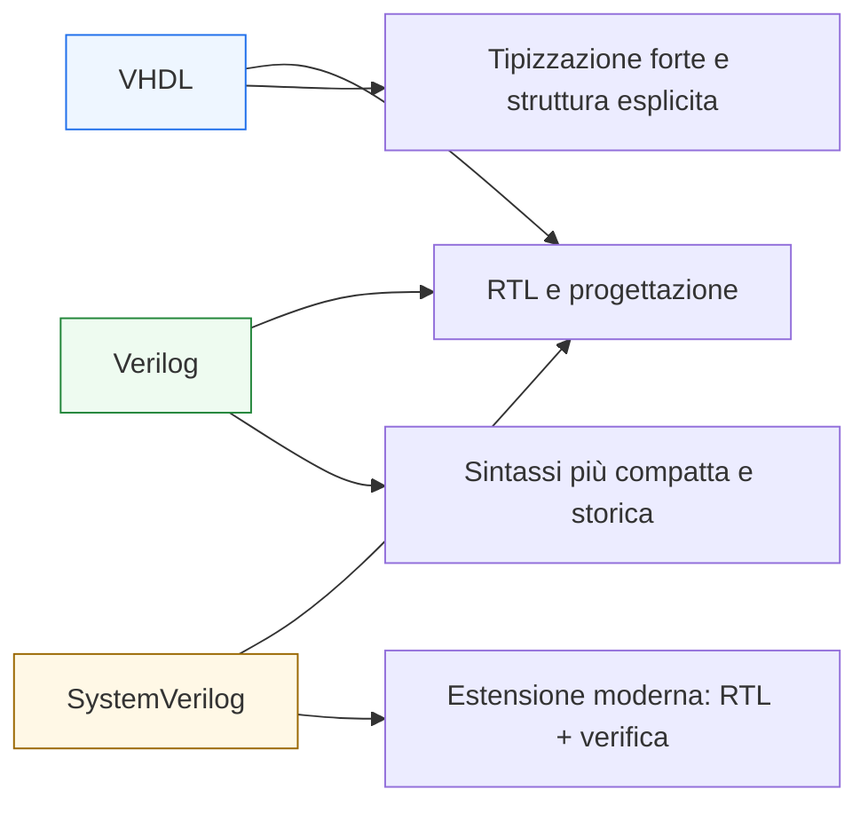

# VHDL vs Verilog vs SystemVerilog

Dopo aver costruito l’intera sezione **VHDL** — dai fondamenti del linguaggio fino a sintesi, timing, verifica, integrazione e contesti FPGA/ASIC — il passo conclusivo naturale è collocare VHDL rispetto agli altri due linguaggi RTL e di verifica più importanti già presenti nella documentazione:
- **Verilog**
- **SystemVerilog**

Questa pagina non ha l’obiettivo di stabilire un “vincitore assoluto”, perché i linguaggi non vanno confrontati in modo semplicistico. L’obiettivo è invece chiarire:
- che cosa cambia davvero nello stile di descrizione;
- quali differenze semantiche contano di più;
- quali punti di forza caratterizzano VHDL;
- in che senso Verilog e SystemVerilog risultano più naturali in certi contesti;
- come leggere i tre linguaggi dal punto di vista della progettazione digitale reale.

Dal punto di vista didattico, questa è una pagina di sintesi molto importante, perché permette di rileggere tutta la sezione VHDL in relazione al percorso già costruito su:
- Verilog
- SystemVerilog
- FPGA
- ASIC
- UVM

Questa lezione mantiene il taglio della sezione:
- didattico ma tecnico;
- orientato all’RTL e alla progettazione reale;
- attento alla semantica del linguaggio e al contesto d’uso;
- accompagnato da esempi concettuali e schemi comparativi quando utili.

## 1. Perché confrontare questi tre linguaggi

La prima domanda utile è: perché ha senso chiudere la sezione VHDL con un confronto rispetto a Verilog e SystemVerilog?

### 1.1 Perché appartengono allo stesso spazio progettuale
Tutti e tre i linguaggi vengono usati, con ruoli in parte diversi, per:
- descrivere hardware digitale;
- scrivere RTL;
- modellare interfacce e controllo;
- supportare flussi di simulazione, sintesi e verifica.

### 1.2 Perché il confronto aiuta a capire meglio anche VHDL
Un linguaggio si capisce più a fondo quando lo si confronta con altri strumenti che risolvono problemi simili in modi diversi.

### 1.3 Perché nella pratica i tre mondi si incontrano spesso
Molti progettisti lavorano o incontrano progetti in cui convivono:
- moduli VHDL;
- moduli Verilog;
- moduli e testbench SystemVerilog;
- flussi di verifica UVM;
- ambienti FPGA e ASIC misti.

---

## 2. Che cosa hanno in comune

Prima di guardare le differenze, conviene chiarire ciò che i tre linguaggi condividono.

### 2.1 Tutti possono descrivere hardware
A livelli diversi e con strumenti diversi, tutti e tre permettono di descrivere:
- logica combinatoria;
- logica sequenziale;
- registri;
- FSM;
- datapath;
- interfacce;
- strutture gerarchiche.

### 2.2 Tutti si inseriscono in un flusso reale di progetto
Possono essere usati in contesti che coinvolgono:
- simulazione;
- sintesi;
- timing;
- implementazione;
- verifica.

### 2.3 Tutti richiedono una lettura hardware
Anche quando la sintassi ricorda un linguaggio software, il significato resta quello di una descrizione del circuito.

---

## 3. Differenza di prospettiva generale

La differenza più utile da chiarire non è solo sintattica. È una differenza di **stile progettuale** e di **cultura del linguaggio**.

### 3.1 VHDL
Tende a privilegiare:
- struttura esplicita;
- forte tipizzazione;
- separazione chiara tra interfaccia e implementazione;
- disciplina nella modellazione.

### 3.2 Verilog
Tende a presentarsi in forma:
- più compatta;
- più minimale;
- più diretta;
- storicamente molto diffusa nell’RTL industriale.

### 3.3 SystemVerilog
Nasce come estensione che:
- rende più ricco il linguaggio RTL;
- aggiunge strumenti moderni di descrizione;
- amplia fortemente il lato della verifica;
- crea un ponte naturale verso testbench evoluti e UVM.

---

## 4. VHDL: punto di forza principale

Il punto di forza più riconoscibile di VHDL è la sua **disciplina strutturale**.

### 4.1 Dove si vede
- `entity` e `architecture` ben separate;
- tipizzazione forte;
- modelli di stato leggibili;
- buona capacità di esprimere interfacce e intenzioni in modo esplicito.

### 4.2 Perché è utile
Aiuta a costruire un RTL che sia:
- leggibile;
- rigoroso;
- adatto a contesti con forte attenzione documentale;
- molto esplicito dal punto di vista del progetto.

### 4.3 Perché questo conta
Chi impara bene VHDL sviluppa spesso una forte attenzione a:
- semantica;
- struttura del modulo;
- chiarezza dell’interfaccia;
- significato dei tipi.

---

## 5. Verilog: punto di forza principale

Il punto di forza più visibile di Verilog è la sua **essenzialità storica**.

### 5.1 Dove si vede
La sintassi è spesso:
- più breve;
- più diretta;
- più scarna;
- più familiare a chi proviene da altri linguaggi di descrizione o da tradizioni industriali consolidate.

### 5.2 Perché è utile
Per molti progettisti, Verilog è:
- rapido da leggere;
- rapido da scrivere;
- molto presente in numerosi flussi RTL storici;
- un riferimento ancora diffusissimo in hardware design.

### 5.3 Perché questo conta
Ha reso Verilog uno dei linguaggi più influenti e persistenti nella progettazione digitale.

---

## 6. SystemVerilog: punto di forza principale

SystemVerilog amplia notevolmente il perimetro di ciò che si può fare in modo naturale.

### 6.1 Lato RTL
Introduce strumenti moderni che migliorano:
- organizzazione del codice;
- modellazione dei tipi;
- interfacce;
- parametrizzazione;
- chiarezza di certi costrutti rispetto al Verilog classico.

### 6.2 Lato verifica
Qui il salto è ancora più forte, perché SystemVerilog diventa il linguaggio naturale di:
- testbench più ricchi;
- assertion;
- randomizzazione;
- classi;
- metodologie come UVM.

### 6.3 Perché è importante
SystemVerilog non è solo “Verilog con qualche miglioria”, ma un linguaggio che estende seriamente sia l’RTL sia il mondo della verifica.

---

## 7. Differenza di tipizzazione

Uno dei punti in cui VHDL e Verilog/SystemVerilog si percepiscono in modo diverso è la tipizzazione.

### 7.1 VHDL
È generalmente percepito come più rigoroso nella gestione dei tipi.

### 7.2 Verilog
Storicamente è più minimale e meno espressivo sul piano tipologico.

### 7.3 SystemVerilog
Migliora molto questo aspetto rispetto a Verilog, introducendo strumenti più ricchi e ordinati.

### 7.4 Perché è importante
La tipizzazione influenza:
- chiarezza dell’intenzione progettuale;
- quantità di ambiguità tollerata;
- stile di modellazione;
- leggibilità del codice.

---

## 8. Differenza nella struttura del modulo

Un altro aspetto molto utile da confrontare è la forma generale con cui il linguaggio presenta il modulo.

### 8.1 VHDL
La separazione tra:
- interfaccia (`entity`)
- implementazione (`architecture`)

è molto esplicita.

### 8.2 Verilog
La struttura del modulo è più compatta e meno formalmente separata in questo senso.

### 8.3 SystemVerilog
Resta vicino alla famiglia Verilog, ma con strumenti che possono rendere il codice molto più espressivo e organizzato.

### 8.4 Perché è importante
Questa differenza cambia il modo in cui il progettista pensa:
- il confine del modulo;
- la sua leggibilità;
- il rapporto tra interfaccia, configurazione e implementazione.

---

## 9. Differenza nella semantica percepita dal progettista

I tre linguaggi portano spesso il progettista a una “postura mentale” un po’ diversa.

### 9.1 VHDL
Invita a una lettura più esplicita e disciplinata:
- dei tipi;
- della struttura;
- dei ruoli del codice;
- della semantica.

### 9.2 Verilog
Invita spesso a una scrittura più compatta e a una lettura più diretta dei pattern RTL classici.

### 9.3 SystemVerilog
Invita a una progettazione più moderna e più integrata con il mondo della verifica.

### 9.4 Perché è importante
Il linguaggio non determina da solo la qualità dell’RTL, ma influenza il modo in cui il progettista tende a costruirlo.

---

## 10. Confronto sul piano dell’RTL puro

Se si guarda solo alla modellazione RTL, tutti e tre i linguaggi possono esprimere:
- registri;
- mux;
- FSM;
- datapath;
- pipeline;
- gerarchie.

### 10.1 VHDL
Spicca per:
- chiarezza strutturale;
- rigore tipologico;
- esplicitazione del significato dei segnali.

### 10.2 Verilog
Spicca per:
- immediatezza;
- tradizione industriale molto ampia;
- compattezza dei pattern RTL classici.

### 10.3 SystemVerilog
Spicca per:
- maggiore modernità rispetto a Verilog;
- strumenti più ricchi per modellazione e organizzazione del codice;
- continuità naturale con ambienti di verifica avanzata.

---

## 11. Confronto sul piano della verifica

Qui SystemVerilog prende una posizione molto diversa rispetto a VHDL e Verilog classico.

### 11.1 VHDL
Può certamente essere usato per:
- testbench;
- simulazione;
- assert di base;
- verifica funzionale semplice o moderata.

### 11.2 Verilog
Può supportare testbench e simulazione, ma resta molto più limitato rispetto alle estensioni moderne.

### 11.3 SystemVerilog
Diventa il linguaggio più naturale per:
- verification environment ricchi;
- assertion moderne;
- class-based verification;
- UVM.

### 11.4 Perché è importante
Se il confronto si sposta sul lato della verifica avanzata, SystemVerilog ha un vantaggio molto forte.

---

## 12. Confronto nel contesto FPGA

Nel mondo FPGA, VHDL e Verilog convivono da molto tempo.

### 12.1 VHDL in FPGA
È spesso apprezzato per:
- chiarezza;
- rigore;
- buon adattamento a flussi didattici e industriali ordinati.

### 12.2 Verilog in FPGA
È molto diffuso per:
- compattezza;
- forte presenza storica;
- continuità con molti flussi di progetto.

### 12.3 SystemVerilog in FPGA
Può essere molto utile, soprattutto quando si desidera un linguaggio RTL più moderno o maggiore continuità con il mondo della verifica.

### 12.4 Perché è importante
Nel contesto FPGA, la scelta dipende spesso da:
- ecosistema del progetto;
- competenze del team;
- strumenti disponibili;
- stile progettuale preferito.

---

## 13. Confronto nel contesto ASIC

Nel mondo ASIC, i tre linguaggi si incontrano spesso in ruoli diversi.

### 13.1 VHDL
Può essere usato in contesti che apprezzano:
- disciplina RTL;
- leggibilità;
- forte struttura progettuale.

### 13.2 Verilog
Resta molto importante nella tradizione industriale ASIC.

### 13.3 SystemVerilog
Ha un ruolo molto forte perché consente:
- RTL moderno;
- verifica avanzata;
- integrazione naturale con UVM e con il lato verification-heavy del flusso.

### 13.4 Perché è importante
Nel contesto ASIC, il confronto non è solo “quale linguaggio per l’RTL”, ma anche:
- quale linguaggio per l’intero ecosistema di design e verification.

---

## 14. VHDL rispetto a Verilog: vantaggi e limiti percepiti

### 14.1 Vantaggi percepiti di VHDL
- maggiore esplicitazione dell’interfaccia
- forte tipizzazione
- buona disciplina strutturale
- leggibilità elevata in molti contesti didattici e progettuali

### 14.2 Limiti percepiti rispetto a Verilog
- sintassi talvolta più verbosa
- maggiore rigidità percepita
- scrittura meno compatta in alcuni pattern molto semplici

### 14.3 Perché è utile dirlo così
Non si tratta di “meglio o peggio”, ma di compromesso tra:
- rigore;
- compattezza;
- espressività;
- cultura del team.

---

## 15. VHDL rispetto a SystemVerilog: vantaggi e limiti percepiti

### 15.1 Vantaggi percepiti di VHDL
- forte disciplina nella modellazione
- chiarezza strutturale
- ottimo valore formativo sul piano semantico e RTL

### 15.2 Limiti percepiti rispetto a SystemVerilog
- minore naturalezza per verification environment moderni
- minore continuità con UVM e verification avanzata
- minore ricchezza di alcuni costrutti moderni di organizzazione

### 15.3 Perché è utile dirlo così
SystemVerilog oggi copre uno spazio più ampio, ma questo non annulla il valore di VHDL come linguaggio di RTL serio e disciplinato.

---

## 16. Esempio concettuale: stessa funzione, culture di scrittura diverse

Immaginiamo di descrivere:
- un registro con enable e reset;
- una FSM di controllo;
- un piccolo datapath.

### 16.1 In VHDL
Ci si aspetta spesso:
- separazione chiara dei ruoli;
- nomi tipologicamente e strutturalmente coerenti;
- esplicitazione più rigorosa dell’interfaccia.

### 16.2 In Verilog
Ci si aspetta spesso:
- espressione più compatta;
- pattern classici molto sintetici;
- forte attenzione a immediatezza del codice.

### 16.3 In SystemVerilog
Ci si aspetta:
- RTL più ricco e moderno;
- strumenti più evoluti di organizzazione;
- continuità con il lato verification.

### 16.4 Perché è utile questo esempio
Mostra che i linguaggi non differiscono solo per “parole chiave”, ma anche per cultura di scrittura.

---

## 17. Quale linguaggio è più formativo

Dal punto di vista formativo, i tre linguaggi insegnano cose in parte diverse.

### 17.1 VHDL
È molto formativo per:
- semantica del linguaggio;
- disciplina della modellazione RTL;
- attenzione alla struttura;
- chiarezza delle interfacce;
- rigore dei tipi.

### 17.2 Verilog
È molto formativo per:
- riconoscimento dei pattern RTL classici;
- lettura di una grande parte della tradizione industriale;
- immediatezza della modellazione hardware di base.

### 17.3 SystemVerilog
È molto formativo per:
- modernizzazione dell’RTL;
- integrazione con la verifica;
- comprensione dell’ecosistema contemporaneo di design e verification.

### 17.4 Perché è importante
Non bisogna ridurre il confronto a “quale è migliore”, ma capire che ognuno forma una sensibilità progettuale diversa.

---

## 18. Quando VHDL è particolarmente naturale

VHDL risulta spesso particolarmente naturale quando si vuole:
- un RTL molto esplicito;
- forte chiarezza dell’interfaccia;
- buona disciplina tra tipi, stato e struttura;
- un codice leggibile anche come documento di progetto;
- una forte attenzione alla semantica del linguaggio.

### 18.1 Perché è importante
Questo spiega bene perché VHDL resti una scelta forte in molti contesti, nonostante la presenza di linguaggi più moderni o più diffusi in certe aree.

---

## 19. Quando Verilog o SystemVerilog risultano più naturali

### 19.1 Verilog
Risulta spesso più naturale quando si cerca:
- sintassi compatta;
- continuità con RTL storico molto diffuso;
- immediatezza dei pattern classici.

### 19.2 SystemVerilog
Risulta spesso più naturale quando si cerca:
- un RTL più moderno;
- strumenti più ricchi di organizzazione e modellazione;
- continuità con verification avanzata e UVM.

### 19.3 Perché è importante
Aiuta a capire la scelta del linguaggio come questione di:
- ecosistema;
- metodologia;
- obiettivi del team;
- equilibrio tra RTL e verifica.

---

## 20. Errori comuni nel confronto tra linguaggi

Anche il confronto tra linguaggi può essere affrontato male.

### 20.1 Ridurre tutto alla sintassi
La vera differenza è spesso semantica, metodologica e culturale.

### 20.2 Trattare un linguaggio come “obsoleto” solo perché più verboso
La verbosità non implica mancanza di valore progettuale.

### 20.3 Pensare che un linguaggio risolva automaticamente i problemi di RTL
La qualità dell’RTL dipende sempre anche dal progettista.

### 20.4 Ignorare il contesto
FPGA, ASIC, verifica di base e verifica avanzata cambiano molto il peso dei vantaggi di ciascun linguaggio.

---

## 21. Buone pratiche di lettura trasversale

Per confrontare bene VHDL, Verilog e SystemVerilog, alcune linee guida sono molto utili.

### 21.1 Guardare prima il modello mentale
- come tratta i tipi?
- come separa interfaccia e implementazione?
- come rende leggibile il controllo?
- come supporta la verifica?

### 21.2 Guardare poi il contesto d’uso
- RTL puro?
- testbench?
- UVM?
- FPGA?
- ASIC?

### 21.3 Non confondere gusto personale e valutazione tecnica
Ogni linguaggio ha punti forti reali e limiti reali.

### 21.4 Leggere sempre il codice come hardware
Questo vale in tutti e tre i casi.

---

## 22. Collegamento con il resto della documentazione

Questa pagina si collega direttamente a:
- la sezione **VHDL** appena costruita;
- la sezione **Verilog**, che ha introdotto la modellazione RTL essenziale;
- la sezione **SystemVerilog**, che ha esteso il discorso verso costrutti più moderni di RTL e verifica;
- la sezione **UVM**, che mostra in modo molto chiaro perché SystemVerilog abbia un ruolo così forte nella verifica avanzata;
- le sezioni **FPGA** e **ASIC**, che danno il contesto implementativo in cui questi linguaggi vengono realmente usati.

---

## 23. In sintesi

VHDL, Verilog e SystemVerilog condividono lo stesso spazio generale della progettazione digitale, ma rappresentano stili e culture progettuali diverse.

- **VHDL** spicca per rigore, tipizzazione e struttura esplicita.
- **Verilog** spicca per essenzialità, compattezza e tradizione industriale molto ampia.
- **SystemVerilog** spicca per ricchezza moderna, continuità con l’RTL e forte integrazione con la verifica avanzata.

Capire bene questo confronto significa chiudere la sezione VHDL con una visione più matura del linguaggio: non come strumento isolato, ma come parte di un ecosistema più ampio di progettazione, verifica e implementazione.

## Prossimo passo

Il passo successivo naturale, a questo punto, è **`case-study-vhdl.md`**, perché permette di chiudere la sezione con una pagina applicativa che ricomponga in un esempio unico:
- modellazione RTL
- FSM
- datapath
- pipeline
- sintesi e timing
- testbench e debug
- integrazione con handshake o controllo
